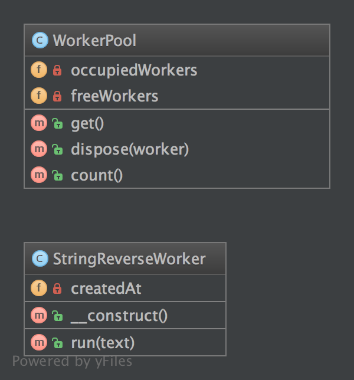

## Объектный пул (Pool)

Порождающий паттерн, который предоставляет набор заранее инициализированных объектов, готовых к использованию («пул»), что не требует 
каждый раз создавать и уничтожать их.

Хранение объектов в пуле может заметно повысить производительность в ситуациях, когда стоимость и скорость инициализации экземпляра 
класса высоки, а количество одновременно используемых экземпляров в любой момент времени является низким. Время на получение объекта 
из пула легко прогнозируется, тогда как создание нового объекта (особенно с сетевым оверхедом) может занимать неопределенное время.

Однако эти преимущества в основном относятся к объектам, которые изначально являются дорогостоящими по времени создания. Например, 
соединения с базой данных, соединения сокетов, потоков или инициализация больших графических объектов, таких как шрифты или растровые 
изображения. В некоторых ситуациях, использование простого пула объектов (которые не зависят от внешних ресурсов, а только занимают 
память) может оказаться неэффективным и приведёт к снижению производительности.

### Код

### WorkerPool.php

    <?php
    
    
    declare(strict_types=1);
    
    
    namespace DesignPatterns\Creational\Pool;
    
    
    use Countable;
    
    
    class WorkerPool implements Countable
    
    {
    
        /**
    
         * @var StringReverseWorker[]
    
         */
    
        private array $occupiedWorkers = [];
    
    
        /**
    
         * @var StringReverseWorker[]
    
         */
    
        private array $freeWorkers = [];
    
    
        public function get(): StringReverseWorker
    
        {
    
            if (count($this->freeWorkers) === 0) {
    
                $worker = new StringReverseWorker();
    
            } else {
    
                $worker = array_pop($this->freeWorkers);
    
            }
    
    
            $this->occupiedWorkers[spl_object_hash($worker)] = $worker;
    
    
            return $worker;
    
        }
    
    
        public function dispose(StringReverseWorker $worker): void
    
        {
    
            $key = spl_object_hash($worker);
    
            if (isset($this->occupiedWorkers[$key])) {
    
                unset($this->occupiedWorkers[$key]);
    
                $this->freeWorkers[$key] = $worker;
    
            }
    
        }
    
    
        public function count(): int
    
        {
    
            return count($this->occupiedWorkers) + count($this->freeWorkers);
    
        }
    
    }

### StringReverseWorker.php

    <?php
    
    
    declare(strict_types=1);
    
    
    namespace DesignPatterns\Creational\Pool;
    
    
    class StringReverseWorker
    
    {
    
        public function run(string $text): string
    
        {
    
            return strrev($text);
    
        }
    
    }

### PoolTest.php

    <?php
    
    
    declare(strict_types=1);
    
    
    namespace DesignPatterns\Creational\Pool\Tests;
    
    
    use DesignPatterns\Creational\Pool\WorkerPool;
    
    use PHPUnit\Framework\TestCase;
    
    
    class PoolTest extends TestCase
    
    {
    
        public function testCanGetNewInstancesWithGet()
    
        {
    
            $pool = new WorkerPool();
    
            $worker1 = $pool->get();
    
            $worker2 = $pool->get();
    
    
            $this->assertCount(2, $pool);
    
            $this->assertNotSame($worker1, $worker2);
    
        }
    
    
        public function testCanGetSameInstanceTwiceWhenDisposingItFirst()
    
        {
    
            $pool = new WorkerPool();
    
            $worker1 = $pool->get();
    
            $pool->dispose($worker1);
    
            $worker2 = $pool->get();
    
    
            $this->assertCount(1, $pool);
    
            $this->assertSame($worker1, $worker2);
    
        }
    
    }
