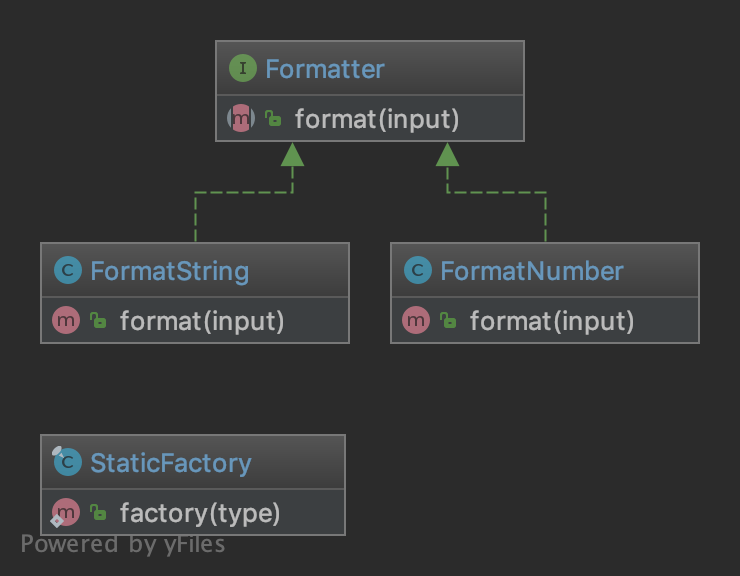

## Статическая Фабрика (StaticFactory)

Подобно AbstractFactory, этот паттерн используется для создания ряда связанных или зависимых объектов. 
Разница между этим шаблоном и Абстрактной Фабрикой заключается в том, что Статическая Фабрика использует только один статический метод,
чтобы создать все допустимые типы объектов. Этот метод, обычно, называется factory или build.

## Код

### StaticFactory.php

    <?php
    
    
    declare(strict_types=1);
    
    
    namespace DesignPatterns\Creational\StaticFactory;
    
    
    use InvalidArgumentException;
    
    
    /**
    
     * Note1: Remember, static means global state which is evil because it can't be mocked for tests
    
     * Note2: Cannot be subclassed or mock-upped or have multiple different instances.
    
     */
    
    final class StaticFactory
    
    {
    
        public static function factory(string $type): Formatter
    
        {
    
            return match ($type) {
    
                'number' => new FormatNumber(),
    
                'string' => new FormatString(),
    
                default => throw new InvalidArgumentException('Unknown format given'),
    
            };
    
        }
    
    }

### Formatter.php

    <?php
    
    
    declare(strict_types=1);
    
    
    namespace DesignPatterns\Creational\StaticFactory;
    
    
    interface Formatter
    
    {
    
        public function format(string $input): string;
    
    }

### FormatString.php

    <?php
    
    
    declare(strict_types=1);
    
    
    namespace DesignPatterns\Creational\StaticFactory;
    
    
    class FormatString implements Formatter
    
    {
    
        public function format(string $input): string
    
        {
    
            return $input;
    
        }
    
    }

### FormatNumber.php

    <?php
    
    
    declare(strict_types=1);
    
    
    namespace DesignPatterns\Creational\StaticFactory;
    
    
    class FormatNumber implements Formatter
    
    {
    
        public function format(string $input): string
    
        {
    
            return number_format((int) $input);
    
        }
    
    }

### StaticFactoryTest.php

    <?php
    
    
    declare(strict_types=1);
    
    
    namespace DesignPatterns\Creational\StaticFactory\Tests;
    
    
    use InvalidArgumentException;
    
    use DesignPatterns\Creational\StaticFactory\FormatNumber;
    
    use DesignPatterns\Creational\StaticFactory\FormatString;
    
    use DesignPatterns\Creational\StaticFactory\StaticFactory;
    
    use PHPUnit\Framework\TestCase;
    
    
    class StaticFactoryTest extends TestCase
    
    {
    
        public function testCanCreateNumberFormatter()
    
        {
    
            $this->assertInstanceOf(FormatNumber::class, StaticFactory::factory('number'));
    
        }
    
    
        public function testCanCreateStringFormatter()
    
        {
    
            $this->assertInstanceOf(FormatString::class, StaticFactory::factory('string'));
    
        }
    
    
        public function testException()
    
        {
    
            $this->expectException(InvalidArgumentException::class);
    
    
            StaticFactory::factory('object');
    
        }
    
    }
