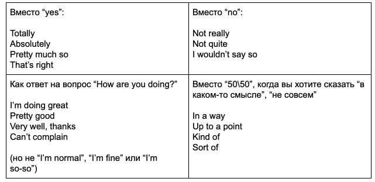

Just a few tips в догонку:

==================================================================================================

Используйте `bullet point approach`, когда готовитесь к собеседованию. Вместо того, чтобы записывать и заучивать целые предложения, 
выделите основные тезисные пункты и потренируйте свой ответ в разговоре с другом или просто перед зеркалом. Ваша цель — звучать 
легко и естественно.

==================================================================================================

Не избегайте `small talk`. Покажите, что вы умеете поддерживать непринужденный разговор на различные темы. Будьте готовы поговорить 
о том, чем вы занимаетесь помимо работы, ваших любимых книгах, хобби и т. д. Будьте приветливы и на вопрос „How are you?” 
отвечайте: „I’m great/very well/doing good. What about yourself?”, а не „Normal” (что, по сути, неправильно) или „Not bad.”

==================================================================================================

Вас могут попросить рассказать о каких-либо трудностях, с которыми вам пришлось столкнуться. В случаях, когда нужно рассказать такую историю из личного опыта, можно применять „STAR technique”. STAR значит:

- `Situation` — опишите конкретную ситуацию или проблему.
- `Task` — задача, которая перед вами стояла.
- `Action` — что вы сделали, чтобы выполнить эту задачу и решить проблему.
- `Result` — каков был конечный результат.

==================================================================================================

Поблагодарите интервьюера, отправив `follow-up` имейл после собеседования. Это поможет вам выделиться из толпы кандидатов и заодно 
покажет, что вы знакомы с англоязычной культурой общения.

==================================================================================================

главный показатель вашего уровня на собеседовании — это, во-первых, то, что `вы говорите, а не из вас вытягивают слова`. Во-вторых, 
связная речь без запинок, заикания и пауз. Следите за темпом речи. Лучше говорить более медленно, но размеренно, чем быстро и 
сбивчиво.

==================================================================================================

`Старайтесь давать развернутые ответы`, ведь если вы отвечаете на все вопросы односложно, ваш уровень никак не смогут оценить. 
Никто не поймет, upper вы или inter, если каждый ваш ответ — это одно слово.

==================================================================================================

Практикуйте `active listening` —  слушайте собеседника и реагируйте на его комментарии. Таким образом вы покажете не только 
заинтересованность в беседе, но и то, что вы в курсе, как общаются носители языка. То есть никто никогда не припишет вам 
Pre-Intermediate, даже если вы сказали will после if :)

==================================================================================================

„Повысить” свой уровень в ускоренном режиме и без особых усилий можно с помощью некоторых общих фраз, которые часто используют носители языка (но мы часто игнорируем). Например:

разнообразить свой словарный запас и создать впечатление беглого английского помогают слова, заменяющие выражения с „very”:

==================================================================================================

Кроме этого, разнообразить свой словарный запас и создать впечатление беглого английского помогают слова, заменяющие выражения 
с „very”:

- Very good = amazing, awesome, fantastic, top-notch
- Very bad = awful, terrible, lame (informal)
- Very interesting = fascinating
- Very boring = dull
- Like very much = love
- Very big = huge
- Very small = tiny
- Very important = crucial, critical, key

И еще помогают так называемые „filler words”, то есть слова, которые ничего, по большому счету, не значат, но делают речь более 
плавной и выигрывают вам дополнительное время подумать над вопросом. Например:

- I would say that...
- Let me see...
- You know...
- I mean...
- It’s hard to remember off the top of my head...

==================================================================================================

В плане грамматики лучше сконцентрироваться на основах и не забивать голову новыми правилами за день до собеседования. Из основ вам больше всего понадобятся:

- `Past Simple` — о прошлых проектах, предыдущих местах работы, первых шагах и т. д. Всегда используется, когда ваше предложение отвечает на вопрос: „Когда именно в прошлом?” e.g. I designed my first app when I was in university.
- `Present Perfect` — о результатах на данный момент e.g. „I’ve worked at my current company for 6 years”.
- `Going to` — для планов на будущее e.g. „I’m going to take a PMI exam this spring”.
- `Present Simple` — для тех действий, которые происходят с какой-то частотой в настоящем e.g. „I very rarely travel abroad”.
- Также такие темы, как `Gerunds` and `Infinitives`, `First` and `Second Conditionals` и `Prepositions`.

==================================================================================================

`Secret grammar tip`: практически всегда вас спросят: „How long have you been working as ...?” И тут многие проваливают тест на 
английский, потому что отвечают не в том времени: „I work/I’m working as a developer for 5 year”. This is wrong! В английском все 
просто: `в каком времени вопрос, в таком времени ответ` (зачастую). Плюс у вас есть маркер времени for, поэтому если вы не 
используете время Present Perfect Continuous, как было в вопросе, ваш уровень для собеседника едва дотянет до weak Intermediate.

==================================================================================================

Произношению нужно также определить особое внимание. Проверьте свое произношение самых часто используемых вами слов (например, в Google dictionary). Можно начать с этого списка:

==================================================================================================

`Practice makes perfect!` Всегда репетируйте перед собеседованием. Да, как в фильмах американцы стоят в ванной перед зеркалом и повторяют свою речь. Но не заучивайте ничего, 
вы должны говорить максимально непринужденно и естественно.

==================================================================================================

==================================================================================================

==================================================================================================

==================================================================================================

==================================================================================================

==================================================================================================

==================================================================================================

==================================================================================================

==================================================================================================

==================================================================================================

==================================================================================================

==================================================================================================

==================================================================================================

==================================================================================================

==================================================================================================

==================================================================================================

==================================================================================================

==================================================================================================

==================================================================================================

==================================================================================================

==================================================================================================

==================================================================================================

==================================================================================================

==================================================================================================

==================================================================================================

==================================================================================================

==================================================================================================

==================================================================================================

==================================================================================================

==================================================================================================

==================================================================================================

==================================================================================================

