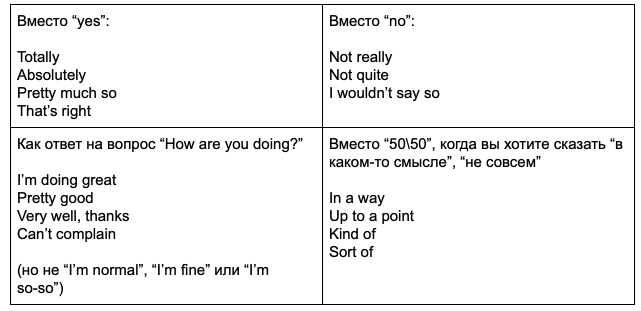
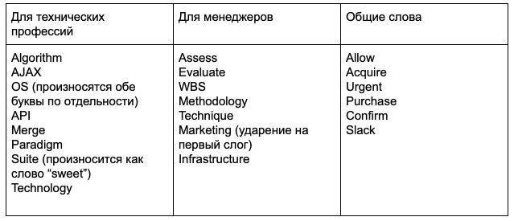

## Just a few tips:

---

Используйте `bullet point approach`, когда готовитесь к собеседованию. Вместо того, чтобы записывать и заучивать целые
предложения,
выделите основные тезисные пункты и потренируйте свой ответ в разговоре с другом или просто перед зеркалом. Ваша цель —
звучать
легко и естественно.

---

Не избегайте `small talk`. Покажите, что вы умеете поддерживать непринужденный разговор на различные темы. Будьте готовы
поговорить о том, чем вы занимаетесь помимо работы, ваших любимых книгах, хобби и т. д. Будьте приветливы и на вопрос „How are you?”
отвечайте: „I’m great/very well/doing good. What about yourself?”, а не „Normal” (что, по сути, неправильно) или „Not bad.”

---

Вас могут попросить рассказать о каких-либо трудностях, с которыми вам пришлось столкнуться. В случаях, когда нужно
рассказать такую историю из личного опыта, можно применять „STAR technique”. STAR значит:

- `Situation` — опишите конкретную ситуацию или проблему.
- `Task` — задача, которая перед вами стояла.
- `Action` — что вы сделали, чтобы выполнить эту задачу и решить проблему.
- `Result` — каков был конечный результат.

---

Поблагодарите интервьюера, отправив `follow-up` имейл после собеседования. Это поможет вам выделиться из толпы
кандидатов и заодно покажет, что вы знакомы с англоязычной культурой общения.

---

главный показатель вашего уровня на собеседовании — это, во-первых, то, что `вы говорите, а не из вас вытягивают слова`.
Во-вторых, связная речь без запинок, заикания и пауз. Следите за темпом речи. Лучше говорить более медленно, но размеренно, чем быстро и сбивчиво.

---

`Старайтесь давать развернутые ответы`, ведь если вы отвечаете на все вопросы односложно, ваш уровень никак не смогут
оценить. Никто не поймет, upper вы или inter, если каждый ваш ответ — это одно слово.

---

Практикуйте `active listening` — слушайте собеседника и реагируйте на его комментарии. Таким образом вы покажете не
только заинтересованность в беседе, но и то, что вы в курсе, как общаются носители языка. То есть никто никогда не припишет вам
Pre-Intermediate, даже если вы сказали will после if :)

---

„Повысить” свой уровень в ускоренном режиме и без особых усилий можно с помощью некоторых общих фраз, которые часто
используют носители языка (но мы часто игнорируем). Например:

---

Кроме этого, разнообразить свой словарный запас и создать впечатление беглого английского помогают слова, заменяющие выражения с „very”:

	- Very good = amazing, awesome, fantastic, top-notch
	- Very bad = awful, terrible, lame (informal)
	- Very interesting = fascinating
	- Very boring = dull
	- Like very much = love
	- Very big = huge
	- Very small = tiny
	- Very important = crucial, critical, key

И еще помогают так называемые „filler words”, то есть слова, которые ничего, по большому счету, не значат, но делают
речь более плавной и выигрывают вам дополнительное время подумать над вопросом. Например:

	- I would say that...
	- Let me see...
	- You know...
	- I mean...
	- It’s hard to remember off the top of my head...

---

В плане грамматики лучше сконцентрироваться на основах и не забивать голову новыми правилами за день до собеседования.
Из основ вам больше всего понадобятся:

- `Past Simple` — о прошлых проектах, предыдущих местах работы, первых шагах и т. д. Всегда используется, когда ваше
  предложение отвечает на вопрос: „Когда именно в прошлом?” e.g. I designed my first app when I was in university.
- `Present Perfect` — о результатах на данный момент e.g. „I’ve worked at my current company for 6 years”.
- `Going to` — для планов на будущее e.g. „I’m going to take a PMI exam this spring”.
- `Present Simple` — для тех действий, которые происходят с какой-то частотой в настоящем e.g. „I very rarely travel
  abroad”.
- Также такие темы, как `Gerunds` and `Infinitives`, `First` and `Second Conditionals` и `Prepositions`.

---

`Secret grammar tip`: практически всегда вас спросят: „How long have you been working as ...?” И тут многие проваливают
тест на английский, потому что отвечают не в том времени: „I work/I’m working as a developer for 5 year”. This is wrong! В
английском все просто: `в каком времени вопрос, в таком времени ответ` (зачастую). Плюс у вас есть маркер времени for, поэтому если вы
не используете время Present Perfect Continuous, как было в вопросе, ваш уровень для собеседника едва дотянет до weak Intermediate.

---

Произношению нужно также определить особое внимание. Проверьте свое произношение самых часто используемых вами слов (
например, в Google dictionary). Можно начать с этого списка:

---

`Practice makes perfect!` Всегда репетируйте перед собеседованием. Да, как в фильмах американцы стоят в ванной перед
зеркалом и повторяют свою речь. Но не заучивайте ничего, вы должны говорить максимально непринужденно и естественно.

---

### Структура собеседования

- Small Talk - Приветствие
- Intro — вступление настроит слушателя на восприятие информации и сформирует ожидания от последующей речи;
- Main part — основной раздел даст информацию об экспертизе и опыте;
- Human touch — лёгкая непринуждённость и живое участие в диалоге помогут разбавить сухие технические детали;
- Closure: signalizing the end of the self-pitch by inviting questions from the interviewer — завершение и «передача микрофона» поможет проявить внимание и уважение к собеседнику, предоставит ему возможность занять активную позицию в беседе.

---

### ЭТАПЫ ИНТЕРВЬЮ

- СКРИНИНГ С HR
- ТЕХНИЧЕСКОЕ ИНТЕРВЬЮ
- ИНТЕРВЬЮ С OWNER

---

### Читаем вакансию и отбираем релевантные навыки
- В первую очередь изучите вакансию и выделите опорные точки для вашей будущей речи.
- Сравните свою экспертизу и опыт с ожиданиями работодателя и выберите релевантные примеры для питча. 
- Отметьте, где ваших опыта и экспертизы не хватает, в каких моментах ожидания компании могут не оправдаться. Продумайте, как это можно смягчить, оставшись при этом честным и не создав от себя завышенных и неадекватных ожиданий.

Например это:
- стратегическое мышление (“... and think ahead”), 
- навыки кросс-функционального взаимодействия (“Collaborate with front-end developers, QA engineers, analysts, devops engineers”), 
- навыки предоставления обратной связи (“Conduct code review”), 
- проактивность, навыки решения проблем и ведения дискуссий (“Participate in the improvement of development processes”). 
- бережная и уважительная коммуникация и прозрачность в межкомандном взаимодействии (“...in an Agile environment”).

---

### Правильно рассказываем о слабых сторонах

    Sorry, I don’t have enough experience with Kubernetes.

Вы рискуете тем, что фраза запомнится прямотой и безапелляционностью, затмит ваши сильные стороны и существенно повлияет на решение рекрутера. 
Чтобы этого не произошло, попробуйте избегать отрицательных конструкций.

    I wish I had more experience and expertise related to Kubernetes.

На русском звучит не очень естественно — мы так мысли не выражаем, но приблизительно так в сознании англоговорящего отразится это предложение. 
Конструкция I wish I had smth… честно, но мягко расскажет об отсутствии чего-то в настоящий момент.

Ещё убедительнее — добавить информацию о том, что вы владеете другой родственной технологией (языком, фреймворком), которая может вам пригодиться в освоении требуемого навыка.

    I wish I had more experience and expertise related to Kubernetes. However, 
    I have experience working with cloud native tools and I’m pretty good at using Go. 
    
    Kubernetes is written in it, so I believe I can make it out quite efficiently.
    My knowledge and hands-on experience with SpringBoot will be helpful as well.

Получается длинновато, но в английском всегда так: чем вежливее надо звучать или чем щекотливее предмет разговора, тем длиннее и витиеватее становятся фразы.

В английском языке и международном сообществе не жалуют прямолинейность — обычно предпочитают смягчать и «притушать» резкие высказывания дополнительными оборотами.

Если трюк с родственными технологиями невозможен, попробуйте компенсировать отсутствие того или иного навыка высокой обучаемостью.

    I wish I had more experience and expertise related to Docker, and I’m ready to invest time 
    and effort in grasping it as quickly as possible. In my previous project, I had to apply frameworks 
    that were absolutely new to me, and I was able to learn on the fly. 

Таким образом вы всегда компенсируете недостающие навыки позитивным фактом: знанием родственных технологий или готовностью быстро осваивать новое.

---

### «I don’t know»?

- I’ve never done it, but I’m a quick learner.
- Here’s what I know… and here’s what I don’t know…
- I haven’t dealt with a situation like that before, but I would start by asking these questions…
- I see this job as an opportunity to learn more about this topic.

### Добавляем человечности и непринуждённости

Скорее всего, в вас ищут человека и коллегу, а не просто машину для генерации кода. Чтобы показать себя с более непринуждённой стороны, добавьте своей презентации human touch — чего-то тёплого и человеческого. Расскажите о своих интересах и увлечениях в свободное от работы время. 

Любовь к кофе объединяет и роднит почти всех из мира IT :) 

    I’m a massive fan of coffee and I never miss a chance to discuss the latest robotics trends over a cup of espresso.

### Используйте слова вроде please (пожалуйста), could you (не могли бы вы) и thank you (спасибо). 

### Слова и фразы вроде you know (знаете) и well (ну) заполняют паузы в речи и дают пару секунд, чтобы подумать над ответом или построить фразу.

---

## НАПРИМЕР:

Intro

	Hello! My name is Alex. Let me tell you a couple of words about myself. 
 	I’ve been a PHP developer for seven years. I’m going to walk you through those of
  	my skills that I feel could make me a good fit for the position.

Main part

	I’ve got experience developing and maintaining PHP services. One of my main responsibilities
 	in the previous job was developing RESTful web services and integrating apps with them. 

	My team and I often had to look for non-standard solutions and select optimal tools for task 
 	implementation (for example, considering advantages and drawbacks of Kafka and RabbitMQ) with 
  	many factors of perspective usage being considered.

	I also performed unit testing and conducted code review. I believe code review provides vast opportunities 
 	for building rapport with your peers, improving the code and thus, delivering quality product.

	My experience of cooperating with all the team including front-enders, devops, designers and business
 	analysts during stand-ups, sprint planning and retrospective meetings help me remember how important it is 
  	to always keep a bigger picture in mind for the product's success. 

Human touch

	I’m quite a people person and a good team player, so I always choose to spend time with a big company of friends
 	in my downtime. I also vote for team sports such as football and beach volleyball. If I feel down, a good mug 
  	of coffee always makes me feel better and full of beans. 

Closure: signalizing the end of the self-pitch by inviting questions from the interviewer

	That’s what I was going to share with you to start off. I’m ready to answer your questions if you have any. 
 	Would you like me to elaborate on anything in particular?

What are your strengths?

	I’m able to master new technologies when the project requires it.
	My teammates always highlighted that my comments on their pull requests were really helpful.

Why did you leave your previous job?

	At some moment, I realized I had to make a choice: to stay with the same company and continue applying 
 	my expertise for solving a scope of familiar tasks or to try something new. I believe that I could 
  	learn a lot working here as well as bring value to the company with my expertise.

## после окончания интервью необходимо задать два самых важных вопроса:

	как вы видите идеального кандидата на данную вакансию? 
	How do you see the perfect candidate for this role?

	представьте что я нанят на эту должность. Что вы мне посоветуете чтобы я был успешен в течении одного - трех месяцев. 
	Imagine, if I am hired. What would yo recommend me to succeed at work in my first one to three months?

## Behavioral part (поведенческое интервью):

1) Нагуглить ценности компании (values)  - это по сути как мини конституция компании.
2) На каждую ценность написать небольшой рассказик - что для тебя значит эта ценность. Это поможет произвести вау эффект.
3) Проанализировать продукт компании и на интервью задать вопросы по этому продукту.

---

# SMALL TALK

Почти все разговоры формата small talk так или иначе начинаются с How are you? и это нормально. Другие формы с тем же смыслом:

	How are you doing? 
	How are you doing today?
	How has your day been so far? 
    How is it going?
    How do you do?
    What's up? (informal, american)
    How you have been?
    How've you been?
    How are things?
    Hi ya (very informal, american) / heya (british)
    How are things with you?
    What's new?
    How's life?
    
  Типичные нейтральные ответы:

  	Fine, 
	Fantastic, 
	Pretty good, 
	I’m doing great, thanks for asking. 
	Couldn’t be better! And yourself?
	A bit busy but fine all in all. How are you?
    I'm fine, thank you
    Not bad at all. What about you?
    Not too bad. You? (british)
    So far so good
    I'm doing well
    Great, thank you. How are you?
    Good, thanks, and you?
    Great, great, thanks
    Fine, thanks. It’s a beautiful day.
    I'm good (тот же ответ если вам предлагают напиток, а вы отказываетесь)

Если вы оказались вовлечены в разговор ни о чем и хотите сбежать потому что уже долго говорите:

    Right, that was fun. Shall we get back to work?
    It was nice catching up with you
    It was interesting to hear about ...
    Sorry, I have to be in a meeting in 3 min

To start

	- Well, let’s get started if you don’t mind. Actually, I wanted to …
	- I appreciate your insights. By the way, are you going to attend the next presentation? 
	- It’s about to start.

Weather:

    — Hope, it was easy to get to the place.
    — Quite so, thanks. I was worried I might hit the traffic but lady luck was on my side.
    — I haven’t been out since the morning. Is it still freezing cold out there?
    — It is! We haven’t had such a cold spring for ages. Hopefully, it’ll soon turn for the better.

Compliments:

	I’m really impressed by the place: very spacious, lots of air! And I’ve noticed a lot of
 	meeting rooms along the way! Cool!

If you are in stress:

	I’m a bit stressed but excited at the opportunity to talk to you. Overall, I feel 
 	I’m ready to walk you through the main highlights of my resume and answer your questions.

Other:

	Cool!, Oh, really?, That’s amazing!, I know exactly what you mean…
	How was your weekend? Did you do anything fun?
	What a lovely background! Does it mean you’re into football?

    Oh, really?
    What happened next?
    Oh, wow!
    Oh, I see.
    That sounds great.
    That’s interesting.
    Why was that?
    Uh-huh.

    Hi, fancy seeing you here – how are you?!
    Hi… it’s great to see / hear you again!
    How are things going?
    What are you worried about?
    What are you happy about? How’s life in [city]?

    Are you still working for (company)?
    How’s it going at (company/university)?
    How has business changed since we talked last?
    Do you commute to work or do you live nearby?
    Are you having a busy week?

    How do you like your steak?
    Have you tried / Do you like the food here?
    Would you like to get a coffee?
    Do you usually have breakfast before work?
    Do you like to cook or prefer to go out?
    Do you know any good restaurants around here?

    What is the one of the best places you’ve ever visited?
    What is your idea of a nice relaxing holiday?
    Do you prefer to fly or to take a car?
    Where would you recommend for sightseeing?
    Where do you like to go on holiday?

    What do you think of the weather?
    The weather is great / terrible this week, isn’t it?
    What do you like to do when it is really cold / hot?
    Do you know if we have good weather this weekend?

    Если сегодня понедельник: 
    did you do anything exciting over weekend?

    Если сегодня пятница: 
    any plans for the weekend?
    Если собеседник в другой стране: 
    it's been raining all week here, how's the weather in your city?

    Если человек скоро уходит в отпуск: 
    So exciting! Where are you going?

    Если человек только что вернулся из отпуска: 
    how was your vacation? Where did you go? How did you like it? Any recommendations?

    Если вы знаете человека какое-то время: 
    do you do any sports? I'm considering to pick up a new hobby.

    Если вас толпа, можно расказать что у вас что-то интересное произошло: 
    I attended a concert yesterday. For the first time since Corona! Is life back to normal for you too?

    Спросить откуда собеседник. Я болею акцентами и часто спрашиваю 
    You've got an interesting accent, I can't figure it out. Where are you from?

Как отвечать?

	oh, nothing in particular, just chilling
	Meeting some friends, maybe picknic in a park.
	oh, just usual - will do some sports.
	I'm looking forward to get some sun this summer!
	It was a nice weekend trip! Didn't know that < fun fact >.	

    Beautiful day, isn't it? 
    Great weather if you're a duck, right?

    I like your new haircut!
    Yeah, I finally got brave enough to cut my hair this short. Enjoying the result so far!

    Nice hair colour!
    Thanks! It's time to experiment! When if not now, haha.

    Oh, you changed rooms! First time I see you with this background.
    Yeah, I got tired of the old room. Little changes energise me!

    Wow, are you in the office? How does it feel?
    Yeah, it's actually empty. Nice to change the scenery though.

    I saw your post about that new project you completed recently. Great job!
    Thanks! I learned a lot while working on that project.

    Congrats with your promotion!
    Thanks! It will take me some time to adjust to the new role, haha.

---

### INTERWIEW QUESTIONS

Be thinking of for when the interview comes
Think of interview questions you'll get, along with the lines of the items below. 
Have at least one answer for each. Have a story, not just data, about something you accomplished.

    What would a typical day for me in this role look like?
    Can you tell me more about the team I would be working in?
    What can I do to excel in this position?
    What’s the most important thing I should accomplish in the first 90 days?
    What are the most immediate projects that I would take on?
    What types of skills is the team missing that you’re looking to fill with a new hire?
    How is my performance in this position measured?
    What goals does your company currently have?
    What challenges are you currently facing?
    I would like to know about the training process for new employees.

	Why do you want this job?
	What's a tough problem you've solved?
	Biggest challenges faced?
	Best/worst designs seen?
	Ideas for improving an existing product
	How do you work best, as an individual and as part of a team?
	Which of your skills or experiences would be assets in the role and why?
	What did you most enjoy at [job x / project y]?
	What was the biggest challenge you faced at [job x / project y]?
	What was the hardest bug you faced at [job x / project y]?
	What did you learn at [job x / project y]?
	What would you have done better at [job x / project y]?
	Have questions for the interviewer

	Some of mine (I already may know the answers, but want their opinion or team perspective):

	How large is your team?
	What does your dev cycle look like? Do you do waterfall/sprints/agile?
	Are rushes to deadlines common? Or is there flexibility?
	How are decisions made in your team?
	How many meetings do you have per week?
	Do you feel your work environment helps you concentrate?
	What are you working on?
	What do you like about it?
	What is the work life like?
	How is the work/life balance?

---

### While searching new contacts

	Hi ___,

	I am expanding my professional network and looking for Software Engineers to connect with. Would be happy to join with you. 
	Thank you 
	Alex

### How to Contact Recruiters

	How to answer on invintation:

	  	Hi [Recruiter name],

		Thank you for your invitation! I just read your article yesterday, and it's super helpful. 
  		Thank you so much for sharing your thoughts!! 
    
		It would be my pleasure to talk to you, please let me know when you will be available and arrange 
  		a call at your convenience.

		Regards,

		(Name) 

	Template for a connection invitation:

		Hi [Name],

		I'm really interested in learning more about [industry] hiring trends, and I know you have expertise in this area. 
		I’d love to connect and learn more about how I can best position myself to be a competitive candidate in the [industry] space. Thanks for your time.

		[Name]

	Inquiring about job opportunities:

		Hi [Name],

		I’m a professional in [industry] and wanted to reach out to inquire if you know of any available positions 
  		relating to [industry niche]. 
    
		I have a strong background in [professional experience] and would love to discuss how my skill set 
  		makes me a great fit for positions in [career field]. 

		Please reach out to schedule a time at your convenience,

		[Name]

	Regarding a specific job opening:

		Hi [Name],

		I noticed that you’re recruiting for [job position], and wanted to inquire to see if you’d had a chance 
  		to review my application. 
    
		I believe my background in [professional experience] and expertise in [skills #1 and #2] make me 
  		the perfect candidate for this position. 
    
		I’d love the opportunity to further discuss how I’d make a great addition to [company]. 

		You can reach me at [email address] or [phone number]. I look forward to hearing from you soon.

		Sincerely,

		[Name]

---

### 1-10: Greetings and Introductions
1. **Hi! How are you doing today?**
2. **Hello! Thanks for taking the time to chat with me.**
3. **How's your day going so far?**
4. **Hi! I’m really excited to be here. How’s everything with you?**
5. **Good morning! Did you have a busy morning so far?**
6. **Hello! It’s great to meet you. How's everything on your side?**
7. **Hi! Thanks for arranging this interview. How’s your week going?**
8. **How’s the day been treating you so far?**
9. **Hi! I hope I’m not catching you at a busy moment. How's it going?**
10. **Hello! I’m looking forward to our chat. How’s your schedule today?**

### 11-20: Weather Talk
11. **It’s a beautiful day, isn’t it?**
12. **The weather is great today. Did you get to enjoy it yet?**
13. **Is it as sunny where you are as it is here?**
14. **Looks like it might rain later—are you a fan of rainy days?**
15. **How’s the weather on your end? It’s getting chilly here.**
16. **Hope you’re staying warm with this cold snap!**
17. **The weather's been unpredictable lately, hasn’t it?**
18. **We finally got some sunshine today! Makes a big difference, right?**
19. **Is it as hot there as it is here? Feels like summer’s back!**
20. **Spring seems to be taking its time, doesn't it?**

### 21-30: Weekend and Free Time
21. **Did you have a good weekend?**
22. **Got any fun plans for the weekend?**
23. **How was your weekend? Do anything exciting?**
24. **What do you usually do to unwind after a long week?**
25. **Looking forward to the weekend?**
26. **Any hobbies you’ve been enjoying lately?**
27. **How do you usually spend your weekends?**
28. **Did you try anything new this weekend?**
29. **What’s your go-to activity to relax after a workday?**
30. **Got any weekend trips planned anytime soon?**

### 31-40: Office and Work Topics
31. **How’s everything at the office these days?**
32. **How’s your team handling remote work?**
33. **How long have you been with the company?**
34. **What’s your favorite part of working for this company?**
35. **What’s the work culture like in your team?**
36. **How did you get into recruiting?**
37. **What do you enjoy most about your role?**
38. **Are you working remotely or going into the office these days?**
39. **How does your team typically handle collaboration?**
40. **What’s a typical day like for you at the company?**

### 41-50: Current Events and General Interest
41. **Did you catch the news about [topic]? It’s been trending.**
42. **Have you seen any good shows or movies lately?**
43. **What’s your go-to source for industry news?**
44. **Did you watch the game last night? It was intense!**
45. **What do you think of the recent changes in the tech industry?**
46. **Are there any books or podcasts you’ve been into lately?**
47. **How do you stay up-to-date with the latest trends?**
48. **What do you think about remote work becoming the new normal?**
49. **Are there any upcoming events or conferences you’re excited about?**
50. **I’ve been hearing a lot about [topic]. What are your thoughts on it?**

### 51-60: Food and Drink
51. **Do you have a favorite coffee spot around here?**
52. **Have you tried any new restaurants lately?**
53. **What’s your go-to drink during work hours? Coffee or tea?**
54. **Do you like to cook or prefer eating out?**
55. **I’m a big fan of [type of food]. How about you?**
56. **What’s the best lunch spot near your office?**
57. **Got any recommendations for good food around here?**
58. **Do you have a favorite type of cuisine?**
59. **Do you like trying new recipes at home?**
60. **Are you a coffee person or a tea person?**

### 61-70: Travel and Vacation
61. **Have you been able to travel much recently?**
62. **Where’s your favorite place to go on vacation?**
63. **Do you have any trips planned for the near future?**
64. **What’s the best place you’ve traveled to?**
65. **If you could visit anywhere in the world, where would it be?**
66. **Are you more of a beach person or a mountain person?**
67. **Any exciting travel stories?**
68. **Do you like to travel for work, or do you prefer staying local?**
69. **What’s your dream vacation destination?**
70. **Any travel tips for [destination]?**

### 71-80: General Interest and Fun
71. **What do you like to do in your free time?**
72. **Have you picked up any new hobbies recently?**
73. **What’s something fun you’ve done recently?**
74. **Are you into any sports or activities?**
75. **What’s the last concert or event you went to?**
76. **Do you enjoy outdoor activities like hiking or biking?**
77. **Do you follow any sports teams?**
78. **Are you more of an early bird or a night owl?**
79. **What’s your favorite way to spend a day off?**
80. **Do you prefer to relax at home or go out for fun?**

### 81-90: Tech and Industry
81. **How do you see the tech industry evolving in the next few years?**
82. **What’s the most exciting trend in tech right now, in your opinion?**
83. **Do you have a favorite programming language?**
84. **How has technology changed your role as a recruiter?**
85. **Are there any tools or platforms you’re currently excited about?**
86. **What’s the biggest challenge you face as a recruiter in tech?**
87. **Do you think AI will significantly change recruiting in the future?**
88. **What’s your favorite part about working in tech recruiting?**
89. **Are there any tech trends you’re particularly following right now?**
90. **How do you stay updated with the latest tech advancements?**

### 91-100: Wrapping Up
91. **It’s been great chatting with you! Thanks for taking the time.**
92. **Thanks for the great conversation. I’m excited about what’s next!**
93. **I appreciate you sharing more about the role and the company.**
94. **I really enjoyed learning more about your team. Thanks for sharing!**
95. **It was great to meet you. I’m looking forward to the next steps.**
96. **Thanks for your insights, they’ve been really helpful.**
97. **I appreciate the opportunity to connect today.**
98. **I’m looking forward to hearing back from you soon!**
99. **Thanks again for your time and have a great rest of your day!**
100. **It’s been a pleasure talking to you—hope we get the chance to work together!**

---

## Here are 10 situations simulating conversations between a PHP developer and an HR recruiter during a phone call, along with example dialogues.

### 1. **Initial Introduction and Icebreaker**
- **Situation**: The HR recruiter calls the PHP developer for the first time, starting with small talk before diving into the interview questions.
  
**HR**: *Hi [Developer’s name], how are you doing today? Thanks for taking the time to chat with me!*  
**Developer**: *I’m doing well, thanks! I appreciate the opportunity to connect. How’s your day going?*  
**HR**: *Busy but good! Let’s dive right in—can you tell me a little about your background and how you got into PHP development?*

---

### 2. **Discussing Work Experience**
- **Situation**: The recruiter asks about the developer’s previous work experience, specifically focusing on PHP-related projects.

**HR**: *Could you walk me through some of the PHP projects you've worked on recently?*  
**Developer**: *Sure! In my last position, I built a custom e-commerce platform using PHP and Laravel. I was responsible for both the backend architecture and implementing payment gateway integration.*  
**HR**: *That sounds impressive. Did you work with any front-end technologies as well?*

---

### 3. **Salary Expectations**
- **Situation**: The recruiter asks the developer about salary expectations early in the conversation.

**HR**: *So, let’s talk about salary. What are your expectations for compensation in this role?*  
**Developer**: *I’ve done some research, and I believe a range between $80,000 to $90,000 would be fair, depending on the benefits and growth opportunities.*  
**HR**: *That sounds reasonable. We’ll keep that in mind as we move forward.*

---

### 4. **Technical Skills Assessment**
- **Situation**: The recruiter needs to evaluate the developer’s PHP expertise.

**HR**: *Can you tell me about your experience with frameworks like Laravel or Symfony?*  
**Developer**: *I’m very comfortable with Laravel—I've been working with it for about 3 years now. I’ve built several RESTful APIs and also worked with Eloquent ORM for database management.*  
**HR**: *That’s great! Have you used Symfony as well?*

---

### 5. **Cultural Fit Discussion**
- **Situation**: The HR recruiter wants to gauge how well the developer will fit into the company culture.

**HR**: *What kind of company culture do you thrive in?*  
**Developer**: *I enjoy working in collaborative environments where communication is open and feedback is encouraged. I like when teams are agile and everyone can contribute to the decision-making process.*  
**HR**: *That aligns well with our team! We emphasize collaboration here.*

---

### 6. **Handling Remote Work**
- **Situation**: The recruiter asks about the developer's preferences and experience with remote work.

**HR**: *How do you feel about remote work? Have you worked in a fully remote environment before?*  
**Developer**: *Yes, I’ve been working remotely for the last two years. I’ve found that I’m very productive in that setting, and I use tools like Slack and Jira to stay connected with my team.*  
**HR**: *Good to hear! We offer flexible remote options, so that experience is a plus.*

---

### 7. **Discussing Career Goals**
- **Situation**: The recruiter asks about the developer's long-term goals.

**HR**: *Where do you see yourself in the next 3 to 5 years?*  
**Developer**: *I’d like to continue growing as a full-stack developer, but I’m also interested in moving into a leadership role where I can mentor junior developers.*  
**HR**: *That’s fantastic! We’re always looking for people with leadership potential.*

---

### 8. **Clarifying Job Description**
- **Situation**: The developer asks for clarification on the job responsibilities.

**Developer**: *Could you tell me more about the day-to-day responsibilities for this position?*  
**HR**: *Of course! You’ll be working primarily on backend PHP development, maintaining existing applications, and building new features. There will also be some opportunity to work with DevOps on CI/CD pipelines.*  
**Developer**: *That sounds like a good fit for my skillset.*

---

### 9. **Discussing Team Dynamics**
- **Situation**: The HR recruiter explains the team setup, and the developer asks about collaboration.

**HR**: *You’ll be joining a team of five developers. Everyone works closely together, and we have daily stand-ups.*  
**Developer**: *That sounds great! How do the teams typically collaborate—do you follow agile methodologies?*  
**HR**: *Yes, we follow Agile with two-week sprints. Collaboration and communication are key.*

---

### 10. **Closing the Conversation**
- **Situation**: The recruiter wraps up the call and outlines the next steps.

**HR**: *It’s been great talking with you! We’ll be moving on to the technical interview next. Do you have any questions for me before we end?*  
**Developer**: *Thanks for the chat! Just curious, what’s the timeline for the next steps?*  
**HR**: *We’re aiming to complete interviews by the end of next week, so you’ll hear from us shortly after that.*  
**Developer**: *Perfect! Looking forward to it.*  

These situations give a balanced mix of small talk, professional inquiries, and technical discussions commonly found in HR-developer phone conversations.

---

## Here are 15 variations of LinkedIn messages for initiating conversation with an HR professional. They vary in tone and approach depending on your goals (networking, job inquiry, or general connection):

---

### 1. **Networking Inquiry**
"Hi [HR's Name], I came across your profile and was impressed by your experience in the HR field. I would love to connect and learn more about career opportunities at [Company Name]. Let’s stay in touch!"

---

### 2. **Job Opportunity Inquiry**
"Hello [HR's Name], I noticed that [Company Name] is currently hiring for [Position Name]. I’m very interested in the role and believe my background in [Your Expertise] aligns well with the position. Could we discuss how I might contribute to your team?"

---

### 3. **Introduction and Networking**
"Hi [HR's Name], I’m [Your Name], a [Your Position]. I’m always looking to connect with HR professionals to broaden my network and exchange industry insights. Let’s connect!"

---

### 4. **Open to Opportunities**
"Hello [HR's Name], I’m actively exploring new career opportunities in [Your Industry]. With your experience at [Company Name], I’d appreciate any advice or insights you could share regarding the current job market."

---

### 5. **Personalized Job Request**
"Hi [HR's Name], I recently applied for the [Job Title] position at [Company Name]. I wanted to personally reach out and express my strong interest in joining your team. Could we discuss how my experience might fit?"

---

### 6. **Professional Networking**
"Hi [HR's Name], I hope you’re doing well. I’m reaching out to build connections in the HR industry. I’d love to connect with you and learn more about your experience at [Company Name]. Looking forward to staying in touch!"

---

### 7. **Request for Job Market Insights**
"Hello [HR's Name], I’ve been exploring career growth opportunities in [Your Field] and would love to hear your thoughts on trends in the industry, particularly at [Company Name]. Do you have any advice for someone with my background?"

---

### 8. **Follow-up After an Application**
"Hi [HR's Name], I hope you’re well. I applied for the [Position] role at [Company Name] last week and wanted to follow up. I’m eager to learn more about the position and how my skills align with the team’s needs. Thank you!"

---

### 9. **Company Culture Inquiry**
"Hi [HR's Name], I’ve been following [Company Name] and love the company’s approach to [Specific Aspect]. I’d like to learn more about the work culture and any upcoming opportunities. Could we connect?"

---

### 10. **Introduction with Common Interest**
"Hello [HR's Name], I noticed we share a common interest in [Industry or Skill]. I’m looking to grow my network with professionals in HR and thought it would be great to connect. I’d love to stay in touch and exchange ideas."

---

### 11. **Job Referral Request**
"Hi [HR's Name], I hope you’re doing well. I came across a role at [Company Name] for a [Position] and think my skills in [Your Skillset] make me a great fit. Could you offer any advice on the best way to apply or potentially refer me?"

---

### 12. **Interest in a Specific Role**
"Hello [HR's Name], I was excited to see the open [Position] at [Company Name]. I believe my experience in [Your Field] would be a great fit. Would it be possible to connect and discuss the role further?"

---

### 13. **Exploring Career Opportunities**
"Hi [HR's Name], I hope you’re having a great day. I’m currently looking for new career opportunities in [Your Industry] and would love to connect with you to explore any openings at [Company Name]. Let’s stay in touch!"

---

### 14. **Seeking Career Advice**
"Hello [HR's Name], I’m currently exploring my next career move and was hoping to gain some insights from HR professionals like yourself. Would you be open to sharing any advice on navigating opportunities at [Company Name]?"

---

### 15. **General Introduction**
"Hi [HR's Name], I hope you’re doing well. I’m [Your Name], and I work in [Your Industry]. I’m always open to connecting with HR professionals to stay informed about industry trends and opportunities. Let’s connect!"

---

These messages are adaptable and can be tailored to the tone you wish to set with the HR professional. Remember to be polite and concise, and personalize each message to increase the chance of a positive response.

---

## РАЗНОЕ

---

Instead of searching for job postings, you should look for messages from HRs. For example, search on LinkedIn with key phrases like "hiring your profession city," and reach out to them directly or respond in the comments. It’s said that this method has a much higher conversion rate.
  
---

Talk about how well you understand legacy code in record time, or how you’ve seen and understand different approaches to processes.

---

### Work relationships are market relationships. One person sells their services and time, the other buys them. If the price isn't right, the seller looks for another buyer, and the buyer looks for another seller. If finding a suitable price doesn't work, negotiations begin. There's no place for personal grudges here.

---

### The only way forward is to let go and not worry about the level of your language skills. Remember that the official language of Europe is "bad English," and just push straight ahead toward your goal. That's it.

---

### Many companies operate in English, aiming for an international team or market. If you can pass a technical interview in English, then you won't face any issues during the work. The same goes for German.

---

### How do you learn?

1. Naturally, by updating my language skills on work projects and keeping up with other tools.
2. Pet projects – to explore other practices and technologies.
3. Reading books – to gain some fundamental knowledge.
4. Algorithms – to study interesting problem-solving strategies.

---

### Why did you choose our company?

1. **The product** – I looked at your product; I liked it and am interested in working with it. I have also partially worked with it before.
2. **Outsourcing** – I have previously worked partially in outstaffing, and your vacancy overall appealed to me. It could also help me grow in terms of technologies.

---

### What about the salary?

1. **During the screening**:
   - If the range is mentioned, give a salary within that range.
   - If the range is higher than your expected salary, DO NOT UNDERCUT. State a salary from the range instead – undercutting will not give you a competitive advantage, period.
   - If no range is provided, say that you're not very familiar with current market trends as you recently started interviewing. Ask what range they have in mind.
   - If you know your minimum range, state it to ensure you're not losing out on salary.

2. **After technical interviews**:
   - Here, you can negotiate.
   - You can leverage other offers, but do it carefully.
   - At this point, they are likely comparing you with other candidates.
   - If you've passed the technical stage, don't hesitate to state your desired salary.

---

### What do you expect from colleagues?

- NO specifics – just that I want people to be good and reasonable.
- I just want to do the work, no special expectations.

---

### Tell me about yourself

- No more than a minute.
- Don't mention any problems – you're the ideal employee who NEVER COMPLAINS.
- Don't bring up things that might reduce your reliability – like health issues, documentation problems, etc.
- Don’t mention crazy career expectations – they might think you’ll leave the company soon.
- Simply say that you're an AVERAGE WORKER – you have a gaming console, a bike, a wife, a child, and are considering a mortgage – someone WITHOUT BIG COMMITMENTS is more likely to leave the job, while a family man is more likely to put up with things.
- DON'T INTERPRET ANYTHING – keep it simple, as certain details can be interpreted either positively or negatively.

---

### How do you choose between two urgent tasks?

1. I will inform the team lead and the project manager.
2. If I decide on my own, I choose the one I can complete faster and then do the second task.

---

### What is most important at work?

- Give the impression that you're a GOOD WORKER – someone without issues, who does what they’re told, is neutral about work, gets along with colleagues, and isn’t stressed by challenges.
- Don’t give any SPECIFIC DETAILS – just vaguely explain that you simply want to do the work. When there are complex tasks, you switch to easier ones; if conflicts arise, you deal with them, and when bored, you ask if there’s anything else to do. Sometimes, you take on new projects to develop your skills, and if you're too tired, you take a day off.
- IDEAL ANSWER – say there’s nothing specific that bothers you. This suggests you don't have reasons to complain. Just explain how you deal with things, and it will become clear that YOU’RE A RELIABLE GUY.

---

### Why should we hire you?

- I don’t know – because I'll have to praise myself.
- Based on the job posting, I seem to fit the role.
- There are certain details to clarify, but we'll figure those out in the process.
- I can handle the work and will integrate well into the team.
- I'm interested in this job, and I think I can handle it.

---

### What do you like about work?

- Don’t go into too much detail.
- I’ve been lucky with work – I haven't faced major difficulties.
- I like my colleagues.
- The pay is good.
- There's room for growth.
- I can’t pick just one thing – there are many interesting aspects.

---

### How do you see your development within our company?

- What if it’s a horrible legacy codebase?
- You have a lot of projects – I’ll be able to grow and improve my skills.
- I'm interested in the processes.
- I'm intrigued by the business domain.
- I’d like to become a tech lead eventually.

---

### What would you do if the manager asked for a hotfix?

- If it's a regular occurrence, I’d create a task for it.
- If it’s a minor, irregular issue, I’d just do it.
- Document it properly.
- Determine the correct priority for such fixes.

---

### When can you start working?

- If the goal is just interview practice, you can receive an offer and not accept it, or say that you got a better offer and already accepted it.
- I will clarify the details and let you know the approximate start date.

---

### What to do if there’s chaos in the processes?

- Show that you won’t run away in such a situation.
- Figure out what’s going on.
- Find out if it’s a regular issue.
- Ask the manager how to handle it.
- Offer to help the manager or colleagues.

---

### What are your first steps in a new job?

- I’ll listen to you on the first day.
- I’ll review the available documentation.
- I’ll check access permissions and repositories.
- Get familiar with the first task.
- Set up the projects.
- After the first weeks, I’ll ask the team lead for feedback.

---

### Do you have any hobbies?

- Avoid mentioning anything unusual.
- Avoid hobbies that take up too much time.
- Avoid things that interfere with work.
- Just DON'T STAND OUT – you're an ordinary person without strange hobbies.

---

### Why are you looking for a job? (Not why you left your previous one)

- If you worked there for a long time, simply mention foundational issues – legacy code, etc.
- It’s important to show that you're not crazy but a normal person.

---

### Why did you leave your previous job?

- NEVER badmouth previous colleagues or the company – if you worked at a bad company, it reflects on you.
- MAIN REASON – organizational issues – moved, worked on documents, solved long-term problems, and persevered.
- DON'T SAY you're tired of the tech stack or want to work with new tools – it’s a red flag suggesting you’ll leave in six months for something new.
- DON'T MENTION past conflicts or failures at your old job.

---

### What is the most important thing at work?

- Answer vaguely without specifics.
- I’m just looking for a job.
- I’m looking for a team – either to learn from someone or to teach someone.
- I don’t have any particular demands.

---

### Three of your positive qualities

- Consistency.
- I enjoy my work – no significant burnout.
- I like interacting with colleagues – interesting people.

---

### How do you handle conflict situations?

- DON’T USE real stories.
- Make something up that’s SIMPLE and REFINED – there was a task where the team lead set a development strategy, code styles, and feature deployment rules, but the manager wanted the task closed quickly. The problem was that they couldn’t agree because both were right. So, I reached out to colleagues – we found a similar task that had been solved before, and we finished the task on time while following all the development rules. In the end, I suggested we create a plan for future situations like this. Meaning, you weren’t part of the conflict but helped solve it! You’re so cool that you never argue with anyone and are tactful in all situations.

## How to email a recruiter

	1. Recruiter email to candidate sample
	2. Thank you email to a recruiter sample
	3. Reply email to a recruiter sample
	4. Email to recruitment agency sample
	5. Sample email to send resume to recruiter
	6. Sample email to a recruiter for job opportunities
	7. Sample email to a recruiter for job interest
	8. Cold email to recruiter sample
	9. Sample email to recruiter after applying
	10. Ask a recruiter how to prepare for an interview email sample
	11. Thank you email to a recruiter after an interview
	12. Sample email to a recruiter asking for an update
	13. Sample thank you email to recruiter after getting the job
	14. Sample email to recruiter after rejection

### 1. Recruiter email to candidate sample

We'll start with an example of an email from a recruiter to a candidate introducing a new opportunity. Given this is what recruiters do every day, having a sample somewhere can save huge amounts of time and effort in creating emails.

We provide an introduction and details of the job opportunity. Then, we list the qualifications needed, ask whether they're interested, and request contact details. Simple!

		Hi (Recipient's name),

		I'm currently recruiting for a new (job title) role and am contacting you to see if you're interested.

		Applicants will need to have (number of years) experience and the following qualifications:

		    List out the qualifications required (or professional memberships, etc.)

		I'm currently preparing CVs for the client and am excited to put you forward. Can you review the information here and let me know if you would like to apply?

		If you would like further information or want to chat about the position, you can contact me at (insert information).

		The deadline for applications is (insert deadline).

		I look forward to hearing from you.
		(Your name)

### 2. Thank you email to a recruiter sample

Let's say you're a candidate who has received the email above. How would you respond?

This thank you email to a recruiter includes a thank you before getting into the specific details of the interaction. (In this example, we'll assume you're not interested.) Finally, we finish with a professional closing.

		Hi (Recipient's name),

		Thank you for sharing details of the (job title) post. While I appreciate you considering me for the role, it's not one that I am currently interested in applying for.

		Even though this one wasn't suitable, I am open to other opportunities, so stay in touch.

		Kindest regards,
		(Your name)

### 3. Reply email to a recruiter sample

This example shows you how to respond to a recruiter's email if you're interested in an opportunity. In this response to a request, we say thank you, outline our availability, and suggest some next steps.

		Hi (Recipient's name),

		Thank you for sharing details of the (job title) role. It looks great, and I would love to apply!

		I’ve attached a copy of my CV with this email. You can access my LinkedIn profile here (insert link).

		I'm available for initial interviews and discussions on the following dates and times:

		    Insert dates and times

		Please get in touch with me if you require more information or details on me, my experience, and my qualifications.

		Best regards,
		(Your name)

### 4. Email to recruitment agency sample

Recruitment agencies are used to dealing with hundreds of emails daily, so yours better stand out to stand a chance! The format here should be familiar, with an introduction, an outline of your relevant qualifications, and a request to discuss suitable opportunities.

You must describe the value you can bring, so be confident (and don't forget your contact details).

		Hi (Recipient's name),

		I'm an experienced (whatever you do), and I am searching for a new role. After several successful years at (company name), it's time to move on, and I would like your help.

		I've attached a copy of my CV to this email, but I have highlighted my qualifications, experience, and key achievements below:

		    Add details!
		    Explain the value you can bring to any business...

		The type of role I am searching for is (insert details and be specific).

		If you can review the information here and contact me, that would be great. I welcome the chance to chat about any suitable roles you are recruiting for.

		Kind regards,
		(Your name)

### 5. Sample email to send resume to recruiter

Sometimes a recruiter will request a sample of your resume for an opportunity. Again, we led with an intro and a clarify the position we're applying for.

Before you send the resume email, ensure you've attached your resume and end with a polite thank you.

		Hi (Recipient's name),

		I've seen some of the roles you are advertising online and wanted to get in touch and share my CV with you.

		I have worked as a (insert details of who you are, what you do, etc.)

		You can find details of my qualifications, work history, and key achievements in my CV, which is attached to this email.

		I would love to chat about any opportunities you may have that I could be suitable for. You can contact me at (insert details).

		I will wait to hear from you.
		(Your name)

### 6. Sample email to a recruiter for job opportunities

If you're struggling with how to send an email to a recruiter to inquire about job opportunities, let us help. Like previous examples, we describe your relevant qualifications and experience and provide an insight into you with information about your interests.

This sample sets out what type of opportunities you're looking for (part-time, hybrid, fully remote, etc.). Again, being specific will ensure you only get sent relevant opportunities.

As always, end with a thank you and keep checking you've added those contact details.

		Hi (Recipient's name),

		My name is (your name), and I am a talented and experienced (programmer, journalist, bricklayer, dog walker, etc.) currently searching for a new role.

		Some of my key skills include (list these out). As a person, I am highly driven and have made a massive personal contribution to the places I have worked, including (list out some examples).

		For more details on my career so far, here's my LinkedIn profile, and I have attached a copy of my CV.

		Do you have any opportunities that suit my skills?

		Please get in touch with me at (insert details), and we can schedule an introductory call.

		Best,
		(Your name)

### 7. Sample email to a recruiter for job interest

Let's say you've spotted a job opportunity online, and you're enthusiastic; this is a great email to send a recruiter. We explain who we are and the opportunity we're applying for.

We express interest in a position enthusiastically and complete the sample with our contact information.

		Hi (Recipient's name),

		I've seen your advert for the (job title) position and wanted to apply.

		I'm a highly skilled and motivated (whatever you do) with impressive transferable experience. I've attached a copy of my CV with this email, and I believe I meet all the essential criteria for the role.

		Please review my CV, and get in touch if you would like to discuss my application. I am incredibly excited by the role and hope that you will consider taking my application forward.

		Many thanks,
		(Your name)

### 8. Cold email to recruiter sample

You'll read lots of examples of how to approach a recruiter. Our advice is don't try to be too smart, just keep it simple and provide the basics.

Start by introducing yourself to the recruiter, explaining who you are and the opportunities you're searching for. Then, request details of any opportunities and provide a professional closing.

Short, simple, and suitable for any recruitment situation.

		Hi (Recipient's name),

		We've not spoken before, but my name is (your name). I'm a qualified, skilled, and talented (programmer, nurse, etc.), and I am currently searching for a new role.

		I am searching for opportunities in (outline the industry you want to work in, your working location and pattern, etc.).

		I have attached a copy of my CV for you to review. Some of my career highlights include (it's always good to add some details).

		Once you have reviewed my CV, please contact me at (insert details) to arrange an introductory call.

		I'm excited to work with you and secure a new role that suits my skills and matches my ambitions.

		Best regards,
		(Your name)

### 9. Sample email to recruiter after applying

This follow-up email to a recruiter is ideal if you've already applied for a job but are waiting for an update. We'll assume the person knows who you are, but we include a short introduction, including the job you've applied for.

The follow-up request is a polite reminder of the next steps in the process, with a request for a reply and a thank you.

		Hi (Recipient's name),

		My name is (your name), and I recently applied for the (role) position with you. I am getting in touch to ask about the progress of my application?

		Please let me know if I have been successful in securing an interview.

		I'm still very excited about the position and would love the chance to secure an interview.

		If you need more information from me or would like to discuss the opportunity in more detail, please contact me at (insert details).

		I look forward to receiving an update.
		(Your name)

### 10. Ask a recruiter how to prepare for an interview email sample

Recruiters want you to do the best you can at an interview. If you're worried or want some advice, ask! It's a good idea to introduce yourself again and remind them of the job opening you're applying for.

Then, provide some details about your request for information and why you need it for your interview preparation.

If you've got a deadline, say so (and always say thank you!).

		Hi (Recipient's name),

		I'm currently preparing for my interview for the (role title) position, and I would like some more information.

		Please can you provide me with extra details on the following:

		    Bullet points are a good way to add a list...

		This detail will help me to prepare for the interview and deliver my best performance. If it's easier to chat about this on the phone or in person, please let me know, and we can arrange a call.

		Thanks in advance!
		(Your name)

### 11. Thank you email to a recruiter after an interview

In this sample, we outline what to say in a thank you email to a recruiter after a phone interview. We explain what happened and offer our gratitude for setting it up.

You can add specific details about the interview and (if you want) request feedback. If you're still searching for a new job, ensure you say so and finish like a pro with a professional email closing.

		Hi (Recipient's name),

		I am checking in with you after my interview for the (job title) role at (company name).

		Firstly, thank you for setting it up. It was great to have an opportunity to meet with (company name) and learn a little more about what they do.

		The interview went great. They asked for more information about (whatever they asked for), and I wanted to provide that here.

		I'm excited to learn about the outcome and welcome any feedback. I'm 100% committed to finding a new role, so please share details of any other opportunities I may be suitable for.

		Thanks,
		(Your name)

### 12. Sample email to a recruiter asking for an update

If you've done an interview but are still waiting for information, here's how to request a status update. Provide details of the job opening, including when you were interviewed.

Request additional information, and conclude with a professional closing.

If you don't hear anything back immediately, don't be disheartened. Recruitment processes can take months, so stick with it!

		Hi (Recipient's name),

		I'm getting in touch to ask for an update on my application for the (job title) role. I was invited to interview on (insert date), and it went well.

		Can you provide me with an update on progress and the next steps in the process?

		I'm currently at work, so I would prefer you to email me at (insert email address) during working hours.

		Many thanks,
		(Your name)

### 13. Sample thank you email to recruiter after getting the job

You've received the great news you've got the job; now it's time to set out the next steps.

Start by advising the recruiter of your decision (in this case, yes!). It's a good idea to express some enthusiasm for the new role and request details of the next steps in the process.

Sign off with a stylish and professional closing.

Cheers on the new job; you're worth it!

	Hi (Recipient's name),

	Thank you for sharing with me the job offer. I'm delighted to accept it!

	Throughout the process, I've been really excited about this position. It's the right next step for me and my career.

	Thank you for all of your support.

	Can you let me know the next steps in the process? Once I've signed a contract of employment, I can let my current employer know and work out my notice period.

	I can't wait to get started!
	(Your name)

### 14. Sample email to recruiter after rejection

It's disappointing not to get a role, but you should always email the recruiter back. Why? Because they're probably working on the next position, and we're 100% sure that's right for you.

You'll need to accept the decision gracefully and wish the successful applicant well (even if you don't really mean it). If you want, ask for feedback and stay positive for the future! The right role is out there; you just need to find it.

		Hi (Recipient's name),

		Thank you for letting me know that I was unsuccessful in my application for the (job title) position.

		I thought the interview went well. We developed a good relationship, so I am disappointed I didn't secure the role. However, I understand it has gone to a candidate with more relevant experience.

		I wanted to say thank you for all the support, advice, and guidance you have provided. I also wanted to confirm my commitment to finding a new position. Please continue to share any suitable roles with me.

		Thanks once again,
		(Your name)

### 15. Recruiting email template

The samples here focus on helping you find a job and build a rewarding relationship with a recruiter. However, if they're too basic or not doing the business, you can create your own with our customizable template.

This template uses professional and effective language to convey your point. It's consistent in formatting and tone and easy to adjust for different recruitment scenarios.

You can work your way through, including relevant email for each scenario (and delete anything that doesn't work for you).

		Hi (Recipient's name),

		My name is (your name), and I'm contacting you about the (job title) position.

		I want to apply for the role, and I have attached my CV (provided a LinkedIn profile, portfolio, etc.) to highlight my skills and experience.

		Some of my key achievements include (add details of your key successes).

		Please can you review my information and let me know if you are happy to progress my application?

		You can contact me with details about the role at (insert contact information).

		I look forward to hearing from you.

		Kind regards,
		(Your name)
