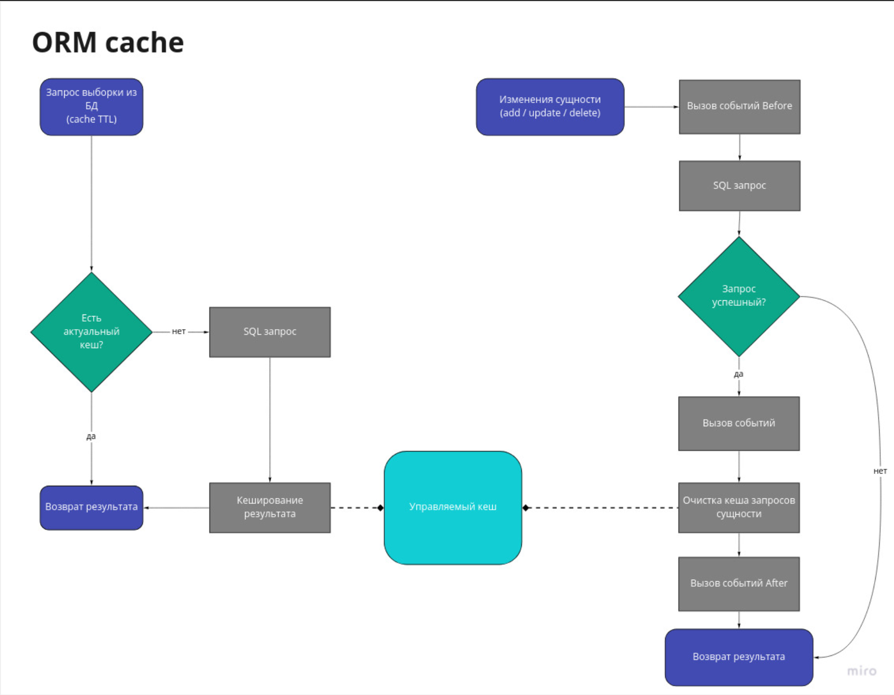
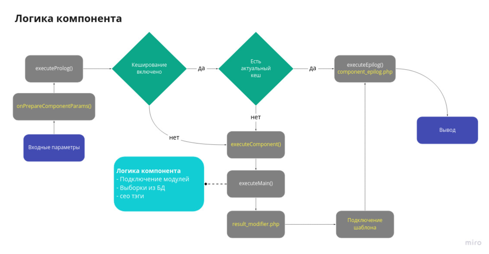

###BITRIX

#### Список ссылок

- [Всё о кешировании в Битрикс: D7, тегированный кеш, кеш в компонентах](https://r-morozov.ru/bitrix/vsjo-o-keshirovanii-v-bitriks-d7-tegirovannyj-kesh-kesh-v-komponentah/)
- [Миграции Phinx в Битрикс](https://varnote.ru/posts/php/bitrix-phinx/)
- [Интеграция Битрикс24 с сайтом - все способы](https://bit-24.ru/blog/integratsii-bitriks24/bitrix24-integration-with-the-site-all-the-ways/)

###BITRIX

* [ ] [Структура проекта - какие папки, откуда init.php, папка local](#Структура-проекта---какие-папки,-откуда-init.php,-папка-local)
* [ ] [Mvc в Bitrix, в других cms](#Mvc-в-Bitrix,-в-других-cms)
* [ ] [Свой модуль, свой компонент](#Свой-модуль,-свой-компонент)
* [ ] [Кэширование в Bitrix](#Кэширование-в-Bitrix)
* [ ] [Порядок выполнения компонента - component, result_modifier, template, кэш, component_epilog](#Порядок-выполнения-компонента---component,-result_modifier,-template,-кэш,-component_epilog)
* [ ] [Таблица b_event](#Таблица-b_event)
* [ ] [D7 Bitrix, что принципиальное новое](#D7-Bitrix,-что-принципиальное-новое)
* [ ] [Распределение прав - можно ли назначить доступ в определенному элементу инфоблока](#Распределение-прав---можно-ли-назначить-доступ-в-определенному-элементу-инфоблока)
* [ ] [Оптимизация работы сайта - как](#Оптимизация-работы-сайта---как)
* [ ] [Миграции](#Миграции)
* [ ] [Интеграция с Bitrix24](#Интеграция-с-Bitrix24)
* [ ] [HL-блоки](#HL-блоки)
* [ ] [Sphinx](#Sphinx)
* [ ] [Многосайтовость](#Многосайтовость)
* [ ] [Композитный сайт](#Композитный-сайт)
* [ ] [Работа с модулем маштабирование](#Работа-с-модулем-маштабирование)
* [ ] [Создание кластерных систем](#Создание-кластерных-систем)

###BITRIX

Система 1С-Битрикс разработана на основе Bitrix Framework. Которая в свою очередь, вроде как основывается на Zend Framework, в официальной документации об этом сказано в скользь. Данный фреймворк построен по принципу Model-View-Controller, написан на PHP и использует в качестве СУБД следующие продукты: MySQL, Oracle, MS SQL.

Логически 1С-Битрикс можно разбить не следующие элементы:

    Модули
    Компоненты
    Шаблон

### Структура проекта - какие папки, откуда init.php, папка local  [&uarr;](#PHP)

Вся система целиком лежит в каталоге /bitrix/, в него входят следующие подкаталоги и файлы:

    /admin/ – административные скрипты;
    /cache/ – файлы кэша;
    /components/ – папка для системных и пользовательских компонентов;
    /js/ – файлы javascript модулей;
    /managed_cache/ – управляемый кеш;
    /modules/ – каталог с модулями системы, каждый подкаталог которого имеет свою строго определённую структуру;
    /php_interface/ – вспомогательный служебный каталог, в него входят следующие каталоги и файлы:
        dbconn.php – параметры соединения с базой;
        init.php – дополнительные параметры портала;
        after_connect.php – подключается сразу же после создания соединения с базой;
        dbconn_error.php – подключается при ошибке в момент создания соединения с базой;
        dbquery_error.php – подключается при ошибке в момент выполнения SQL запроса;
        /ID сайта/init.php – дополнительные параметры сайта; файл подключается сразу же после определения специальной константы c идентификатором сайта – SITE_ID;
    /templates/ – каталог с шаблонами сайтов и компонентов , в него входят следующие подкаталоги:
        /.default/ – подкаталог с общими файлами, используемыми тем или иным шаблоном по умолчанию, структура данного каталога аналогична нижеописанной структуре каталога содержащего конкретный шаблон;
        /ID шаблона сайта/ – подкаталог с шаблоном сайта, в него входят следующие подкаталоги и файлы:
            /components/ – каталог с кастомизированными шаблонами компонентов;
            /lang/ – языковые файлы принадлежащие как данному шаблону в целом, так и отдельным компонентам;
            /images/ – каталог с изображениями данного шаблона;
            /page_templates/ – каталог с шаблонами страниц и их описанием хранящимся в файле .content.php. Когда пользователь создает новую страницу, он может выбрать, по какому шаблону из представленных в этом каталоге это будет сделано;
            header.php – пролог данного шаблона;
            footer.php – эпилог данного шаблона;
            template_styles.css – основной файл стилей для шаблона;
            styles.css – CSS стили шаблона для визуального редактора (вкладка Стили сайта);
    header.php – стандартный файл, подключающий в свою очередь конкретный пролог текущего шаблона сайта; данный файл должен использоваться на всех страницах публичной части;
    footer.php – стандартный файл, подключающий в свою очередь конкретный эпилог текущего шаблона сайта; данный файл должен использоваться на всех страницах публичной части;
    license_key.php – файл с лицензионным ключом;

### Mvc в Bitrix, в других cms  [&uarr;](#PHP)

Сравнивая 1С-Битрикс с шаблоном проектирования Model-View-Controller, можно сказать что:

    Модуль в 1С-Битрикс это модель в MVC.
    Компонент в 1С-Битрикс это контроллер и представление в MVC (компонент с помощью API одного или нескольких модулей манипулирует данными, а  шаблон компонента (представление) выводит данные на страницу).
    Шаблон в 1С-Битрикс это чистое представление в понятии MVC (от него зависит не содержимое сайта а его оформление).

P.S. Это деление условно, т.к. я считаю, что фреймворк Bitrix придерживается технологии MVC не достаточно строго.
Начнем с модулей…
Модули располагаются в /bitrix/modules/, задача каждого из них –  предоставить API для выполнения той или иной функцию для CMS в целом, например: дать возможность хранить и выводить информациювроде статей, новостей, фотогалерей (модуль «информационные блоки»); организовать интернет-магазин(модуль «Интернет-магазин»); гибко управлять ценами на товар и связывать интернет-магазин с 1С:Предприятие и другими сервисами вроде Яндекс.Маркет (модуль «Торговый каталог»); датьвозможность организовать блог (модуль «Блоги»), форум (модуль «Форумы») и т.п. Предоставляемые модулями функции могут использовать как другие модули так и компоненты.

### Свой модуль, свой компонент  [&uarr;](#PHP)

Файлы модуля располагаются в папке /bitrix/modules/ID модуля/. Структура папки:

    admin/ - каталог с административными скриптами модуля;
        menu.php - файл с административным меню модуля;
    classes/ - скрипты с классами модуля;
        general/ - классы модуля, не зависящие от используемой базы данных;
        mysql/ - классы модуля, предназначенные для работы только с MySQL;
        mssql/ - классы модуля, предназначенные для работы только с MS SQL;
        oracle/ - классы модуля, предназначенные для работы только с Oracle;
    lang/ID языка/ - каталог с языковыми файлами скриптов модуля;
    lib/ - каталог с файлами (API: классы, логика) нового ядра D7 (может не присутствовать, если у модуля нет собственных методов);
    install/ - каталог с файлами используемыми для инсталляции и деинсталляции модуля;
        admin/ - каталог со скриптами подключающими административные скрипты модуля (вызывающие скрипты);
        js/ - каталог с js-скриптами модуля. Копируются в /bitrix/js/ID_модуля/;
        db/ - каталог с SQL скриптами для инсталляции/деинсталляции базы данных;
            mysql/ - SQL скрипты для инсталляции/деинсталляции таблиц в MySQL;
            mssql/ - SQL скрипты для инсталляции/деинсталляции таблиц в MS SQL;
            oracle/ - SQL скрипты для инсталляции/деинсталляции таблиц в Oracle;
        images/ - каталог с изображениями используемыми модулем; после инсталляции модуля они должны быть скопированы в каталог /bitrix/images/ID модуля/;
        templates/ - каталог с компонентами 1.0 модуля. (Каталог сохраняется только с целью совместимости версий.);
            ID модуля/ - каталог с основными файлами компонент;
            lang/ID языка/ID модуля/ - в данном каталоге находятся языковые файлы компонент модуля;
        components/пространство имен/имя компонента/ - каталог с компонентами 2.0 модуля;
        themes/имя_модуля/ - содержит css и картинки для стилей административной панели, если модуль в таковых нуждается (Устаревшая, до версии 12.0);
        panel/имя_модуля/ - содержит css и картинки для стилей административной панели, если модуль в таковых нуждается.
        index.php - файл с описанием модуля;
        version.php - файл с номером версии модуля. Версия не может быть равной нулю.
    include.php - данный файл подключается в тот момент, когда речь идет о подключении модуля в коде, в нем должны находиться включения всех файлов с библиотеками функций и классов модуля;
    default_option.php - содержит массив с именем $ID модуля_default_option, в котором заданы значения по умолчанию для параметров модуля;

    Примечание: В случае партнерских модулей, в названии которых содержится точка (пример - mycompany.forum) в имени переменной точка будет автоматически заменена на символ подчеркивания.

    options.php - данный файл подключается на странице настройки параметров модулей в административном меню Настройки;
    prolog.php - файл может подключаться во всех административных скриптах модуля. Обычно в нем определяется константа ADMIN_MODULE_NAME (идентификатор модуля), используемая в панели управления;
    .settings.php - файл настроек модуля, описывающий настройки модуля, которые можно прочитать через \Bitrix\Main\Config\Configuration::getInstance($module).

Реализация логики и способа отображения компонента содержится в двух файлах:

    - В контроллере - www\bitrix\components\bitrix\имя_компонента\component.php
    - И в представление  (так называемый шаблон компонента) - www\bitrix\components\bitrix\имя_компонента\templates\имя_ша­блона_компонента\template.php

Суть работы компонента хорошо описана в официальной документации, повторю их слова еще раз  «компонент (т.е. его контроллер замечание от меня), с помощью API одного или нескольких модулей, манипулирует данными, шаблон компонента выводит данные на страницу».

Компонент в своем составе может иметь несколько шаблонов, один из которых будет активным(указывается при вызове компонента).

Помимо контроллера и представления, компонент имеет файлы, выполняющие более второстепенные задачи: файл – содержимого справки, логотип компонента для админпанели, файл-описание компонента для админпанели и т.п.

Типичная структура компонента выглядит так:

    help (директория, файлы справки компонента, т.е. всплывающие подсказки при настройке компонента)
    images (директория, изображения которые использует компонент)
    lang (директория, содержит подпапки с языковыми файлами)
    templates (директория с шаблонами, т.е. с представлениями)
    .description.php (файл с описанием компонента)
    .parameters.php (файл содержит описание входных параметров компонента, файл нужен только для конфигурирование компонента через окошко)
    component.php (файл (контроллер), основная логика компонента)

### Кэширование в Bitrix  [&uarr;](#PHP)

Простое кеширование - CPhpCache - класс для кеширования PHP переменных и HTML результата выполнения скрипта.

Тегированный кеш - RegisterTag

### Порядок выполнения компонента - component, result_modifier, template, кэш, component_epilog  [&uarr;](#PHP)

### Таблица b_event  [&uarr;](#PHP)

Бывают случаи, когда на сайте есть проблемы с отправкой почты. Перед тем как исправлять ошибку, стоит обратить внимание на очередь писем которые не были отправлены.

Если исправить ошибку с отправкой почты и не почистить очередь писем, в которой, например, может быть 3000 писем, то все эти письма начнут отправляться, и ваши посетители будут в недоумении, типа: "зачем мне пришло письмо о заказе который я оформлял месяц назад?".

Очередь писем в Bitrix можно посмотреть в таблице b_event. Путь к просмотру в админке: Настройки, Производительность, Таблицы.

Если в записях в поле DATE_EXEC ничего не стоит, значит данное письмо еще не обрабатывалось почтовым сервером.

Чтобы удалить все такие письма, нужно сделать SQL запрос. Для этого заходим в Настройки, Инструменты, SQL запрос.

Вставляем команду которая указана ниже и нажимаем кнопку Выполнить запрос.

    delete from `b_event`

После выполнения этой команды таблица будет полностью очищена и соответственно ни одно "левое" письмо не улетит вашим клиентам.

### D7 Bitrix, что принципиальное новое  [&uarr;](#PHP)

В новом ядре:

    изменен жизненный цикл страниц;
    облегчена и сделана более удобной командная разработка;
    добавлена обработка ошибок и исключений;
    единая библиотека классов для выполнения служебных функций;
    улучшена поддержка современных IDE (сред разработки);
    в компоненты добавлена возможность поддержки ООП;
    отказались от использования глобальных переменных;
    одностраничный шаблон;
    быстрые страницы для реализации ajax интерфейса.

Новая ORM система

Появился важный инструмент – ORM (объектно-реляционное отображение), который позволяет структурировать данные и иметь к ним единый интерфейс доступа (единый getList, add, update и т.д.).
Модуль «Highload Инфоблоки»

Модуль «Highload Инфоблоки», созданный на основе ORM с поддержкой NoSQL, распределяет нагрузку и помогает быстро находить нужные данные, не замедляя работу сайта, что важно для ресурсов с высокой посещаемостью.

Особенности нового модуля:

    Модуль позволяет создавать списки для хранения произвольных данных (новости, вакансии), каждый хранится в своих таблицах БД:
        производительность за счет разделения данных по таблицам;
        унифицированное и производительное API по работе с данными за счет новой ORM;
        пользовательские поля.
    Административные страницы:
        создания/изменения списков (создаются таблицы, модифицируются поля, индексы);
        изменение элементов списка.
    Универсальные компоненты.

Библиотека классов

В новой версии доступна библиотека классов, где собраны и категоризированы различные функции. Это значительно облегчает и ускоряет процесс создания и управления сайтом.
Переход на новое ядро
При создании сайта можно будет использовать старое и новое ядро. При этом, переход на новое ядро будет выполняться последовательно, не нанося ущерба работающим сайтам. По переходу на новое ядро будут подготовлены подробные инструкции.

### Распределение прав - можно ли назначить доступ в определенному элементу инфоблока  [&uarr;](#PHP)

1) Если для пользователя нужна отдельная группа, то создаем ее здесь: Настройки->Пользователи->Группы пользователей->Добавить группу

   1.1) Во вкладке Параметры - указываем имя группы и символьный код

   1.2) Во вкладке Доступ - настраиваем права на доступ к модулям проекта. Некоторые самописные модули, могут отсутствовать в этом списке. В таком случае программист в коде должен донастроить модуль:

        1.2.1) В /admin/menu.php добавляем проверку на уровень доступа пользователя к данному модулю. Если прав будет недостаточно, то данный модуль не отобразится в меню. К примеру вот такая проверка: if ($GLOBALS['APPLICATION']->GetUserRight('module.id') < 'R') { return []; }

        1.2.2) Необходимо админу дать возможность настраивать уровень доступа к данному модулю. В таком случае нужно в /install/index.php добавить вот такую переменную в классе-установщике: public $MODULE_GROUP_RIGHTS = 'Y';

2) Создаем нового пользователя тут: Настройки->Пользователи->Список пользователей->Добавить пользователя

   2.1) Во вкладке Пользователь - указываем E-Mail, Логин, пароль и подтверждение пароля.
   2.2) Во вкладке Группы - привязываем пользователя к нужной группе

3) Если была создана новая группа пользователей:

   3.1) вот тут: Контент->Файлы и папки->Bitrix, необходимо группе к которой привязан новый пользователь, дать доступ к папке /admin/. Для этого заходим в настройки папки (в контектсном меню папки - Права на доступ продукта) и даем нашей группе доступ на чтение. Если этого не сделать то пользователь просто не сможет залогиниться.
   3.2) Если необходимо настроить доступ к медиабиблиотеке, то настроить его можно тут: Контент->Медиабиблиотека->Доступ. Даем группе к которой привязан новый пользователь, доступ на чтение либо же доступ на запись.

4) Если необходимо дать новому пользователю, права на чистку кэша:

   4.1) Создать новый уровень доступа вот тут: Настройки->Пользователи->Уровни доступа->Добавить уровень доступа. Далее:
   4.1.1) В поле - Название - пишем любое ассоциативное название уровня доступа.
   4.1.2) В поле - Модуль, выбираем - Главный модуль
   4.1.3) В поле - Буква, пишем букву R
   4.1.4) В поле - Описание, если необходимо, добавляем описание данного уровня доступа.
   4.1.5) Во вкладке - Включаемые операции, активируем неколько чекбоксов(при необходимости, можно активировать и остальные чекбоксы):
   Просмотр своего профиля (view_own_profile)
   Редактирование своего профиля (edit_own_profile)
   Управление кешем (cache_control)

   4.2) Если ранее, подобный уровень доступа был уже создан. То п. 4.1 пропускаем.
   4.3) Заходим во вкладку - Доступ в настройках группы(см. п.1.2) и для модуля - Главный модуль, выбираем новый необходимый уровень доступа, созданный в п.4.1

5) Если на проекте используются инфоблоки:

   5.1) идем в настройки нужного инфоблока: Контент->Инфоблоки->Типы инфоблоков->Название инфоблока
   5.2) во вкладке Доступ, настраиваем доступ группы к которой привязан новый пользователь, к инфоблоку. Эту операцию необходимо проделать для каждого инфоблока, к которому необходимо настроить доступ.

### Оптимизация работы сайта - как  [&uarr;](#PHP)

В зависимости от фреймворка / цмс существуют разные варианты отладочных консолей / дебаг-панелей.

На примере bitrix протестировать производительность можно в админке - /bitrix/admin/perfmon_panel.php?lang=ru Результат запуска теста предоставит нам список наиболее загруженных страниц, среднее время их загрузки и количество запросов на каждый хит.

Оптимизируем каждую из нагруженных страниц, сортируя по количеству запросов и времени их выполнения следующим образом:

    Убираем запросы в цикле (пример ниже)
    В запрашиваемых данных оставляем только нужные. Т.е. в массиве select должны быть указаны только те поля, с котороми работает скрипт
    Если время запроса превышает 0.001 секунду - оптимизируем запрос, думаем над созданием индексов
    Проверяем, настроено ли кэширование и параметры, от которого оно зависит.
    В случае Битрикса можно использовать их запатентованную технологию Автокомпозит, которая сохраняет созданые копии страниц в директорию /bitrix/html_pages/ и при загрузке страницы отдает их, подгружая динамический контент в фоновом режиме. В результате пользователю страница отдается моментально

### Миграции  [&uarr;](#PHP)

Почти в каждом современном PHP фреймворке есть собственная система миграций. Так уж сложилось, что в Битрикс нет никакой возможности модификации структуры базы данных, кроме как делать это в админке.

Выбор пал на Phinx по следующем причинам:

    Он не привязан к фреймворку и может работать как самостоятельный модуль
    В нем есть разделения на миграцию структуры и на миграцию данных (Seeder)
    Имеет удобный builder, а также позволяет использовать ORM Bitrix в миграциях
    Вся настройка сводится к одному php файлу

### Интеграция с Bitrix24  [&uarr;](#PHP)

Виды интеграции заявок и лидов с сайта в Битрикс24
Интеграция с помощью CRM форм Битрикс24
Интеграция с помощью Rest Api
Интеграция сайта на Битрикс с Битрикс24
Интеграция через службу почты — вариант на крайний случай
Интеграция форм CRM и сайта, собранного на конструкторе
Интеграция Битрикс24 с интернет магазином на Битрикс
Интеграция Б24 с интернет-магазином на базе прочих CMS

### HL-блоки  [&uarr;](#PHP)

https://dev.1c-bitrix.ru/learning/course/index.php?COURSE_ID=43&CHAPTER_ID=05745

Поскольку модуль Информационные блоки считается очень "тяжелым" для создания легких справочников или хранения большого количества 
данных (когда модуль может вести себя не очень оптимально), то появилась потребность в создании аналога инфоблоков (модуль Highload-блоки), 
но гораздо проще и "полегче". Новый модуль доступен с версии 14.0 продукта и написан на новом ядре D7. Структура данных этого модуля 
предполагает возможность использования в нагруженных проектах.

Примечание: Highload-блоки и традиционные инфоблоки - это разные вещи. Поэтому нет возможности конвертации традиционных инфоблоков в Highload-блоки. 
Это все равно как конвертировать форум в wiki. Технически можно создать какую-то аналогичную структуру и перенести данные. Но это имеет смысл только 
для конкретного проекта при определенной необходимости.

Highload-блоки - это быстрые справочники, без поддержки иерархии, с ограниченной поддержкой свойств. Они могут обращаться к БД 
в том числе и через HandlerSocket и работать с большими объёмами данных. Highload-блоки хранят элементы в своих таблицах и используют свои индексы.

### Sphinx  [&uarr;](#PHP)

https://dev.1c-bitrix.ru/learning/course/?COURSE_ID=35&LESSON_ID=5935&LESSON_PATH=3906.4507.5935

Внешний полнотекстовый поиск Sphinx позволяет сделать быстрым и качественным поиск на вашем сайте, снизить нагрузку на сервер.
Он доступен в продуктах «1С-Битрикс» с версии 14.0.0 и полностью интегрирован с компонентами модуля Поиск.

### Многосайтовость  [&uarr;](#PHP)

https://dev.1c-bitrix.ru/learning/course/?COURSE_ID=103&LESSON_ID=287

### Композитный сайт  [&uarr;](#PHP)

https://habr.com/ru/post/325926/

По сути, технология «композитный сайт» – это улучшенная версия технологии html-кэширования сайта.

В html-шаблоне сайта можно выделять области статистического и динамического контента. За счет этого вы обеспечите пользователям мгновенный доступ к 
определенной информации на страницах. Статический контент – это такая область на странице, которую видят все посетители. Динамический контент показывается в 
индивидуальном порядке каждому отдельному посетителю. В качестве динамического контента может использоваться форма авторизации, корзина, баннеры и т.п.

При использовании композитного сайта статический контент загружается мгновенно. Посетитель сайта сразу видит содержимое статической области и может 
изучать его и выполнять другие необходимые действия. Динамическая область подгружается постепенно в фоновом режиме и кэшируется в браузере.

Как запустить технологию композитного сайта?

Для начала проверьте, какая версия 1С-Битрикс используется на вашем сайте. Технология композитного сайта доступна для версии 14.5 и выше. При наличии 
более ранней версии вам потребуется обновить программу до актуальной или приобрести продление.

Зайдите в раздел «Настройка продукта». Там вы увидите пункт «Композитный сайт». Чтобы данная технология заработала на вашем сайте, недостаточно ее 
просто включить. Для этого вам потребуется подогнать отдельные страницы под «композитный сайт». Каждый элемент шаблона страницы должен быть адаптирован к 
применению технологии. Если хоть один компонент не будет настроен под «композитный сайт», то технология не будет работать на всей странице.

Для настройки статической области на странице необходимо добавить в шаблон строку следующего вида:

      $this->setFrameMode(true).

Для выделения динамических областей используйте:

      $frame = $this->createFrame()->begin();

      $frame->end().

### Работа с модулем маштабирование  [&uarr;](#PHP)

https://dev.1c-bitrix.ru/learning/course/index.php?COURSE_ID=48&CHAPTER_ID=06644&LESSON_PATH=3918.4635.6644

### Создание кластерных систем  [&uarr;](#PHP)

https://dev.1c-bitrix.ru/learning/course/index.php?COURSE_ID=35&LESSON_ID=3018&LESSON_PATH=3906.6663.4750.3018
