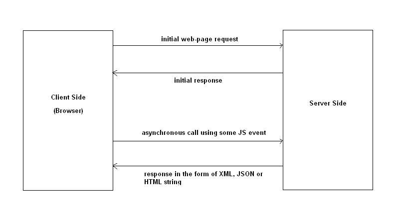

# Readme

JavaScript ↑

Познакомиться с такими понятиями как:

- Переменные
- Типы данных
- Функции
- Рекурсия
- Замыкания
- Область видимости
- Объекты
- События
- DOM

Адаптивный/отзывчивый веб-дизайн ↑

Усвоить понятия:

- Адаптивный веб-дизайн
- Отзывчивый веб-дизайн
- Media queries
- Mobile first
- Graceful degradation
- RESS

JavaScript библиотеки ↑

Цель - познакомиться с наиболее популярными библиотеками JavaScript. Знать где и когда их применять.

Список библиотек:

- jQuery
- ReactJS
- Underscore - набор полезных функций
- Modernizr - обнаруживает HTML5 и CSS3 функции в браузере пользователя
- Babel - компилятор для написания JavaScript следующего поколения
- Three - 3D
- WOW - анимация при прокрутки страницы
- Moment - Работа с датой и временем
- Mocha - написание тестов

Препроцессоры CSS ↑

Усвоить понятия:

- Переменные
- Миксины
- Функции
- Импорт
- Минификация

Список препроцессоров CSS:

- Sass/Scss
- Less
- Stylus

Сборщик проектов ↑

Сборщик проектов — небольшое приложение, которое используется для автоматизации скучных и рутинных задач, которые
приходится постоянно выполнять в процессе разработки проекта. Такие задачи включают в себя, к примеру, запуск модульных
тестов, конкатенацию файлов, минификацию, препроцессинг CSS.

Сборщики проектов:

- Gulp
- Grunt
- Webpack
- Vite

Пакетный менеджер ↑

Список пакетных менеджеров:

- Bower
- npm
- Yarn

CSS фреймворки ↑

Список фреймворков:

- Bootstrap
- Skeleton
- Foundation

JavaScript фреймворки ↑

Существуют разные фреймворки, не нужно изучать всё сразу, необходимо взять несколько фреймворков за основу.

Список фреймворков:

- Angular
- Vue
- Svelte
- Ember

Одностраничное приложение ↑

Одностраничное приложение или SPA (single page application) - сайт или веб-приложение, использующий единственный
HTML-документ как оболочку для всех веб-страниц и организующий взаимодействие с пользователем через динамически
подгружаемые HTML, CSS, JavaScript, обычно посредством AJAX.

Изучить:

- JavaScript фреймворки
- Роутинг
- Шаблонизатор
- API, например REST
- AJAX

Области видимости
Нативный js (селекторы, события)

ООП
Замыкания.
Регулярные выражения
Vue

Long Poling
Short Poling
Sent event

### Ajax [&uarr;](#Other-tasks)

AJAX расшифровывается как асинхронный JavaScript и XML и позволяет асинхронно извлекать контент с внутреннего сервера
без
обновления страницы. Таким образом, он позволяет обновлять содержимое веб-страницы без перезагрузки.

Общий вызов AJAX работает примерно так:

Давайте быстро пройдемся по обычному потоку AJAX:

    1. Сначала пользователь, как обычно, открывает веб-страницу синхронным запросом.
    2. Затем пользователь нажимает на элемент DOM - обычно кнопку или ссылку - который инициирует асинхронный запрос к серверу. Конечный пользователь не заметит этого, поскольку вызов выполняется асинхронно и не обновляет браузер. Однако вы можете распознать эти AJAX-вызовы с помощью такого инструмента, как Firebug.
    3. В ответ на запрос AJAX сервер может вернуть данные строки XML, JSON или HTML.
    4. Данные ответа анализируются с использованием JavaScript.
    5. Наконец, проанализированные данные обновляются в DOM веб-страницы.

### Pjax [&uarr;](#Other-tasks)

PJAX это виджет в Yii2 позволяющий обновлять вам только заданный участок страницы, без перезагрузки всего содержимого.

Pjax это js скрипт, он не связан с сервером и понятия не имеет что там происходит.
Он ждет ответ из которого надо взять контейнер с определенным селектором.
