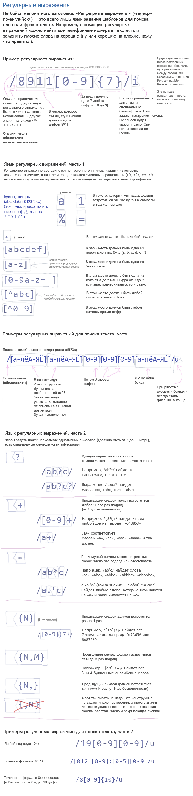
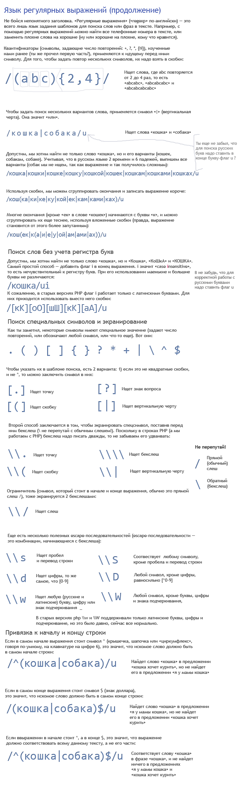
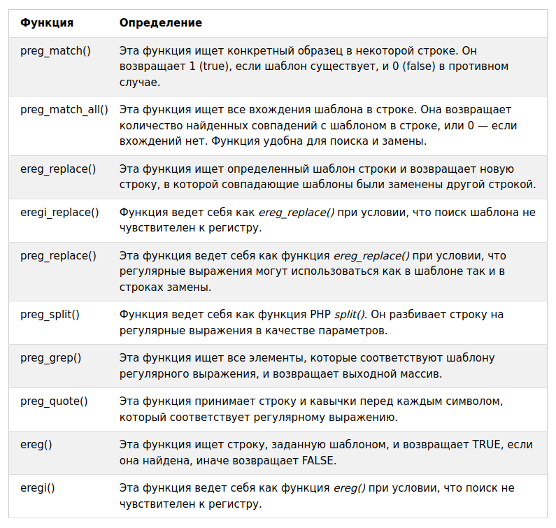

[# Readme

#### Список ссылок

- [Регулярные выражения](https://ru.wikipedia.org/wiki/%D0%A0%D0%B5%D0%B3%D1%83%D0%BB%D1%8F%D1%80%D0%BD%D1%8B%D0%B5_%D0%B2%D1%8B%D1%80%D0%B0%D0%B6%D0%B5%D0%BD%D0%B8%D1%8F)
- [http://archive-ipq-co.narod.ru/l1/regexp.html](http://archive-ipq-co.narod.ru/l1/regexp.html)
- [Regular expression tester with syntax highlighting, explanation, cheat sheet](https://regex101.com/)

- [Жадные и ленивые квантификаторы](https://learn.javascript.ru/regexp-greedy-and-lazy)

### Регулярные выражения [&uarr;](#Other-tasks)

### Функции регулярных выражений в PHP [&uarr;](#Other-tasks)

