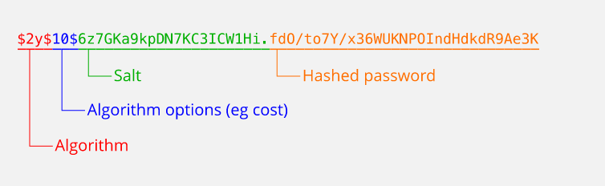

# Readme

### HTTPS [&uarr;](#Readme)

HTTPS (от англ. HyperText Transfer Protocol Secure) – расширение протокола HTTP, которое используется для шифрования и
безопасного обмена данными между пользователем и сайтом. Вся информация шифруется с помощью криптографических протоколов
TSL или его предшественника SSL. Википедия рулит! Если не уходить глубоко в технические подробности, то HTTPS шифрует
данные и не дает возможности их перехватить.

Принципом работы защищённого протокола HTTPS является обмен ключами шифрования. Прежде чем ответить на запрос от
браузера, сервер предъявляет ключ — SSL-certificate. Браузер проверяет подлинность ключа в Центре сертификации. Если
ключ «подошёл», браузер и сервер доверяют друг другу и договариваются о разовом шифре. Так происходит каждую сессию, то
есть каждый раз при обмене запросами и ответами. Вот таким хитрым способом и обеспечивается сохранность данных и
конфиденциальность при обмене информацией.

Как это работает? Как только Вы зашли на сайт, то Ваш браузер получает от сервера сертификат, в котором есть вся
информация о сайте, его владельце, кем выдан и еще много всего. Самое главное, Ваш браузер получает открытый ключ, по
которому он начнет шифровать все данные. На сервере стоит закрытый ключ, с помощью которого можно расшифровать всю
информацию.

Если кто-то захочет перехватить или получить конфиденциальные данные, то он сможет увидеть только набор с непонятных
символов, на расшифровку которых потребуется несколько лет. За это время сертификат устареет, и в итоге злоумышленник
ничего не получит.

#### Зачем нужен SSL-сертификат для сайта

    Чтобы сайт стал работать по протоколу безопасного соединения HТТPS, нужен SSL-сертификат. Это виртуальный документ, который содержит данные об организации, её владельце и подтверждает их существование. Позволяет узнать сервер и подтвердить безопасность сайта.

    Использование сертификата безопасности для сайта гарантирует:

        Подлинность ресурса, к которому обращается пользователь. Это повышает у посетителей уровень доверия.
        Целостность передаваемой информации. При транспортировке от сервера к браузеру данные не изменятся и не потеряются.
        Конфиденциальность. 256-разрядное шифрование исключает доступ злоумышленников к информации.

    Что дает SSL-сертификат для сайта кроме защиты данных? SSL-сертификат помогает в SEO-продвижении проекта — позволяет занять более высокую позицию в поисковой выдаче. Поисковые системы (Google, Яндекс и пр.) дорожат доверием аудитории и выше ранжируют сайты, которые работают через безопасное соединение.

### OWASP-Security-Risks [&uarr;](#Readme)

### CORS [&uarr;](#Readme)

Ошибка в консоли вашего браузера

    No ‘Access-Control-Allow-Origin’ header is present on the requested resource.

    Cross-Origin Request Blocked: The Same Origin Policy disallows reading the remote resource at https://example.com/

    Access to fetch at ‘https://example.com’ from origin ‘http://localhost:3000’ has been blocked by CORS policy.

Это примеры CORS-ошибок.CORS — это невероятно полезный механизм в мире неправильно настроенных веб серверов,
злоумышленников, орудующих в интернете и организаций, продвигающих веб-стандарты.

Если браузер запрашивает тег из источника, который отличается от получателя по схеме, в полностью определенному имени
хоста или порту, то это и есть запрос между различными источниками (cross-origin request).

Источники & cross-origin

Источник идентифицируется следующей тройкой параметров: схема, полностью определенное имя хоста и порт.
Например, <http://example.com> и <https://example.com> имеют разные источники: первый использует схему http, а второй
https. Вдобавок, портом для http по умолчанию является 80, тогда как для https — 443. Следовательно, в данном примере 2
источника отличаются схемой и портом, тогда как хост один и тот же (example.com).

Таким образом, если хотя бы один из трех элементов у двух ресурсов отличается, то источник ресурсов также считается
разным.

CORS — это механизм, который дает контролировать доступ к тегам на веб странице по сети. Механизм классифицируется на
три разные категории доступа тегов:

    - Запись из разных источников
    - Вставка из разных источников 
    - Считывание из разных источников 

Вставки из разных источников — это теги, загружаемые через `<script>, <link>, , <video>, <audio>, <object>, <embed>, <iframe>`
и т.п. Все они разрешены по умолчанию. `<iframe>` выделяется на их фоне, так как он используется для загрузки
другой страницы внутри фрейма. Его обрамление в зависимости от источника может регулироваться посредством использования
заголовка X-Frame-options.

Что касается `` и других вставных тегов, то они устроены так, что сами инициируют запросы из разных источников
cross-origin запроса. Именно поэтому в CORS существует различие между вставкой из разных источников и считыванием из
разных источников.

Считывание из разных источников — это теги, загружаемые через вызовы AJAX/ fetch. Все они по умолчанию заблокированы
вашим браузером. Существует обходной путь для вставки таких тегов на странице, но такие трюки регулируются другой
политикой, которая соблюдается в современных браузерах.

### SSL/TLS [&uarr;](#Readme)

### Content-Security-Policy-(CSP) [&uarr;](#Readme)

### Server-Security [&uarr;](#Readme)

### Хэш-алгоритмы [&uarr;](#Readme)

Хеширование — это преобразование информации с помощью особых математических формул. В результате возникает хеш — отображение
данных в виде короткой строки, в идеале — уникальной для каждого набора информации. Размер строки может быть одинаковым для
информации разного объема.

Хеш — это не закодированная исходная информация. Это скорее уникальная метка, которая генерируется для каждого набора данных
индивидуально. Если захешировать большую книгу и одно слово, получатся хеши одинаковой длины. А если изменить в слове одну букву и снова захешировать полученную строку, новый хеш будет совершенно другим, там не окажется участков, которые повторяли бы предыдущий.

Математические алгоритмы, по которым хешируется информация, называются хеш-функциями. Их название тоже иногда сокращают как «хеш».
Хеш-функций существует очень много, они различаются методами вычислений, назначением, надежностью и другими параметрами.

Кто работает с хешированием

    - IT-специалисты, разработки которых хранят чувствительную конфиденциальную информацию. Например, в веб-разработке хеши обычно нужны для проверки паролей. Вместо них на сервере хранятся хеши, а когда пользователь вводит пароль, тот автоматически хешируется, и хеш сравнивается с сохраненным на сервере.
    - Разработчики, имеющие дело со сложными структурами данных, такими как ассоциативные массивы и хеш-таблицы.
    - Люди, которые имеют дело с криптовалютой. В этой сфере активно используется хеширование как удобный способ проверки подлинности данных. На алгоритмах хеширования во многом построен блокчейн.
    - Этичные хакеры и специалисты по информационной безопасности для обеспечения конфиденциальности данных или, наоборот, для проверки той или иной информации. Например, конкретный вирус можно распознать по характерному хешу.

Для чего нужно хеширование

Основное назначение хеширования — проверка информации. Эта задача важна в огромном количестве случаев: от проверки паролей на сайте
до сложных вычислений в блокчейне. Так как хеш — это уникальный код определенного набора данных, по нему можно понять, соответствует
ли информация ожидаемой. Поэтому программа может хранить хеши вместо образца данных для сравнения. Это может быть нужно для защиты
чувствительных сведений или экономии места.

Вот несколько примеров:

    - вместо паролей на сервере хранятся хеши паролей;
    - антивирус хранит в базе хеши вирусов, а не образцы самих программ;
    - электронная подпись использует хеш для верификации;
    - информация о транзакциях криптовалюты хранится в виде кешей;
    - коммиты в Git идентифицируются по хешу (подробнее про Git и коммиты можно прочесть в нашей статье).

Среди других, менее распространенных примеров использования — поиск дубликатов в больших массивах информации, генерация ID и
построение особых структур данных. Это, например, хеш-таблицы — в них идентификатором элемента является его хеш, и он же определяет
расположение элемента в таблице.

Почему популярные хеширующие функции, такие как md5() и sha1() не подходят для паролей?

    Такие хеширующие алгоритмы как MD5, SHA1 и SHA256 были спроектированы очень быстрыми и эффективными. При наличии современных технологий и оборудования, стало довольно просто выяснить результат этих алгоритмов методом "грубой силы" для определения оригинальных вводимых данных.

    Из-за той скорости, с которой современные компьютеры могут "обратить" эти хеширующие алгоритмы, многие профессионалы компьютерной безопасности строго не рекомендуют использовать их для хеширования паролей.

Если популярные хеширующие функции не подходят, как же я тогда должен хешировать свои пароли?

    При хешировании паролей существует два важных соображения: это стоимость вычисления и соль. Чем выше стоимость вычисления хеширующего алгоритма, тем больше времени требуется для взлома его вывода методом "грубой силы".

    PHP предоставляет встроенное API хеширования паролей, которое безопасно работает и с хешированием и с проверкой паролей.

    Другой возможностью является функция crypt(), которая поддерживает несколько алгоритмов хеширования. При использовании этой функции вы можете быть уверенным, что выбранный вами алгоритм доступен, так как PHP содержит собственную реализацию каждого поддерживаемого алгоритма, даже в случае, если какие-то из них не поддерживаются вашей системой.

    При хешировании паролей рекомендуется применять алгоритм Blowfish, который также используется по умолчанию в API хеширования паролей, так как он значительно большей вычислительной сложности, чем MD5 или SHA1, при этом по-прежнему гибок.

    Учтите, что, если вы используете функцию crypt() для проверки пароля, то вам нужно предостеречь себя от атак по времени, применяя сравнение строк, которое занимает постоянное время. Ни операторы PHP == и ===, ни функция strcmp() не являются таковыми. Функция же password_verify() как раз делает то, что нужно. Настоятельно рекомендуется использовать встроенное API хеширования паролей, если есть такая возможность.

Функции хеширования паролей

    password_algos — Получает доступные идентификаторы алгоритма хеширования пароля
    password_get_info — Возвращает информацию о заданном хеше
    password_hash — Создаёт хеш пароля
    password_needs_rehash — Проверяет, что указанный хеш соответствует заданным опциям
    password_verify — Проверяет, соответствует ли пароль хешу

Что такое соль?

    Криптографическая соль представляет собой данные, которые применяются в процессе хеширования для предотвращения возможности разгадать оригинальный ввод с помощью поиска результата хеширования в списке заранее вычисленных пар ввод-хеш, известном также как "радужная" таблица.

    Более простыми словами, соль - это кусочек дополнительных данных, которые делают ваши хеши намного более устойчивыми к взлому. Существует много онлайн-сервисов, предоставляющих обширные списки заранее вычисленных хешей вместе с их оригинальным вводом. Использование соли делает поиск результирующего хеша в таком списке маловероятным или даже невозможным.

    password_hash() создаёт случайную соль в случае, если она не была передана, и чаще всего это наилучший и безопасный выбор.

Как я должен хранить свою соль?

    При использовании функции password_hash() или crypt(), возвращаемое значение уже содержит соль как часть созданного хеша. Это значение нужно хранить как есть в вашей базе данных, так как оно содержит также информацию о хеширующей функции, которая использовалась, и может быть непосредственно передано в функции password_verify() или crypt() при проверке пароля.

    Следующая диаграмма показывает формат возвращаемого значения функциями crypt() или password_hash(). Как можно видеть, они содержат полную информацию об алгоритме и соли, требуемых для будущей проверки пароля. 

