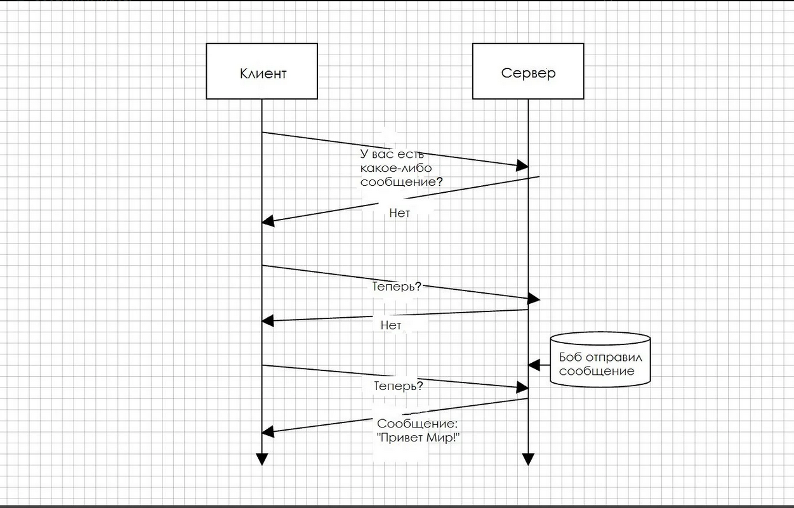
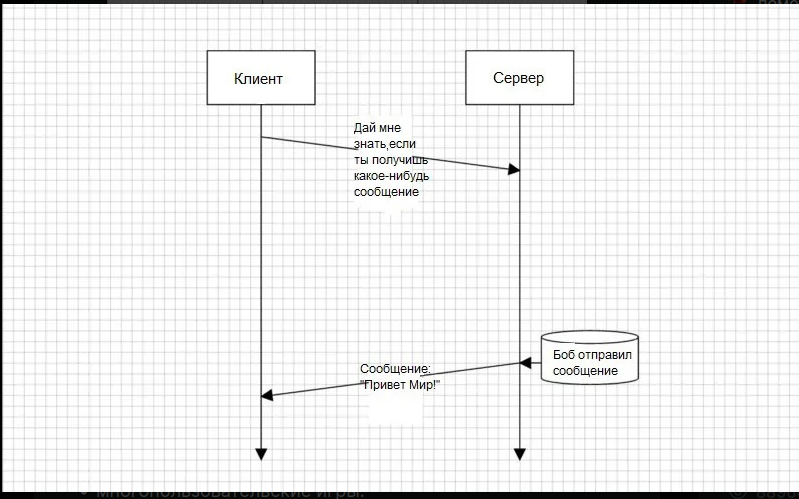

# Readme

### Web сокеты [&uarr;](#Other-tasks)

Веб-сокеты (Web Sockets) — это передовая технология, которая позволяет создавать интерактивное соединение между клиентом
(браузером) и сервером для обмена сообщениями в режиме реального времени. Веб-сокеты, в отличие от HTTP, позволяют работать с
двунаправленным потоком данных, что делает эту технологию совершенно уникальной.

Как работает HTTP?

Браузер постоянно спрашивает у сервера, есть ли для него новые сообщения, и получает их.

Как работают веб-сокеты?

Веб-сокетам же для ответа не нужны ваши повторяющиеся запросы. Достаточно выполнить один запрос и ждать отклика. Вы можете просто слушать сервер, который будет отправлять вам сообщения по мере готовности.

Веб-сокеты можно использовать, если вы разрабатываете:

    приложения реального времени;
    чат-приложения;
    IoT-приложения;
    многопользовательские игры.

Когда следует избегать использования веб-сокетов?

    Практически никогда. Единственный минус — это несовместимость с некоторыми браузерами, но уже 95 % браузеров поддерживают 
    веб-сокеты.

    В некоторых случаях веб-сокеты вам всё же не понадобятся. Если вы создаёте простую CMS, вам вряд ли пригодится функциональность 
    в режиме реального времени. 
    
    Также не стоит использовать веб-сокеты в REST API, поскольку вам хватит таких HTTP-запросов, как GET, POST, DELETE и PUT.

Эквивалент в HTTP

    Так как HTTP должен постоянно проверять канал на наличие новых сообщений, можно использовать «грязную» проверку 
    (dirty check) — подход, при котором клиент с заданной периодичностью (допустим, каждые 200 мс) проверяет наличие новых 
    сообщений на сервере.
    
    Чтобы не вникать в XMLHttpRequest, можно использовать библиотеку Axios. Она декларативна и очень понятна.

