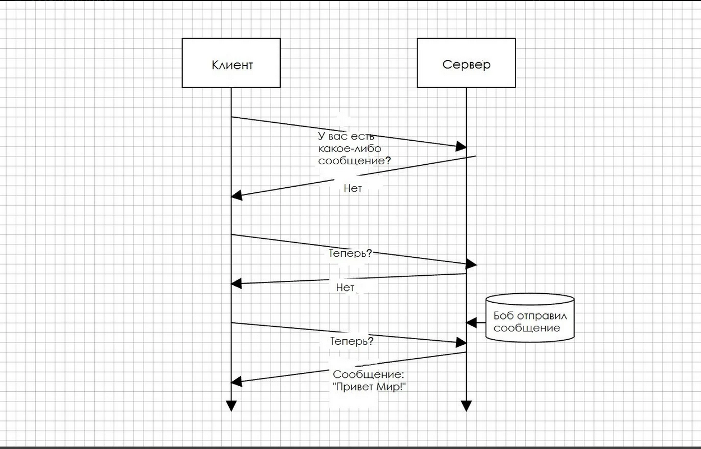
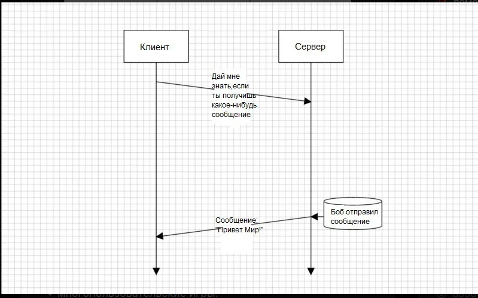

#Other-tasks

### принципиальное различие скриптовых и “обычных” языков

Скриптовый язык программирования — язык программирования, разработанный для записи «сценариев»,
последовательностей операций, которые пользователь может выполнять на компьютере.
Интерпертируется с помощью интерпретатора. Имеет динамическую типизацию.

Интерпретация — пооператорный (покомандный, построчный) анализ, обработка и тут же выполнение исходной программы
или запроса (в отличие от компиляции, при которой программа транслируется без её выполнения)[2][3][4].

### почтовые протоколы
Протоколы электронной почты — это правила, по которым почта отправителя письма взаимодействует с почтой получателя.

Есть три вида протоколов — IMAP, POP3, SMTP. HTTP не относится к протоколам электронной почты, но может использоваться, чтобы отобразить веб-версию почты.

Протокол SMTP больше подходит для отправки массовых рассылок. POP3 — если размер почтового сервера ограничен. IMAP — если необходимо синхронизировать почту с другими устройствами.

Какие протоколы электронной почты существуют:

#### POP3

Почтовый протокол POP3 не хранит письма на сервере, а загружает их копии на устройства: компьютер, ноутбук или смартфон. 
После скачивания копий писем протокол удаляет оригиналы с сервера. Получается, что письма на сервере не остаются, и если 
вдруг письмо по ошибке будет удалено с устройства, скачать его заново не получиться.

При этом перенесённые письма можно смотреть в любой момент без доступа к интернету. Это выгодно, если на связь установлен лимит.

Этот протокол электронной почты имеет простой интерфейс, который на все запросы отвечает OK, что значит «всё в порядке», либо ERR, если произошла ошибка.

Протокол использует два порта: 110 — для получения незашифрованных писем, 995 — для зашифрованных. 
Зашифрованные письма позволяют избежать взлома почты.

Это работает так:

    Пользователь, который получает письмо, подключается к серверу при помощи порта 110 или 995.
    Загружает все полученные письма на своё устройство.
    Просматривает сообщения, удаляет ненужные.
    Отключается от входящего сервера.

#### IMAP

При использовании протокола передачи электронной почты IMAP письма не удаляются с сервера, а продолжают храниться на нём. 
Письма можно прочитать не скачивая с любого устройства, подключённого к интернету.

IMAP скачивает сообщение на устройства, только если по ним кликнуть. Перед выгрузкой письма можно отфильтровать и выгрузить не все,
а только необходимые. При этом на устройство загрузится только текст письма. Чтобы посмотреть вложения, нужно подключиться к 
интернету и открыть письмо в почтовом клиенте.

IMAP использует систему флагов, которые помечают письма как прочитанные, важные, недавние и так далее. Вот некоторые флаги:

    \seen — письмо прочитано;
    \answered — на письмо отправлен ответ;
    \draft — письмо не закончено и является черновиком;
    \flagged — письмо имеет отметку «срочное».

Порты

Порт 143 работает по умолчанию. Он позволяет принимать незашифрованные письма. Порт 993 используется для безопасного подключения 
к электронной почте.

Это работает так:

    Сервер получателя отправляет серверу отправителя сообщение, что он готов принимать письма.
    Пользователь-отправитель проходит авторизацию в почтовом клиенте — указывает имя и пароль.
    Сервер отправителя получает сообщение, что пользователь прошёл аутентификацию.
    Дальше пользователь выбирает папку, с которой хочет работать.
    После выбора папки сервер получает сообщение, что за папку пользователь выбрал, и может приступить к выполнению различных действий с письмами.

#### SMTP

Протокол SMTP применяют для пересылки множества сообщений между сервером-отправителем и сервером-получателем. 
Приём писем происходит через специальный набор команд.

В тело письма нельзя вставить изображения: SMTP может передавать только текстовый контент. Однако можно добавить изображение 
как вложение.

Перед отправкой сообщения протокол SMTP устанавливает предварительное соединение с получателем, что позволяет быстро доставить 
письмо. Если сообщение не может быть доставлено, отправитель получает отчёт об ошибке.

Сообщения

    HELO — команда, которая начинает диалог между двумя серверами — отправителем и получателем;
    EHELLO — команда, которые указывает, что сервер отправителя хочет использовать расширенный протокол SMTP;
    MAIL FROM — команда, которая указывает на адрес отправителя;
    RCPT TO — команда, которая определяет, кто получит письмо;
    VRFY — команда, которая используется принимающим сервером, чтобы проверить, является ли имя пользователя действительным или нет.

Порты

SMTP по умолчанию использует порт 25. При необходимости отправлять незашифрованные сообщения — порт 2525. Если нужно отправлять 
письмо в безопасном режиме — порт 465.

Работает так:

    Сервер получателя письма проверяет настройки сервера отправителя. Если настройки в порядке, даёт разрешение на отправку.
    Сервер отправителя соединяется с сервером получателя и отправляет письмо.
    Сервер получателя подтверждает успешную доставку. Если письмо вдруг не дошло, отправляет сообщение об ошибке.

#### HTTP

Этот протокол используется для обмена данными в интернете. Он не предназначен для связи по электронной почте, но его можно 
использовать, чтобы получить доступ к веб-версии почтового ящика.

Работает HTTP так:

    Чтобы отобразить веб-страницу почты, браузер отправляет запрос на сервер, где «лежит» HTML-документ этой страницы.
    После ответа сервера браузер изучает HTML-документ и при необходимости запрашивает дополнительные файлы — скрипты, таблицы стилей, дополнительные ресурсы.
    Браузер соединяет все документы в одном окне и отображает единую веб-страницу.

Hotmail — пример использования HTTP в качестве протокола электронной почты.

Какой почтовый протокол лучше выбрать:

Протокол SMPT подходит для массовой отправки электронных писем. Если нет задачи отправлять рассылку, то лучше выбирать 
между POP3 и IMAP.

Если размер почтового сервера ограничен, выгоднее использовать POP3. В итоге сообщения не будут занимать место: они будут 
удаляться с сервера, как только письма будут перенесены на компьютер.

Если нужно синхронизировать почту с другими устройствами, есть смысл выбрать IMAP.

### JWT

JWT – это открытый стандарт для передачи пакетов между сторонами в веб-среде. Он используется для шифрования и передачи 
данных авторизованных пользователей между поставщиком идентификации (ваш корпоративный веб-сайт) и поставщиком услуг.

Простыми словами, JWT — это лишь строка в следующем формате header.payload.signature.
Предположим, что мы хотим зарегистрироваться на сайте. В нашем случае есть три участника — пользователь user, сервер 
приложения application server и сервер аутентификации authentication server. Сервер аутентификации будет обеспечивать 
пользователя токеном, с помощью которого он позднее сможет взаимодействовать с приложением.

Приложение использует JWT для проверки аутентификации пользователя следующим образом:

    1. Сперва пользователь заходит на сервер аутентификации с помощью аутентификационного ключа (это может быть пара логин/пароль, либо Facebook ключ, либо Google ключ, либо ключ от другой учетки).
    2. Затем сервер аутентификации создает JWT и отправляет его пользователю.
    3. Когда пользователь делает запрос к API приложения, он добавляет к нему полученный ранее JWT.
    4. Когда пользователь делает API запрос, приложение может проверить по переданному с запросом JWT является ли пользователь тем, за кого себя выдает. В этой схеме сервер приложения сконфигурирован так, что сможет проверить, является ли входящий JWT именно тем, что был создан сервером аутентификации (процесс проверки будет объяснен позже более детально).

### прокси сервера

Прокси-сервер — это дополнительное звено между вами и интернетом. Некий посредник, который отделяет человека от посещаемого сайта.
Создает условия, при которых сайт думает, что прокси — это и есть реальный человек. Только не вы.

Такие посредники довольно многофункциональны и используются в нескольких сценариях:

    - Для обеспечения конфиденциальности. Чтобы сайты не знали, кто именно их посещает.
    - Для повышения уровня безопасности при выходе в сеть. Базовые атаки будут направлены именно на прокси.
    - Еще он нужен, чтобы получать доступ к контенту, который существует только в определенной локации.
    - Чтобы ускорить доступ к некоторым ресурсам в интернете.
    - Ну и для того, чтобы получить доступ к заблокированным страницам. Сайтам, мессенджерам и так далее.

Все за счет того, что прокси подменяет IP-адрес, а трафик проходит через дополнительный сервер, на котором могут быть 
кэшированные данные или организованы дополнительные механизмы защиты данных.

Так как proxy-сервера отвечают за подмену IP, стоит немного пояснить, что он вообще делает и почему замена IP-адреса решает 
вышеописанные проблемы с доступом к сайтам и сервисам.

    - IP-адрес говорит сайтам и веб-приложениям, где вы находитесь. Что ставит под угрозу конфиденциальность и безопасность.
    - Его же используют, чтобы блокировать доступ к контенту. Зачастую на основе физического расположения.

Поэтому люди используют proxy и прячутся за посторонними адресами, чтобы избегать блокировок и не так сильно светиться в 
интернете. Но опять же есть исключения, когда proxy-сервер в открытую делится данными о пользователе с сайтом и используется 
только для ускорения передачи запросов.

VPN обеспечивает большую конфиденциальность и безопасность, чем прокси-сервер, поскольку направляет трафик через защищенный 
VPN-сервер и шифрует его. Прокси-сервер просто направляет трафик через промежуточный сервер, не обязательно обеспечивая при 
этом дополнительную защиту.

### Асинхронность, конкурентность, параллельность, многопоточность в PHP

Если кратко, то асинхронное выполнение кода - это возможность некий блок кода (иначе говоря, "задачу") выполнить не в заранее заданном порядке, а в порядке, который зависит от.

От чего? От внешних условий: от наступления определенного события или, к примеру, наступления момента времени.

Самый простой пример, который можно привести, это, конечно, знаменитая функция setTimeout из JS

Корутины
Файберы

### Ajax

AJAX расшифровывается как асинхронный JavaScript и XML и позволяет асинхронно извлекать контент с внутреннего сервера без 
обновления страницы. Таким образом, он позволяет обновлять содержимое веб-страницы без перезагрузки.

Общий вызов AJAX работает примерно так:

Давайте быстро пройдемся по обычному потоку AJAX:

    1. Сначала пользователь, как обычно, открывает веб-страницу синхронным запросом.
    2. Затем пользователь нажимает на элемент DOM - обычно кнопку или ссылку - который инициирует асинхронный запрос к серверу. Конечный пользователь не заметит этого, поскольку вызов выполняется асинхронно и не обновляет браузер. Однако вы можете распознать эти AJAX-вызовы с помощью такого инструмента, как Firebug.
    3. В ответ на запрос AJAX сервер может вернуть данные строки XML, JSON или HTML.
    4. Данные ответа анализируются с использованием JavaScript.
    5. Наконец, проанализированные данные обновляются в DOM веб-страницы.

### Pjax

PJAX это виджет в Yii2 позволяющий обновлять вам только заданный участок страницы, без перезагрузки всего содержимого.

Pjax это js скрипт, он не связан с сервером и понятия не имеет что там происходит. 
Он ждет ответ из которого надо взять контейнер с определенным селектором.

### yield

Генератор в целом выглядит как обычная функция, за исключением того, что вместо возвращения одного значения, генератор будет 
перебирать столько значений, сколько необходимо. Любая функция, содержащая yield, является функцией генератора.

Когда вызывается генератор, он возвращает объект, который можно итерировать. Когда вы итерируете этот объект 
(например, в цикле foreach), PHP вызывает методы итерации объекта каждый раз, когда вам нужно новое значение, после чего 
сохраняет состояние генератора и при следующем вызове возвращает следующее значение.

Когда все значения в генераторе закончились, генератор просто завершит работу, ничего не вернув. После этого основной код 
продолжит работу, как если бы в массиве закончились элементы для перебора.

В самом простом варианте оператор "yield" можно рассматривать как оператор "return", за исключением того, что вместо прекращения 
работы функции, "yield" только приостанавливает её выполнение и возвращает текущее значение, и при следующем вызове функции она 
возобновит выполнения с места, на котором прервалась.

Польза yield не в экономии памяти, а в более красивом коде, который и память экономит, и позволяет инкапсулировать детали реализации.

foreach c генератором - это всего лишь красивая обёртка для цикла

    for ($i = 1; $i < 800000; $i++) {
        echo $i;
    }

Всю работу делает этот цикл. Генератор просто позволяет "вывернуть его наизнанку", и обращаться к получаемым в цикле значениям 
не внутри, а "снаружи".

Отсюда и практическое применение генератора: оно не в "экономии памяти", а в использовании foreach. Везде, где foreach удобнее 
while или for, генератор будет предпочтительнее. Он позволяет писать более красивый, и - главное - более универсальный код. 
К примеру мы пишем обработчик каких-то данных, причем источник этих данных может быть совершенно разным - это может быть массив,
или текстовый файл, или база данных.

Без генератора нам придется либо вторые два источника приводить к массиву, тратя память, либо дублировать код три раза, поскольку
мы должны будем поместить его внутри цикла.

А генератор позволит обращаться ко всем трем источникам через foreach, то есть код можно будет написать только один раз.

С помощью генераторов удобно писать `бесконечные` итераторы всяких последовательностей - к примеру, четных чисел, когда каждое п
оследующее обращение к генератору будет возвращать следующий элемент из последовательности. Такое себе вычисление по-требованию, 
то есть "ленивое".

Пример #1 Простой пример выдачи значений

    <?php
    function gen_one_to_three() {
        for ($i = 1; $i <= 3; $i++) {
            // Обратите внимание, что $i сохраняет своё значение между вызовами.
            yield $i;
        }
    }
    
    $generator = gen_one_to_three();
    foreach ($generator as $value) {
        echo "$value\n";
    }
    ?>
    
Результат выполнения данного примера:
    
    1
    2
    3

Пример #2 Парсим большие csv (построчный перебор)

    <?php
    function getRows($file) {
        $handle = fopen($file, 'rb');
        if ($handle === false) {
            throw new Exception();
        }
        while (feof($handle) === false) {
            yield fgetcsv($handle);
        }
        fclose($handle);
    }
    
    foreach (getRows('data.csv') as $row) {
        print_r($row);
    }

### short-polling, long-polling, websockets и Sent event

Очень часто встречается вопрос о том, как же работают уведомления/чаты в ВК или других высоконагруженных проектах? 
Ведь такие уведомления приходят мгновенно и, если использовать обычный AJAX, то сервер достаточно быстро упадет. 
Эта статья поможет прояснить, какие существуют способы реализации данного функционала.

#### Обычный HTTP запрос
Для начала вспомним, как вообще идет HTTP запрос при обычной работе:

    1. Клиент посылает запрос на веб-страницу к серверу.
    2. Сервер формирует ответ.
    3. Сервер посылает ответ клиенту.

Как видим, общение между хостом и клиентом происходит в два этапа: запрос (client pull) и ответ (server push). 
Клиент формирует HTTP запрос, в ответ на который сервер отдаёт данные. Учитывая такой алгоритм работы, возникает идея как можно 
чаще опрашивать наш сервер, чтобы получать свежие данные и как можно быстрее отдавать клиенту информацию.

#### Периодические запросы (polling)

Первое решение, которое приходит в голову для непрерывного получения событий с сервера – polling, т.е периодические запросы на 
сервер: «эй, я тут, изменилось ли что-нибудь?». Например, раз в 10 секунд.

В ответ сервер во-первых помечает у себя, что клиент онлайн, а во-вторых посылает сообщение, в котором в специальном формате 
содержится весь пакет событий, накопившихся к данному моменту. Для этого обычно используют подход, который называется AJAX.

#### Простые запросы (short-polling или просто AJAX)

Алгоритм работы: запрос → ответ

    Отправляем запрос на сервер.
    Получаем немедленный ответ.
    Повторяем это действие каждые X секунд/минут/etc., чтобы получать актуальные данные для приложения (setInterval).

Такой подход подразумевает большое количество запросов на сервер. Это создаёт определённую нагрузку на сетевой трафик. 
Ресурсы сервера нагружаются только во время запроса, но выгружаются как только был отдан ответ.

Плюсы:

    - Простота реализации. Причём, простота реализации тут достаточно условная. Клиентская часть – довольно проста, а вот сервер получает сразу большой поток запросов. Даже если клиент ушёл пить чай – его браузер каждые 10 секунд будет «долбить» сервер запросами. Готов ли сервер к такому?

Минусы:

    - Лишний входящий трафик на сервер. При каждом запросе браузер передает множество заголовков и в ответ получает, кроме данных, также заголовки. Для некоторых приложений трафик заголовков может в 10 и более раз превосходить трафик реальных данных.
    - Задержки между событием и уведомлением. Сервер отсылает данные не тогда, когда они появились, а когда прилетит новый запрос.
    - Серверу приходится хранить события пока клиент не заберет их или пока они не устареют. Это можно перекрыть, добавив кеширующий слой типа Varnish (потребуется больше памяти).

#### Длинные запросы (long-polling)

Алгоритм работы: запрос → ожидание → ответ

    1. Отправляем запрос на сервер.
    2. Соединение не закрывается сервером, пока не появится сообщение.
    3. Когда сообщение появилось – сервер отвечает на запрос, пересылая данные.
    4. Браузер тут же делает новый запрос.

Улучшенный вариант предыдущего метода. Клиент отправляет запрос на сервер, сервер держит открытое соединение (thread) пока не 
придут какие-нибудь данные или клиент не отключится самостоятельно. Как только данные пришли — отправляется ответ и соединение 
закрывается, открывается следующее и так далее.

Если сравнивать этот подход с простыми запросами, то на его примере можно увидеть, что short-polling усиленно гоняет трафик, 
но за те 3 секунды вы используете всего лишь 1,5 сек. процессорного времени — а это значит, что параллельно между запросами 
и ответами вы можете запускать что-то ещё.

В случае с long-polling'ом, процессорное время будет использовано всё время, пока thread активен. И тут уже необходимо 
рассчитывать серверные ресурсы.

Плюсы:

    - Минимальное количество запросов. Не нужно постоянно «долбать» сервер запросами.
    - Realtime-отдача данных.

Минусы:

    - Потребляет больше серверных ресурсов. Нагрузка существенно увеличивается, если входящие данные имеют большой размер.

#### Область применения

Периодические запросы отлично работают в тех случаях, когда сообщения приходят редко.

При большом количестве частых сообщений (много пользователей — много диалогов) график приёма-отправки, приведённый выше, 
превращается в «пилу». Каждое сообщение – это новый запрос, дополнительный трафик заголовков.

В этих случаях используются другие способы получения данных, подразумевающие непрерывное соединение с сервером.

#### WebSockets

Алгоритм работы: клиент ↔ сервер

WebSockets — это бинарный дуплексный протокол, позволяющий клиенту и серверу общаться на равных. Типичная схема работы выглядит так:

    1. Отправляем запрос на сервер.
    2. Запрошенная страница выполняет JS, который открывает соединение с сервером.
    3. Сервер и клиент могут посылать друг другу сообщения, когда новая информация доступна (либо на сервере, либо на клиенте).

Создается TCP соединение с сервером и сохраняется открытым столько, сколько требуется. Сервер или клиент могут легко закрыть его.
При подключении происходит так называемое "рукопожатие" (handshaking), т.е. клиентом отсылаются специальные заголовки, которые 
шифруются посредством base64. Если серверу всё понравилось, то он вернет заголовоковок Accept. Следует помнить, что клиентское 
рукопожатие всегда будет иметь заголовок Origin, который будет отправлен на сервер, хотят они принимать клиентов с различных 
источников или нет.

После установки соединения сервер и клиент могут посылать друг другу сообщения, когда новая информация доступна (либо на сервере,
либо на клиенте) - в обоих направлениях в любое время. Это очень эффективно, если приложение требует частого обмена данными в 
обоих направлениях: можно применять для игр, чатов и всех тех приложений где вам нужны предельно точные события близкие к 
реальному времени.

Плюсы по сравнению с polling:

    - Поднимается одно соединение
    - Предельно высокая временная точность событий
    - Управление сетевыми сбоями контролирует браузер

Минусы:

    - Не совместимый с HTTP протокол, нужен свой отдельный сервер, усложняется отладка.
    - Не поддерживается Opera-Mini и некоторыми другими старыми браузерами.

#### Server-Sent Events (SSE)

Современный стандарт Server-Sent Events позволяет браузеру создавать специальный объект EventSource, который сам обеспечивает
соединение с сервером, делает пересоединение в случае обрыва и генерирует события при поступлении данных.

Клиент отправляет запрос на сервер, сервер в ответ отправляет следующий заголовок:

    Content-Type: text/event-stream

И не закрывает соединение. Вот и все — SSE работает! Чтобы отправить клиенту какие-то данные, сервер просто пишет в сокет 
строку следующего формата:

    data: My message\n\n

Если необходимо отправить несколько строк данных, то формат будет следующим:

    data: {\n
    data: "msg": "hello world",\n
    data: "id": 12345\n
    data: }\n\n

SSE спроектирован иначе, чем WebSockets: WebSocket умеет слать сообщения в обе стороны (клиент ↔ сервер), Server-Sent-Events 
только в одну (клиент ← сервер).

С другой стороны, SSE проще в реализации, работает по обычному протоколу HTTP и сразу поддерживает ряд возможностей, которые для 
WebSockets ещё надо реализовать.

Поэтому в тех случаях, когда нужна преимущественно односторонняя передача данных от сервера к браузеру, они могут быть удачным 
выбором.

### Web сокеты

Веб-сокеты (Web Sockets) — это передовая технология, которая позволяет создавать интерактивное соединение между клиентом
(браузером) и сервером для обмена сообщениями в режиме реального времени. Веб-сокеты, в отличие от HTTP, позволяют работать с
двунаправленным потоком данных, что делает эту технологию совершенно уникальной.

Как работает HTTP?

Браузер постоянно спрашивает у сервера, есть ли для него новые сообщения, и получает их.

Как работают веб-сокеты?

Веб-сокетам же для ответа не нужны ваши повторяющиеся запросы. Достаточно выполнить один запрос и ждать отклика. Вы можете просто слушать сервер, который будет отправлять вам сообщения по мере готовности.

Веб-сокеты можно использовать, если вы разрабатываете:

    приложения реального времени;
    чат-приложения;
    IoT-приложения;
    многопользовательские игры.

Когда следует избегать использования веб-сокетов?

    Практически никогда. Единственный минус — это несовместимость с некоторыми браузерами, но уже 95 % браузеров поддерживают 
    веб-сокеты.

    В некоторых случаях веб-сокеты вам всё же не понадобятся. Если вы создаёте простую CMS, вам вряд ли пригодится функциональность 
    в режиме реального времени. 
    
    Также не стоит использовать веб-сокеты в REST API, поскольку вам хватит таких HTTP-запросов, как GET, POST, DELETE и PUT.

Эквивалент в HTTP

    Так как HTTP должен постоянно проверять канал на наличие новых сообщений, можно использовать «грязную» проверку 
    (dirty check) — подход, при котором клиент с заданной периодичностью (допустим, каждые 200 мс) проверяет наличие новых 
    сообщений на сервере.
    
    Чтобы не вникать в XMLHttpRequest, можно использовать библиотеку Axios. Она декларативна и очень понятна.

### хэширование

### Регулярные выражения

