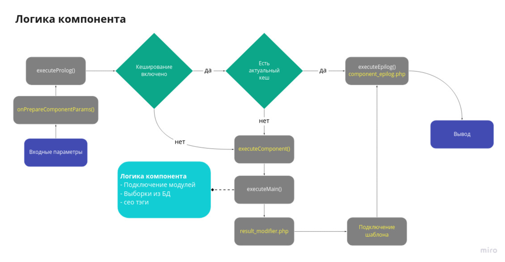

#PHP

###OTHER

* [PHP versions](#PHP-versions-)
* [Reflection API](#Reflection-API-)
* [Что такое PEAR и PECL?](#Что-такое-PEAR-и-PECL?)
* [Обработка ошибок](#Обработка-ошибок)
* [Типы данных в PHP](#Типы-данных-в-PHP)
* [Псевдотипы](#Псевдотипы)
* [Анонимные функции, замыкания](#Анонимные-функции,-замыкания)
* [Назовите 5 различных функций для работы с массивами.](#Назовите-5-различных-функций-для-работы-с-массивами.)
* [Функции сортировки массивов - несколько штук](#Функции-сортировки-массивов---несколько-штук)
* [!empty() vs isset()](#!empty()-vs-isset())
* [отличие include от require.](#отличие-include-от-require.)

###ПРОЕКТИРОВАНИЕ

* [Что такое MVC и какие преимущества его использования?](#Что-такое-MVC-и-какие-преимущества-его-использования?-)
* [логика в контроллере, должна ли быть и почему](#логика-в-контроллере,-должна-ли-быть-и-почему)

###СТРУКТУРЫ ДАННЫХ

* [SPL классы](#SPL-классы)
* [Какие структуры данных вы знаете?](#Какие-структуры-данных-вы-знаете?-)
* [Разница стэка и очереди.](#Разница-стэка-и-очереди.)

###DB

* [Знакомы ли с ORM, ActiveRecord?](#Знакомы-ли-с-ORM,-ActiveRecord?)
* [что такое PDO и подготовленные запросы](#что-такое-PDO-и-подготовленные-запросы)

###ООП

* [3 принципа ООП.](#3-принципа-ООП.)
* [Особенности ООП в PHP.](#Особенности-ООП-в-PHP.)
* [Области видимости](#Области-видимости)
* [Чем интерфейс отличается от абстрактного класса?](#Чем-интерфейс-отличается-от-абстрактного-класса?)
* [Несколько конструкторов в классе](#Несколько-конструкторов-в-классе)
* [Трейты - зачем](#Трейты---зачем)
* [Можно ли сделать множестенное наследование в PHP](#Можно-ли-сделать-множестенное-наследование-в-PHP)
* [Статические свойства и методы](#Статические-свойства-и-методы)

###HIGHLOAD

* [Какие Вы знаете технологии повышения производительности PHP?](#Какие-Вы-знаете-технологии-повышения-производительности-PHP?)

###PATTERNS

* [Паттерны, антипаттерны](#Паттерны,-антипаттерны)
* [Какие паттерны использовали в работе?](#Какие-паттерны-использовали-в-работе?)

###ALGORITMS

* [Алгоритмы. Какие использовал?](#Алгоритмы.-Какие-использовал?)

###BITRIX

* [Структура проекта - какие папки, откуда init.php, папка local](#Структура-проекта---какие-папки,-откуда-init.php,-папка-local)
* [Mvc в Bitrix, в других cms](#Mvc-в-Bitrix,-в-других-cms)
* [Свой модуль, свой компонент](#Свой-модуль,-свой-компонент)
* [Кэширование в Bitrix](#Кэширование-в-Bitrix)
* [Порядок выполнения компонента - component, result_modifier, template, кэш, component_epilog](#Порядок-выполнения-компонента---component,-result_modifier,-template,-кэш,-component_epilog)
* [Таблица b_event](#Таблица-b_event)
* [D7 Bitrix, что принципиальное новое](#D7-Bitrix,-что-принципиальное-новое)
* [Распределение прав - можно ли назначить доступ в определенному элементу инфоблока](#Распределение-прав---можно-ли-назначить-доступ-в-определенному-элементу-инфоблока)
* [Оптимизация работы сайта - как](#Оптимизация-работы-сайта---как)
* [Миграции](#Миграции)
* [Интеграция с Bitrix24](#Интеграция-с-Bitrix24)

#OTHER

### PHP versions [&uarr;](#PHP)

PHP 5

Пятая версия PHP была выпущена разработчиками 13 июля 2004 года. Изменения включают обновление ядра Zend (Zend Engine 2), что существенно 
увеличило эффективность интерпретатора. Введена поддержка языка разметки XML. Полностью переработаны функции ООП, которые стали во многом 
схожи с моделью, используемой в Java. В частности, введён деструктор, открытые, закрытые и защищённые члены и методы, окончательные члены и 
методы, интерфейсы и клонирование объектов. Нововведения, однако, были сделаны с расчётом сохранить наибольшую совместимость с кодом на 
предыдущих версиях языка. На данный момент последней стабильной веткой является PHP 5.6, которая содержит ряд изменений и дополнений:

    Увеличена скорость работы, примерно на 10-20%
    Введено пространство имён
    Позднее статическое связывание и специальный метод __callStatic()
    Лямбда-функции и замыкания
    Добавление расширений: intl, phar, fileinfo и sqlite3
    Опциональный сборщик мусора
    Был написан драйвер MySQLnd для самой популярной у PHP разработчиков базы данных MySQL. С появлением нативного драйвера скорость работы с Mysql значительно увеличилась, также новый драйвер доступен уже в стандартной сборке(ранее это было невозможно из-за лицензии, связанной с libmysql)
    Прекращение поддержки версий операционной системы до Windows 2000 (Windows 98, NT4, и.т.д.)
    Новые синтаксические конструкции, такие как NOWDOC, ограниченный GOTO, короткий вид тернарного оператора «?:»

PHP 6

Шестая версия PHP находилась в стадии разработки с октября 2006 года. В ней уже было сделано множество нововведений, как, например, 
исключение из ядра регулярных выражений POSIX и «длинных» суперглобальных массивов, удаление директив safe_mode, magic_quotes_gpc и r
egister_globals из конфигурационного файла php.ini. Основные усилия были сосредоточены на поддержке Юникода. Однако в марте 2010 года 
разработка PHP6 была признана бесперспективной из-за сложностей с поддержкой Юникода. Исходный код PHP6 перемещён на ветвь, а основной 
линией разработки стала версия 5.4.

PHP 7

В 2014 году было проведено голосование, по результатам которого следующая версия получила название PHP 7. 
Выход новой версии планировался в середине октября 2015 года. В марте 2015 года Zend представили инфографику, в которой описаны основные 
нововведения PHP 7.

3 декабря 2015 года было объявлено о выходе PHP версии 7.0.0.

Новая версия основывается на экспериментальной ветви PHP, которая изначально называлась phpng (PHP Next Generation — следующее поколение), 
и разрабатывалась с упором на увеличение производительности и уменьшение потребления памяти. В новой версии добавлена возможность указывать 
тип возвращаемых из функции данных, добавлен контроль передаваемых типов для данных, а также новые операторы.

//todo - дописать

### Reflection API [&uarr;](#PHP)

Поговорим для начала о том, что же вообще такое рефлексия (от англ. reflection - отражение) в программировании. 
Этот термин пришёл к нам из психологии. Там данное слово означает способность человека к самоанализу, оценке своих поступков, мыслей и прочего вот этого всего. 
Кроме того, человек в процессе всего этого может ещё и изменять свою точку зрения, что приведёт к изменению его поведения.

    Рефлексия означает процесс, во время которого программа может отслеживать 
    и модифицировать собственную структуру и поведение во время выполнения.

В PHP имеется очень мощный набор инструментов, позволяющий реализовать рефлексию. 
Рассмотрим некоторые инструменты для рефлексии, о которых мы уже знаем. 
Языковые конструкции self и static, магические константы __DIR__ и __CLASS__, функции get_defined_vars(), func_get_args() или eval(). 

    В конце концов возможность создавать объект класса, имя которого хранится в переменной:
    $obj = new $className();
    
    а затем и вызов метода, название которого так же хранится в переменной:
    $obj->$methodName();

Всё это рефлексия, всё это используется для того, чтобы влиять на поведение программы непосредственно во время её выполнения.

PHP включает в себя полноценный Reflection API, который предоставляет возможность проводить интроспекцию классов, интерфейсов, функций, методов и модулей. 
Кроме того, Reflection API позволяет получать doc-блоки комментариев функций, классов и методов.

PHP Reflection API – это набор специальных классов-рефлекторов, позволяющих вывести рефлексию на новый уровень. 
С помощью этих классов мы можем создавать объекты-рефлекторы для разных типов данных в PHP, которые позволят творить с ними всё что только вздумается.

PHP даёт вам ключ к любому запертому ящику, таким образом мы имеем ключи
для следующего:

    ReflectionClass: сообщает информацию о классе.
    ReflectionFunction: сообщает информацию о функции.
    ReflectionParameter: извлекает информацию о параметрах функции или метода.
    ReflectionClassConstant: сообщает информацию о константе класса.

### Что такое PEAR и PECL? [&uarr;](#PHP)

    PEAR - (PHP Extension and Application Repository) — это библиотека классов PHP с открытым исходным кодом.
    PEAR - это по сути предшественник Composer. Добавляет внешние библиотечки PHP, но на уровне системы, а не одного проекта.

    PECL (англ. PHP Extension Community Library) — это репозиторий модулей для PHP, написанных на C, доступных через систему пакетов PEAR.
    PECL был создан, когда возникла проблема удаления некоторых модулей из стандартной поставки PHP.
    В PECL находится ряд модулей к PHP, которые по каким-либо причинам (морально устарели, не прошли тестирование,
    имеются более функциональные аналоги) не входят в стандартную поставку PHP.
    PECL - это компилируемые расширения языка. Можно поставить API для memcache через него, а можно и через пакет в Ubuntu/Debian.

    Лично я считаю, что лучше добавлять как пакет, если есть возможность, поскольку aptitude знает о зависимостях между пакетами и при обновлении проблем не должно быть. 
    А если через PECL поставили, то готовьтесь к ручной переустановке.

### Обработка ошибок [&uarr;](#PHP)

    try {
    ... защищённый участок кода ...
    } catch (Exception $e) {
    ... код, если возникла исключительная ситуация ...
    } finally {
    ... код с гарантированный выполнением ...
    }

Не все ошибки — исключения

    В PHP все ошибки имеют тип в виде предопределённых констант: E_ERROR, E_WARNING, E_NOTICE и т.д.
    Так вот ошибки E_WARNING не являются исключительной ситуацией, поскольку программа может продолжить своё выполнение дальше.
    Это важное понимание того, что такое исключения — отслеживание аварийных ситуаций, чтобы продолжить дальнейшее выполнение программы.
    То есть когда мы пытаемся поделить число на ноль, то это всего лишь некорректная обработка входящих данных, которая не может привести к полному краху.

### Типы данных в PHP [&uarr;](#PHP)

    В PHP есть десять базовых типов данных:

    bool (логический тип)
    int (целые числа)
    float (дробные числа)
    string (строки)
    array (массивы)
    object (объекты)
    callable (функции)
    mixed (любой тип)
    resource (ресурсы)
    null (отсутствие значения)

    Из этих типов данных первые четыре являются скалярными: bool, int, float, string.
    Скалярный тип данных включает в себя числовые и строковые данные, а также ссылки.

### Псевдотипы [&uarr;](#PHP)

mixed ¶

    mixed говорит о том, что параметр может принимать много (но необязательно все) типов.

    Например, функция gettype() принимает все типы PHP, тогда как str_replace() принимает только типы string и array.

number ¶

    number говорит о том, что параметр может быть либо integer, либо float.

callback ¶

    Псевдотип callback использовался в этой документации до того, как был введен тип callable в PHP 5.4. Он означает в точности то же самое.
    
array|object ¶

    array|object указывает, что параметр может быть как массивом array, так и объектом object.

void ¶

    void в качестве типа результата означает, что возвращенное значение бесполезно. void в списке параметров означает, что функция не принимает параметров. Начиная с PHP 7.1, void разрешается использовать в качестве подсказки возвращаемого типа функции.

### Анонимные функции, замыкания [&uarr;](#PHP)

    Анонимные функции, также известные как замыкания (closures), позволяют создавать функции, не имеющие определенных имен. 
    Они наиболее полезны в качестве значений callback-параметров, но также могут иметь и множество других применений.

    Анонимные функции реализуются с использованием класса Closure.
    Анонимные функции выдают объекты этого типа. Класс получил методы, позволяющие контролировать анонимную функцию после её создания.

    $message = 'привет';
    
    $example = function () use ($message) {
    var_dump($message);
    };
    $example();

Автоматическое связывание $this

    class Test
    {
        public function testing()
        {
            return function() {
                var_dump($this);
            };
        }
    }
    
    $object = new Test;
    $function = $object->testing();
    $function();

### Назовите 5 различных функций для работы с массивами. [&uarr;](#PHP)

    array_chunk 	Разбивает массив на несколько меньших массивов заданного размера
    array_combine 	Создает массив из двух заданных массивов - массива индексов элементов и массива значений
    array_diff 	Формирует массив из тех элементов первого заданного массива, которые отсутствуют в остальных заданных в качестве аргументов функции массива
    array_intersect 	Формирует массив из элементов, которые присутствуют во всех заданных массивах
    array_key_exists 	Проверяет наличие заданного индекса в массиве
    array_keys 	Возвращает массив из индексов заданного массива
    array_merge 	Объединяет несколько массивов в один
    array_pop 	Возвращает последний элемент массива, одновременно удаляя элемент из массива
    array_push 	Добавляет заданные элементы в конец массива

### Функции сортировки массивов - несколько штук [&uarr;](#PHP)

    arsort 	Сортирует массив по убыванию его значений, сохраняя индексы неизменными
    asort 	Сортирует массив по возрастанию его значений, сохраняя индексы неизменными
    krsort 	Сортирует массив по убыванию его индексов
    ksort 	Сортирует массив по возрастанию его индексов
    sort 	Сортирует массив по возрастанию значений его элементов с перенумерацией его индексов
    usort 	Сортирует массив с использование заданной функции сравнения элементов массива
    rsort 	Сортирует массив по убыванию значений его элементов с перенумерацией его индексов

### !empty() vs isset() [&uarr;](#PHP)

    isset() - определяет, установлена ли переменная. Если переменная существует и её значение не null, то функция вернёт true, иначе - false.
    
    empty() - проверяет переменную на существование и на пустоту. Если переменная существует, и в ней есть не пустое значение или true, 
    то функция вернёт false, иначе true.

### отличие include от require. [&uarr;](#PHP)

    Обе функции одинаковы, но они имеют одно различие. Разница в том, что функция include() выдает предупреждение, но скрипт продолжит выполнение,
    а функция require() выдает предупреждение и фатальную ошибку, т. е. скрипт не будет продолжать выполнение.

###ПРОЕКТИРОВАНИЕ

### Что такое MVC и какие преимущества его использования? [&uarr;](#PHP)

MVC — это шаблон программирования, который позволяет разделить логику приложения на три части:

    Model (модель). Получает данные от контроллера, выполняет необходимые операции и передаёт их в вид.
    View (вид или представление). Получает данные от модели и выводит их для пользователя.
    Controller (контроллер). Обрабатывает действия пользователя, проверяет полученные данные и передаёт их модели.

Впоследствии шаблон проектирования стал эволюционировать. Например, была представлена иерархическая версия HMVC; MVVM.

HMVC (англ. Hierarchical model–view–controller) — Иерархические Модель-Вид-Контроллер, одно из расширений архитектурного паттерна MVC, 
позволяющее решить некоторые проблемы масштабируемости приложений, имеющих классическую MVC-архитектуру.
Согласно парадигме HMVC, каждая отдельная MVC триада используется в качестве слоя в иерархической структуре. При этом, каждая триада в этой 
иерархии независима от других, и может обратиться к контроллеру другой триады. Такой подход существенно облегчает и ускоряет разработку сложных 
приложений, облегчает их дальнейшую поддержку и масштабирование, способствует повторному использованию кода.

Model-View-ViewModel (MVVM) — шаблон проектирования архитектуры приложения. Представлен в 2005 году Джоном Госсманом (John Gossman) 
как модификация шаблона Presentation Model.
Используется для разделения модели и её представления, что необходимо для их изменения отдельно друг от друга. 
Например, разработчик задаёт логику работы с данными, а дизайнер работает с пользовательским интерфейсом.

### логика в контроллере, должна ли быть и почему [&uarr;](#PHP)

На самом деле контроллер связующее звено. Он должен быть тонким, но не более чем нужно.
Сами по себе контроллеры берут на себя, например, валидацию входных данных, построение http ответа и тд. 
Все логика должна выносится в сервисы. Чтобы вы понимали, сервис - это просто класс, зачастую, без хранения состояния и с единственным методом, 
который содержит бизнес логику. Из контроллера будет вызываться метод этого сервиса, тот будет возвращать результат. 
Контроллер будет преобразовывать этот результат в нужный формат, дабы отдать его пользователь в нужном виде. 
Сервисы можно не использовать в небольших приложениях.

И стоит рассказать в данном контексте о модели. Она может быть простой и смешиваться с энвироментом в виде эктив рекордс. 
Или сложной. Иметь сверху обёртку в виде реализации сервисов, связывающих её с внешним миром, например, репозиториями, 
внешними приходящими данными и т.д.
В контроллер стоит вынести приём данных из внешних источников, работу с правами, реакцию на события (логирование, отправка почты и т.д.). 
Причём реакция - это не обязательно исполнение действий напрямую, но так же постановка их в очередь для обработчика.

И вот от сложности самой модели и её обёртки зависит тонкость контроллера.
Чем проще реализация модели, тем толще контроллер.

В небольших приложениях в контроллеры наваливают бизнес логику, чтобы не тратить время на построение архитектуры. Оно себя оправдывает. 
Да мы лишаем себя возможности модульных тестов, но функциональные остаются рабочими. И это является противоречием назначению контроллера.
В проектах средней величины уже пытаются выносить бизнес логику в сервисы. Сервисный слой это и есть модель из множества классов. 
В контроллере вызывается один-два из этих сервисов и данные передаются в представление. И все бы хорошо, связующее звено для сервисов..., но 
это грамотно завуалированная бизнес логика, которую отчетливо видно лишь в крупных проектах.

В гораздо больших проектах количество различных сервисов возрастает в разы, контроллер превращается в один большой экшен, который сам является сервисом, 
чтобы тратить меньше времени на поиск необходимого куска кода.

###СТРУКТУРЫ ДАННЫХ

### SPL классы [&uarr;](#PHP)

Стандартная библиотека PHP (SPL) — это набор интерфейсов и классов, предназначенных для решения стандартных задач.

SPL предоставляет ряд стандартных структур данных, итераторов для оббегания объектов, интерфейсов, стандартных исключений,
некоторое количество классов для работы с файлами и предоставляет ряд функций, например spl_autoload_register().

В библиотеке SPL содержатся такие структуры данных:

    Двусвязные списки
        SplDoublyLinkedList — Двусвязные списки
            SplStack — Стек
            SplQueue — Очередь

    Кучи
        SplHeap — Куча
            SplMaxHeap — Сортировка кучи по убыванию
            SplMinHeap — Сортировка кучи по возрастанию
        SplPriorityQueue — Приоритетные очереди

    Массивы
        SplFixedArray — Массив с ограниченной длиной

    Карта
        SplObjectStorage — Хранилище объектов

### Какие структуры данных вы знаете? [&uarr;](#PHP)

SplDoublyLinkedList - Двусвязный список ( DLL )

    SplDoublyLinkedList — двусвязный список. Каждый узел такого списка хранит ссылку на предыдущий и на следующий за ним узел. 
    Представьте, что вы находитесь в очереди и при этом можете видеть только человека перед вами и позади вас. 
    Это аналогия отношения связи между элементами в SplDoublyLinkedList. Вставка элемента в список соответствует ситуации, когда кто-то влез в очередь, а вы вдруг забыли, кто стоял перед вами (и этот кто-то забыл о вас).
    Двусвязный список позволяет эффективно обходить и добавлять большие наборы данных без необходимости повторного хеширования.

    Вообще, связный список — это базовая динамическая структура данных, состоящая из узлов, каждый из которых содержит как данные, так и ссылки 
    на следующий и/или предыдущий узел списка. Зачем они нужны? Их преимущество перед массивом — это структурная гибкость: порядок элементов 
    может не совпадать с порядком расположения данных в памяти, а обход всегда явно задаётся внутренними связями.
    Списки бывают трёх типов : одно-, дву- и XOR связные.

    Линейный однонаправленный список — это структура данных, состоящая из элементов одного типа, связанных между собой последовательно посредством 
    указателей. Каждый элемент списка имеет указатель на следующий элемент. Последний элемент списка указывает на NULL. Элемент, на который нет 
    указателя, является первым (головным) элементом списка. Здесь ссылка в каждом узле указывает на следующий узел в списке. В односвязном списке 
    можно передвигаться только в сторону конца списка. Узнать адрес предыдущего элемента, опираясь на содержимое текущего узла, невозможно.
    
    Двусвязный список — это список, ссылки в каждом узле которого указывают на предыдущий и на последующий узел. По двусвязному списку можно 
    эффективно передвигаться в любом направлении — как к началу, так и к концу. В этом списке проще производить удаление и перестановку элементов, 
    так как легко доступны адреса тех элементов списка, указатели которых направлены на изменяемый элемент.

Мы же рассмотрим встроенную в SPL структуру данных — двусвязный список. В SPL он является основой для двух крайне важных и интересных структур. 
Это стэк и очередь.

    Сам класс обеспечивает основные возможности двусвязного списка. Не секрет, что есть два принципа работы с элементами списка — FIFO и LIFO. 
    В DLL можно работать по любому из этих принципов. Это и позволяет реализовывать стэк и очередь.
    
    Все операции итератора, удаления, добавления и т.п. имеют алгоритмическую сложность O(1), что является очень дешёвой операцией.
    
    Вот операции, которые предоставляет SPL класс DLL
    count ( void ) — Подсчитывает количество элементов в двусвязном списке
    current ( void ) — Возвращает текущий элемент массива
    isEmpty ( void ) — Проверяет, является ли двусвязный список пустым
    key ( void ) — Возвращает индекс текущего узла
    next ( void ) — Перемещает итератор к следующему элементу
    prev ( void ) — Перемещает итератор к предыдущему элементу
    push ( mixed $value ) — Помещает элемент в конец двусвязного списка
    rewind ( void ) — Возвращает итератор в начало
    serialize ( void ) — Сериализует хранилище

SplQueue и SplStack

    SplQueue и SplStack очень похожи на SplDoublyLinkedList. Обе эти структуры, по сути, представляют собой двусвязные списки с разными флагами 
    итераторов(IT_MODE_LIFO — Last In First Out — последним пришёл, первым ушёл; и IT_MODE_FIFO — First In First Out — первым пришёл, первым ушёл), 
    которые регулируют порядок обработки узлов и что делать с этими элементами после того, как они будут обработаны. 
    Ещё одно отличие между этими структурами заключается в том, что интерфейс SplQueue содержит более интуитивно понятные методы enqueue() и dequeue()
    в отличие от методов push() и pop() у SplStack.

SplHeap

    SplHeap — куча, представленная в виде бинарного дерева, каждый узел которого имеет не более двух дочерних узлов. Это абстрактный класс, 
    требующий расширения с определением метода compare(), позволяющего выполнять сортировку в реальном времени при вставке новых узлов в дерево.

    От SplHeap наследуются два класса: SplMaxHeap – для сортировки массива по убыванию его значений, SplMinHeap – для сортировки массива по возрастанию.

SplMaxHeap и SplMinHeap

    SplMaxHeap и SplMinHeap — конкретные реализации абстрактного класса SplHeap. SplMaxHeapреализует метод compare() таким образом, чтобы дерево 
    было отсортировано в порядке убывания значений узлов, а SplMinHeap — в порядке возрастания значений.

SplPriorityQueue

    SplPriorityQueue — очередь, похожая на SplHeap, но в отличие от SplHeap сортировка осуществляется на основании значения свойства priority 
    (приоритет), заданного для каждого узла.

SplFixedArray

    SplFixedArray — массив фиксированной длины, индексами которого могут быть только целые числа. Эти ограничению обеспечивают более высокую 
    скорость обработки массива, которая достигается, в том числе, благодаря тому, что в SplFixedArray нет хеширования ключей элементов при их добавлении (в отличие от обычных массивов).

SplObjectStorage

    SplObjectStorage — хранилище объектов, предоставляет интерфейс для сопоставления объектов к данным, либо может быть использовано в качестве 
    контейнера для множества объектов. Позволяет использовать объект в качестве ключа ассоциативного массива и связать его с некоторыми данными.
    

### Разница стэка и очереди. [&uarr;](#PHP)

    Очередь, как и стек — это линейная структура данных, элементы в которой хранятся в последовательном порядке. 

    Наиболее часто встречающаяся аналогия для объяснения стека — стопка тарелок. 
    Вне зависимости от того, сколько тарелок в стопке, мы всегда можем снять верхнюю. 
    Чистые тарелки точно так же кладутся на верх стопки, и мы всегда будем первой брать ту тарелку, которая была положена последней.

    Очереди очень похожи на стеки. Они также не дают доступа к произвольному элементу, но, в отличие от стека, элементы кладутся (enqueue) и 
    забираются (dequeue) с разных концов. Такой метод называется «первый вошел, первый вышел» (First-In-First-Out или FIFO). 
    То есть забирать элементы из очереди мы будем в том же порядке, что и клали. Как реальная очередь или конвейер.

    Единственное существенное отличие между стеком и очередью заключается в том, 
    что в очереди вместо LIFO (Last In First Out — последним пришёл, первым ушёл) , действует принцип FIFO (First In First Out — первым пришёл, первым ушёл)

###DB

### Знакомы ли с ORM, ActiveRecord? [&uarr;](#PHP)

ORM (Object-Relation Mapping) – общее название для фреймворков, позволяющих автоматически связать базу данных с кодом. Они стараются скрыть существование базы данных настолько, насколько это возможно. Взамен, программисту дают возможность оперировать данными в базе через специальный интерфейс. Вместо построения SQL-запросов, программист вызывает простые методы, а всю остальную работу берёт на себя ORM.

    $user = new App\Models\User();
    $user->name = 'Petr';
    $user->save(); // сохранение пользователя в базу

Несмотря на общую цель, ORM бывают очень разными. Eloquent относится к наиболее распространённому и простому типу ORM, реализующему шаблон проектирования Active Record. Этот шаблон базируется на идее, что каждой таблице в приложении соответствует один класс (модель). Этот класс отвечает как за реализацию бизнес логики, так и за взаимодействие с базой данных. Последнее обычно появляется в модели за счёт наследования от базового класса ORM.

Кроме Active Record существует шаблон Data Mapper, он например, реализован в Doctrine. Этот подход разделяет сущности и код, связанный с базой данных, на два независимых слоя. Такой подход гибче, но при этом сложнее в работе.

Data Mapper — это паттерн, который выступает в роли посредника для двунаправленной передачи данных между постоянным хранилищем данных (часто, реляционной базы данных) и представления данных в памяти (слой домена, то что уже загружено и используется для логической обработки). Цель паттерна в том, чтобы держать представление данных в памяти и постоянное хранилище данных независимыми друг от друга и от самого преобразователя данных. Слой состоит из одного или более mapper-а (или объектов доступа к данным), отвечающих за передачу данных. Реализации mapper-ов различаются по назначению. Общие mapper-ы могут обрабатывать всевозоможные типы сущностей доменов, а выделенные mapper-ы будет обрабатывать один или несколько конкретных типов.

Ключевым моментом паттерна Data Mapper, в отличие от Active Record является то, что модель данных следует Принципу Единой Обязанности SOLID.

Принцип единственной ответственности (англ. single-responsibility principle, SRP) — принцип ООП, обозначающий, что каждый объект должен иметь одну ответственность и эта ответственность должна быть полностью инкапсулирована в класс. Все его поведения должны быть направлены исключительно на обеспечение этой ответственности. 

Важная часть любой ORM — это Query Builder (построитель запросов). Это абстракция поверх SQL, которая упрощает генерацию запросов. Она обычно выглядит как цепочка функций, каждая из которых отвечает за конкретную часть SQL, например: ORDER, SELECT или WHERE.

    $users = App\Models\User::where('state', 'active')
    ->orderBy('name', 'desc')
    ->take(10)
    ->get();

Ещё одна обязанность ORM – изменение схемы базы данных: добавление, удаление и модификация таблиц. Делается это, как правило, не на чистом SQL, а с помощью специального языка. Это позволяет работать с ORM, не отвлекаясь на особенности конкретных баз данных. ORM сама создаёт правильный SQL-запрос, подходящий под конкретную базу данных:

    Capsule::schema()->create('users', function ($table) {
        $table->bigIncrements('id');
        $table->string('email')->unique();
        $table->string('first_name');
        $table->string('password');
        $table->string('last_name');
        $table->timestamps();
    });

В Eloquent используется подход Database First. Это значит, что для создания новых моделей или изменения поведения старых, нужно сначала изменить базу данных, а ORM сама подхватывает изменения и работает с ними. Например, для добавления нового свойства достаточно добавить новую колонку. В коде ничего менять не нужно, она автоматически начинает работать.

В некоторых ORM встречается подход Code First. В таком случае изменения делаются не в базе, а в коде. А дальше ORM сама формирует необходимые изменения для базы данных, подстраивая ее под код

PHP ORM:

Doctrine, ORM для PHP 7.1+ Бесплатное ПО (MIT), с открытым исходным кодом

    Doctrine — объектно-реляционный проектор (ORM) для PHP 7.1+, который базируется на слое абстракции доступа к БД (DBAL). Одной из ключевых возможностей Doctrine является запись запросов к БД на собственном объектно-ориентированном диалекте SQL, называемом DQL (Doctrine Query Language) и базирующемся на идеях HQL (Hibernate Query Language). 

    Doctrine ORM применяется во фреймворках Laravel, Yii, Symfony. 

    Doctrine версии 1.* следует паттерну Active Record для работы с данными[3]. Для примера, если программист хочет создать пользователя в базе данных, он может больше не использовать SQL, а написать следующий PHP код:

        $user = new User();
        $user->name = "john";
        $user->password = "doe";
        $user->save();
        echo "The user with id {$user->id} has been saved.";

    Doctrine версии 2.* следует паттерну Data mapper Для создания пользователя может использоваться следующий кодː

        $user = new User();
        $user->setName("john");
        $user->setPassword("doe");
        $entityManager->persist($user);
        $entityManager->flush();
        echo "The user with id {$user->getId()} has been saved.";

Eloquent, ActiveRecord ORM для PHP ^7.2, с открытым исходным кодом (MIT), из фреймворка Laravel. Она также доступна в качестве независимого компонента

    Eloquent - это реализация шаблона ActiveRecord в Laravel для работы с базами данных. Для каждой таблице в базе есть соответствующий класс-модель, который используется для работы с этой таблицей. Модель позволяет запрашивать данные из таблиц, вставлять новые записи и совершать другие действия.

### что такое PDO и подготовленные запросы [&uarr;](#PHP)

Большинство баз данных поддерживают концепцию подготовленных запросов. Что это такое? Это можно описать, как некий вид скомпилированного шаблона SQL запроса, который будет запускаться приложением и настраиваться с помощью входных параметров. У подготовленных запросов есть два главных преимущества: 

    Запрос необходимо однажды подготовить и затем его можно запускать столько раз, сколько нужно, причём как с теми же, так и с отличающимися параметрами. Когда запрос подготовлен, СУБД анализирует его, компилирует и оптимизирует план его выполнения. В случае сложных запросов этот процесс может занимать ощутимое время и заметно замедлить работу приложения, если потребуется много раз выполнять запрос с разными параметрами. При использовании подготовленного запроса СУБД анализирует/компилирует/оптимизирует запрос любой сложности только один раз, а приложение запускает на выполнение уже подготовленный шаблон. Таким образом подготовленные запросы потребляют меньше ресурсов и работают быстрее. 

    Параметры подготовленного запроса не требуется экранировать кавычками; драйвер это делает автоматически. Если в приложении используются исключительно подготовленные запросы, разработчик может быть уверен, что никаких SQL-инъекций случиться не может (однако, если другие части текста запроса создаются с неэкранированным вводом, то SQL инъекция по-прежнему возможна). 

Подготовленные запросы также полезны тем, что PDO может эмулировать их, если драйвер базы данных не имеет подобной функциональности. Это значит, что приложение может пользоваться одной и той же методикой доступа к данным независимо от возможностей СУБД. 

Если же в запрос передаётся хотя бы одна переменная, то этот запрос в обязательном порядке должен выполняться только через подготовленные выражения. Что это такое? Это обычный SQL запрос, в котором вместо переменной ставится специальный маркер - плейсхолдер. PDO поддерживает позиционные плейсхолдеры (?), для которых важен порядок передаваемых переменных, и именованные (:name), для которых порядок не важен. Примеры:

    $sql = 'SELECT name FROM users WHERE email = ?';
    $sql = 'SELECT name FROM users WHERE email = :email';

тобы выполнить такой запрос, сначала его надо подготовить с помощью функции prepare(). Она также возвращает PDO statement, но ещё без данных. Чтобы их получить, надо исполнить этот запрос, предварительно передав в него переменные. Передать можно двумя способами:
Чаще всего можно просто выполнить метод execute(), передав ему массив с переменными:

    $stmt = $pdo->prepare('SELECT name FROM users WHERE email = ?');
    $stmt->execute(array($email));

    $stmt = $pdo->prepare('SELECT name FROM users WHERE email = :email');
    $stmt->execute(array('email' => $email));

Как видно, в случае именованных плейсхолдеров в execute() должен передаваться массив, в котором ключи должны совпадать с именами плейсхолдеров.

ВАЖНО: Подготовленные выражения - основная причина использовать PDO, поскольку это единственный безопасный способ выполнения SQL запросов, в которых участвуют переменные. 

###ООП

### 3 принципа ООП.  [&uarr;](#PHP)

Объектно-ориентированная парадигма

    Определение гласит, что «Объектно-ориентированное программирование – это парадигма программирования, в которой основной концепцией является понятие объекта, который отождествляется с предметной областью.»

    Таким образом, система представляется в виде набора объектов предметной области, которые взаимодействуют между собой некоторым образом. Каждый объект обладает тремя cоставляющими: идентичность (identity), состояние (state) и поведение (behaviour).

    Состояние объекта — это набор всех его полей и их значений.

    Поведение объекта — это набор всех методов класса объекта.

    Идентичность объекта — это то, что отличает один объект класса от другого объекта класса. С точки зрения Java, именно по идентичности определяется метод equals.

Принципы объектно-ориентированного программирования

    Инкапсуляция
    Наследование
    Полиморфизм

Инкапсуляция

    Научное определение гласит, что «Инкапсуляция – это принцип, согласно которому любой класс и в более широком смысле – любая часть системы должны рассматриваться как «черный ящик»: пользователь класса или подсистемы должен видеть только интерфейс (т.е. список декларируемых свойств и методов) и не вникать во внутреннюю реализацию.»

    Таким образом, получается, что если класс A обращается к полям класса B напрямую, это приводит не к тому, что «нарушается информационная безопасность», а к тому, что класс A завязывается на внутренне устройство класса B, и попытка изменить внутреннее устройство класса B приведет к изменению класса А. Более того, класс A не просто так работает с полями класса B, он работает по некоторой бизнес-логике. То есть логика по работе с состоянием класса В лежит в классе А, и когда мы захотим переиспользовать класс В, это не удастся сделать, ведь без кусочка класса А класс В может быть бесполезным, что приведет к тому, что класс В придется отдавать вместе с классом А. Экстраполируя это на всю систему, получается, что переиспользовать можно будет только всю систему целиком.

    Инкапсуляция является самым недооцененным принципом, который, к сожалению, мало кем интерпретируется правильно. Она позволяет минимизировать число связей между классами и подсистемами и, соответственно, упростить независимую реализацию и модификацию классов и подсистем.

Наследование

    Наследование — это возможность порождать один класс от другого с сохранением всех свойств и методов класса-предка (суперкласса), добавляя при необходимости новые свойства и
    методы.

    Наследование является самым переоцененным принципом. Когда-то считалось, что «У идеального программиста дерево наследования уходит в бесконечность и заканчивается абсолютно пустым объектом», потому как когда-то люди не очень хорошо понимали то, что наследование — это способ выразить такое свойство реального мира как иерархичность, а не способ переиспользовать код, отнаследовав машину от холодильника, потому что у обоих предметов есть ручка. Наследования желательно по возможности избегать, потому что наследование является очень сильной связью. Для уменьшения количества уровней наследования рекомендуется строить дерево «снизу-вверх».

Полиморфизм

    Полиморфизм — это возможность использовать классы – потомки в контексте, который был предназначен для класса – предка.

    За самым садистским определением кроется возможность языка программирования для декомпозиции задачи и рефакторинга if'ов и switch'ей.

### Особенности ООП в PHP.

Следует учитывать, что в PHP несколько упрощенная реализация ООП (объектно-ориентированное программирование). Поэтому, когда речь идёт об ООП как абстрактной парадигме, то следует использовать какой-то более серьёзный язык, вроде Java, С++ или Object Pascal. Потому что на этих языкам можно посмотреть практическую реализацию принципов ООП. В PHP программисты пытаются подражать другим ЯП, что в итоге приводит к излишней сложности и путанице, поскольку язык сам по себе не позволяет сделать «как в теории». 

Нужно понимать, что PHP никогда не создавался как объектно-ориентированный. Это всегда был функциональный скриптовый язык, в задачу которого входило быстро выполнить небольшой код-вставку в HTML. ООП в PHP был добавлен по сути только в 5-й версии (2004 год), да и то в слишком простой форме. Более-менее говорить об ООП в PHP можно лишь с версии 5.3 (2009 год). 

В PHP есть два ограничения. Первое — не может быть двух одноименных функций и второе — динамическая типизация, когда компилятор сам решает какой тип данных использовать (в PHP 7/8 идёт работа в сторону строгой типизации). 

Поскольку в PHP функции не могут быть перегружены (то есть мы не можем создать две одноименные функции), а значит на этом уровне ad-hoc-полиморфизм просто отсутствует. Точно такая же ситуация и в методах классов — невозможно создать одноименную функцию.

Поэтому в PHP полиморфизм рассматривается как переопределение (или перекрытие), то есть когда потомок переопределяет метод родительского класса.

Часто приходится встречать выражение «Один интерфейс - много реализаций» (сказал Бьёрн Страуструп, автор C++). Выражение на само деле подходит лишь к «настоящему» полиморфизму, то есть не реализуемый в PHP. Часто приходится видеть совершенно бездумное раздувание кода, когда класс разбивается на абстрактный класс и интерфейс (потому что об этом сказал Страуструп...). То есть вместо одной сущности получается сразу несколько. При этом классы получают сложную логику наследования.

### Области видимости  [&uarr;](#PHP)

Область видимости свойства, метода или константы (начиная c PHP 7.1.0) может быть определена путём использования следующих ключевых слов в объявлении: public, protected или private. 

Доступ к свойствам и методам класса, объявленным как public (общедоступный), разрешён отовсюду. Модификатор protected (защищённый) разрешает доступ самому классу, наследующим его классам и родительским классам. Модификатор private (закрытый) ограничивает область видимости так, что только класс, где объявлен сам элемент, имеет к нему доступ. 

Свойства класса могут быть определены как public, private или protected. Свойства, объявленные без явного ключевого слова области видимости, определяются как общедоступные (public). 

Методы класса могут быть определены как public, private или protected. Методы, объявленные без указания области видимости, определяются как public. 

Начиная с PHP 7.1.0, константы класса могут быть определены как public, private или protected. Константы, объявленные без указания области видимости, определяются как public. 

Объекты, которые имеют общий тип (наследуются от одного класса), имеют доступ к элементам с модификаторами private и protected друг друга, даже если не являются одним и тем же экземпляром. Это объясняется тем, что реализация видимости элементов известна внутри этих объектов. 

Область видимости переменной

    Область видимости переменной - это контекст, в котором эта переменная определена. 

    Любая используемая внутри функции переменная по умолчанию ограничена локальной областью видимости функции.

Использование статических (static) переменных

    Другой важной особенностью области видимости переменной является статическая переменная. Статическая переменная существует только в локальной области видимости функции, но не теряет своего значения, когда выполнение программы выходит из этой области видимости. 

    Статические переменные также дают возможность работать с рекурсивными функциями. 

    Статическим переменным можно присвоить значения, являющиеся результатом выражения, но нельзя использовать для этого функцию, так это вызовет ошибку разбора. 

    Начиная с PHP 8.1.0, когда метод, использующий статические переменные, наследуется (но не переопределяется), унаследованный метод теперь будет использовать статические переменные совместно с родительским методом. Это означает, что статические переменные в методах теперь ведут себя так же, как статические свойства. 

    class Foo {
        public static function counter() {
            static $counter = 0;
            $counter++;
            return $counter;
        }
    }
    class Bar extends Foo {}
    var_dump(Foo::counter()); // int(1)
    var_dump(Foo::counter()); // int(2)
    var_dump(Bar::counter()); // int(3), до PHP 8.1.0 int(1)
    var_dump(Bar::counter()); // int(4), до PHP 8.1.0 int(2)

    PHP использует модификаторы переменных static и global как ссылки. Например, реальная глобальная переменная, внедрённая в область видимости функции указанием ключевого слова global, в действительности создаёт ссылку на глобальную переменную. Это может привести к неожиданному поведению

### Чем интерфейс отличается от абстрактного класса?  [&uarr;](#PHP)

Абстрактные классы в php реализуются добавлением ключевого слово abstract. Абстрактные классы могут иметь свойства и методы. Но в отличии от обычных классов, методы в абстрактных классах не имеют тела. Ключевое значение в таких методах — необходимость их реализации в дочерних классах.

Интерфейс — это тот же абстрактный класс, но у него нет свойств. Интерфейс объявляется при помощи ключевого слова interface.

Еще одной важной особенностью является то, что класс может унаследовать только один класс, но может реализовывать сколь угодно много интерфейсов.

Что такое Интерфейсы

    В общих чертах, Интерфейс должен описывать, как будет построен класс реализующий его, это похоже на план, описывающий публичные методы и константы, которые должны быть реализованы.

    Интерфейсы должны:

        Использоваться для определения публичных методов класса.
        Использоваться для определения констант класса.

    Интерфейсы не должны:

        Использоваться сами по себе.
        Использоваться для определения приватных или защищённых методов класса.
        Использоваться для определения свойств класса.

    Интерфейсы используются для определения публичных методов, которые должен включать класс. Важно помнить, что интерфейс всегда предназначен для реализации классом, поэтому в нём вы определяете только сигнатуру метода

    Почему же константы в интерфейсах не получили широкого распространения в промышленном коде, хотя и используются иногда? Причина в том, что их невозможно переопределить в интерфейсе-наследнике или в классе, реализующем данный интерфейс. Константы интерфейсов — самые константные константы в мире :)

Совместимость сигнатур методов

    Для дальнейшего изучения интерфейсов нам с вами нужно узнать о важнейшем понятии, которое незаслуженно обойдено вниманием в мануале по PHP: о понятии «совместимости сигнатур».

    Сигнатура — это описание функции (метода), включающее в себя:

        Модификатор доступа
        Имя функции (метода)
        Список аргументов, где для каждого аргумента указано:

            Тип
            Имя
            Значение по умолчанию
            либо оператор «три точки»

        Тип возвращаемого значения

    Примеры:

    function ();
    public function foo($arg = null);
    protected function sum(int $x, int $y, ...$args): int;

Наследование интерфейсов

    Интерфейсы могут наследоваться друг от друга:

    interface First
    {
        public const PI = 3.14159;
        public function foo(int $x);
    }

    interface Second
        extends First
    {
        public const E = 2.71828;
        public function bar(string $s);
    }

    Интерфейс-наследник получает от интерфейса-предка в наследство все определенные в предке методы и константы.

    В интерфейсе-наследнике можно переопределить метод из родительского интерфейса. Но только при условии, что либо его сигнатура будет в точности совпадать с сигнатурой родительского, либо будет совместима (см. предыдущий раздел)

    interface First
    {
        public function foo(int $x);
    }

    interface Second
        extends First
    {

    // Так можно, но бессмысленно
    public function foo(int $x);  

    // Так нельзя, фатальная ошибка Declaration must be compatible
    public function foo(int $x, int $y); 

    // Так можно, потому что эта сигнатура совместима с родительской - мы просто добавили необязательный аргумент
    public function foo(int $x, int $y = 0);  
    
    // Так тоже можно, все аргументы после "..." являются необязательными
    public function foo(int $x, ...$args);  

    // И так тоже можно
    public function foo(int $x, ...$args): int;  

    }

Что такое Абстрактные классы

    Абстрактные классы PHP очень похожи на интерфейсы PHP; они не предназначены быть классами сами по себе и представляют базовые методы без реализации.

    Абстрактный класс может:

        Использоваться для определения сигнатур методов класса с использованием abstract методов (аналогично интерфейсам).
        Использоваться для определения методов.
        Использоваться для определения констант класса.
        Использоваться для определения свойств класса.
        Расширятся дочерним классом.

    Абстрактный класс не может:

        Использоваться самостоятельно

Как решить, что использовать

    Это зависит от вашей цели. Сохранив аналогию с домом, если вы создаёте чертежи, которые в дальнейшем можно использовать для проектирования домов разных типов, вам нужен интерфейс.

    Если вы построили дом и вам нужно создать копии с улучшениями, то вам нужен абстрактный класс.

    Различие в применении абстрактного класса и интерфейса — очень тонкий вопрос. Абстрактный класс скорее служит для объединения семейства классов. Например, есть абстрактный класс Автомобиль, и от него наследуются классы Ford, Toyota, у которых есть общие методы (объявленные в абстрактном классе).
    Но если появляется класс Велосипед, то в нем нет смысла реализовывать, например, метод ПоменятьМасло. Для таких классов лучше описывать интерфейсы.

### Несколько конструкторов в классе  [&uarr;](#PHP)

Переопределением называют случаи, когда сигнатура метода (имя и параметры) в суперклассе и дочернем классе совпадают. 

Когда два или более метода в одном классе имеют одинаковое имя, но разные параметры, это называется перегрузкой.

Перегрузка в PHP означает возможность динамически "создавать" свойства и методы. Эти динамические сущности обрабатываются с помощью магических методов, которые можно создать в классе для различных видов действий.

Методы перегрузки вызываются при взаимодействии со свойствами или методами, которые не были объявлены или не видны в текущей области видимости. 

Интерпретация "перегрузки" в PHP отличается от большинства объектно-ориентированных языков. Традиционно перегрузка означает возможность иметь несколько одноимённых методов с разным количеством и типами аргументов. 

Перегрузка свойств ¶

    Метод __set() будет выполнен при записи данных в недоступные (защищённые или приватные) или несуществующие свойства.

    Метод __get() будет выполнен при чтении данных из недоступных (защищённых или приватных) или несуществующих свойств.

    Метод __isset() будет выполнен при использовании isset() или empty() на недоступных (защищённых или приватных) или несуществующих свойствах.

    Метод __unset() будет выполнен при вызове unset() на недоступном (защищённом или приватном) или несуществующем свойстве. 

    Замечание: 

    Возвращаемое значение __set() будет проигнорировано из-за способа обработки в PHP оператора присваивания. Аналогично, __get() никогда не вызывается при объединении присваиваний, например, подобным образом:

        $a = $obj->b = 8;

    Замечание:

    PHP не будет вызывать перегруженный метод изнутри того же перегруженного метода. Это означает, что, например, написание return $this->foo внутри __get() вернёт null и вызовет ошибку уровня E_WARNING, если не определено свойство foo, вместо того, чтобы вызвать метод __get() во второй раз. Однако методы перегрузки могут неявно вызывать другие методы перегрузки (например, метод __set() вызывает метод __get()). 

Перегрузка методов

     __call() запускается при вызове недоступных методов в контексте объект.

    __callStatic() запускается при вызове недоступных методов в статическом контексте. 

Конструкторы

    PHP позволяет объявлять методы-конструкторы. Классы, в которых объявлен метод-конструктор, будут вызывать этот метод при каждом создании нового объекта, так что это может оказаться полезным, например, для инициализации какого-либо состояния объекта перед его использованием. 

    Начиная с PHP 8.0.0, параметры конструктора можно использовать для задания соответствующих свойств объекта. Это довольно распространённая практика — присваивать свойствам объекта параметры, переданные в конструктор, не производя никаких дополнительных преобразований. Определение свойств класса в конструкторе позволяет значительно сократить количество шаблонного кода для такого случая. 

    class Point {
        public function __construct(protected int $x, protected int $y = 0) {
        }
    }

`К сожалению, конструкторы, как и остальные методы класса в PHP, не могут быть «перегружены».`

Статические методы создания объекта

    PHP поддерживает только один конструктор для класса. Однако в некоторых случаях есть необходимость создавать объект разными путями в зависимости от разных входных данных. Рекомендуемый способ - использовать статические методы как обёртки над конструктором. 

    Конструктор можно сделать скрытым или защищённым для предотвращения его прямого вызова. В таком случае объект класса можно будет создать только с помощью статических методов. Так как это методы того же класса, они имеют доступ ко всем его скрытым методам, даже если они относятся к разным экземплярам класса. Скрытый конструктор опционален и может присутствовать или отсутствовать по необходимости. 

    
    class Product {

        private ?int $id;
        private ?string $name;

        private function __construct(?int $id = null, ?string $name = null) {
            $this->id = $id;
            $this->name = $name;
        }

        public static function fromBasicData(int $id, string $name): static {
            $new = new static($id, $name);
            return $new;
        }
    }

    $p1 = Product::fromBasicData(5, 'Widget');

    fromBasicData() принимает явные параметры, создаёт экземпляр класса через конструктор и возвращает объект.

### Трейты - зачем  [&uarr;](#PHP)

PHP реализует метод для повторного использования кода под названием трейт (trait).

    Трейт - это механизм обеспечения повторного использования кода в языках с поддержкой только одиночного наследования, таких как PHP. Трейт предназначен для уменьшения некоторых ограничений одиночного наследования, позволяя разработчику повторно использовать наборы методов свободно, в нескольких независимых классах и реализованных с использованием разных архитектур построения классов. Семантика комбинации трейтов и классов определена таким образом, чтобы снизить уровень сложности, а также избежать типичных проблем, связанных с множественным наследованием и смешиванием (mixins).

    Трейт очень похож на класс, но предназначен для группирования функционала хорошо структурированным и последовательным образом. Невозможно создать самостоятельный экземпляр трейта. Это дополнение к обычному наследованию и позволяет сделать горизонтальную композицию поведения, то есть применение членов класса без необходимости наследования. 

    trait ezcReflectionReturnInfo {
        function getReturnType() { /*1*/ }
        function getReturnDescription() { /*2*/ }
    }

    class ezcReflectionMethod extends ReflectionMethod {
        use ezcReflectionReturnInfo;
        /* ... */
    }

    class ezcReflectionFunction extends ReflectionFunction {
        use ezcReflectionReturnInfo;
        /* ... */
    }

Приоритет

    Наследуемый член из базового класса переопределяется членом, находящимся в трейте. Порядок приоритета следующий: члены из текущего класса переопределяют методы в трейте, которые в свою очередь переопределяют унаследованные методы. 

Несколько трейтов ¶

    В класс можно добавить несколько трейтов, перечислив их в директиве use через запятую. 

Разрешение конфликтов

     Если два трейта добавляют метод с одним и тем же именем, это приводит к фатальной ошибке в случае, если конфликт явно не разрешён.

    Для разрешения конфликтов именования между трейтами, используемыми в одном и том же классе, необходимо использовать оператор insteadof для того, чтобы точно выбрать один из конфликтующих методов.

    Так как предыдущий оператор позволяет только исключать методы, оператор as может быть использован для включения одного из конфликтующих методов под другим именем. Обратите внимание, что оператор as не переименовывает метод и не влияет на какой-либо другой метод. 

Изменение видимости метода

    Используя синтаксис оператора as, можно также изменить видимость метода в использующем трейт классе. 

    trait HelloWorld {
        public function sayHello() {
            echo 'Hello World!';
        }
    }

    // Изменение видимости метода sayHello
    class MyClass1 {
        use HelloWorld { sayHello as protected; }
    }

    // Создание псевдонима метода с изменённой видимостью
    // видимость sayHello не изменилась
    class MyClass2 {
        use HelloWorld { sayHello as private myPrivateHello; }
    }

Трейты, состоящие из трейтов 

    Трейты могут использоваться как в классах, так и в других трейтах. Используя один или более трейтов в определении другого трейта, он может частично или полностью состоять из членов, определённых в этих трейтах. 

Абстрактные члены трейтов

     Трейты поддерживают использование абстрактных методов для того, чтобы установить требования к использующему классу. Поддерживаются общедоступные, защищённые и закрытые методы. До PHP 8.0.0 поддерживались только общедоступные и защищённые абстрактные методы.
    
    Предостережение:

    Конкретный класс исполняет эти требования путём определения конкретного метода с тем же именем; при этом сигнатура метода может отличаться.

    trait Hello {
        public function sayHelloWorld() {
            echo 'Hello'.$this->getWorld();
        }
        abstract public function getWorld();
    }

    class MyHelloWorld {
        private $world;
        use Hello;
        public function getWorld() {
            return $this->world;
        }
        public function setWorld($val) {
            $this->world = $val;
        }
    }

Свойства

    Трейты могут также определять свойства. 

    trait PropertiesTrait {
        public $x = 1;
    }

    class PropertiesExample {
        use PropertiesTrait;
    }

    $example = new PropertiesExample;
    $example->x;

Статические члены трейта ¶

    В трейтах можно определять статические переменные, статические методы и статические свойства.

    Замечание:

    Начиная с PHP 8.1.0, вызов статического метода или доступ к статическому свойству непосредственно в трейте устарел. К статическим методам и свойствам следует обращаться только в классе, использующем трейт. 

Константы

    Начиная с версии PHP 8.2.0, трейты могут также определять константы. 

    Если трейт определяет константу, то класс не может определить константу с таким же именем, если только они не совместимы (одинаковая область видимости, начальное значение и модификатор final), иначе выбрасывается фатальная ошибка. 

    trait ConstantsTrait {
        public const FLAG_MUTABLE = 1;
        final public const FLAG_IMMUTABLE = 5;
    }

    class ConstantsExample {
        use ConstantsTrait;
    }

    $example = new ConstantsExample;
    echo $example::FLAG_MUTABLE; // 1
    

### Можно ли сделать множестенное наследование в PHP  [&uarr;](#PHP)

Стоит отметить, что в PHP мы можем унаследовать класс только от одного класса. Множественное наследование не поддерживается.

Если вам это понадобилось в PHP, значит пора внедрять интерфейсы. Свойства вы так не унаследуете, но опять таки если вам это понадобилось, пора от них избавляться в пользу методов.

Как альтернативу множественному наследованию - можно использовать трейты.

    Если ли в PHP множественное наследование?

    Если вам зададут такой вопрос, смело отвечайте: «да». Интерфейс может наследоваться от нескольких других интерфейсов.

    interface First
    {
        public function foo(int $x);
    }

    interface Second
    {
        public function bar(string $s);
    }

    interface Third
    extends First, Second
    {
        public function baz(array $a);
    }

    Правила решения конфликтов сигнатур методов при множественном наследовании:

    — либо сигнатуры совпадают полностью
    — либо сигнатура метода интерфейса, упомянутого в списке предков первым, должна быть совместима с сигнатурой из второго предка (да, порядок упоминания имеет значение, но это очень редкий кейс, просто не принимайте его никогда во внимание)

### Статические свойства и методы  [&uarr;](#PHP)

Ключевое слово static имеет в PHP три различных значения.

Значение первое — статическая локальная переменная

    В PHP переменные локальны. Это значит, что переменная, определенная и получившая значение внутри функции (метода), существует только во время выполнения этой функции (метода). При выходе из метода локальная переменная уничтожается, а при повторном входе — создается заново.

    function foo() {
        $a = 0;
        echo $a;
        $a = $a + 1;
    }

    foo(); // 0
    foo(); // 0
    foo(); // 0

    Однако всё меняется, если мы перед присваиванием поставим ключевое слово static:

    function foo() {
        static $a = 0;
        echo $a;
        $a = $a + 1;
    }

    foo(); // 0
    foo(); // 1
    foo(); // 2

    Ключевое слово static, написанное перед присваиванием значения локальной переменной, приводит к следующим эффектам:

    1) Присваивание выполняется только один раз, при первом вызове функции
    2) Значение помеченной таким образом переменной сохраняется после окончания работы функции
    3) При последующих вызовах функции вместо присваивания переменная получает сохраненное ранее значение

    Такое использование слова static называется статическая локальная переменная.

    Подводные камни статических переменных:

    1) Камень первый — статической переменной присваивать можно только константы или константные выражения.

    2) Камень второй — методы существуют в единственном экземпляре. Тут всё чуть сложнее. Для понимания сути приведу код:

    class A {
        public function foo() {
            static $x = 0;
            echo ++$x;
        }
    }

    $a1 = new A;
    $a2 = new A;

    $a1->foo(); // 1
    $a2->foo(); // 2
    $a1->foo(); // 3
    $a2->foo(); // 4

    Вопреки интуитивному ожиданию «разные объекты — разные методы» мы наглядно видим на этом примере, что динамические методы в PHP «не размножаются». Даже если у нас будет сто объектов этого класса, метод будет существовать лишь в одном экземпляре, просто при каждом вызове в него будет пробрасываться разный $this. 

Значение второе — статические свойства и методы классов

    В объектной модели PHP существует возможность задавать свойства и методы не только для объектов — экземпляров класса, но и для класса в целом. Для этого тоже служит ключевое слово static:

    Для доступа к таким свойствам и методам используются конструкции с двойным двоеточием («Paamayim Nekudotayim»), такие как ИМЯ_КЛАССА::$имяПеременной и ИМЯ_КЛАССА:: имяМетода().

    Оператор разрешения области видимости (также называемый "Paamayim Nekudotayim") или просто "двойное двоеточие" - это лексема, позволяющая обращаться к статическим свойствам, константам и переопределённым свойствам или методам класса. 

    Само собой разумеется, что у статических свойств и статических методов есть свои особенности и свои «подводные камни», которые нужно знать:

    1) Особенность первая, банальная — нет $this. Собственно это проистекает из самого определения статического метода — поскольку он связан с классом, а не объектом, в нём недоступна псевдопеременная $this, указывающая в динамических методах на текущий объект. Что совершенно логично.

    2) Особенность вторая — static не аксиома!

    class A {
        static public function foo() {
            echo 42;
        }
    }

    $a = new A;
    $a->foo();

    Вот так, да. Статический метод, если он не содержит в коде $this, вполне можно вызывать в динамическом контексте, как метод объекта. Это не является ошибкой в PHP.

    И кстати, всё написанное выше относится только к методам. Использование статического свойства через "->" невозможно и ведет к фатальной ошибке.

Значение третье, кажущееся самым сложным — позднее статическое связывание или LSB (Late Static Binding)

    Понять суть LSB проще всего на несложных примерах:

    class Model {
        public static $table = 'table';

        public static function getTable() {
            return self::$table;
        }
    }

    class User extends Model {
        public static $table = 'users';
    }

    echo User::getTable(); // 'table'

    Ключевое слово self в PHP всегда значит «имя класса, где это слово написано». В данном случае self заменяется на класс Model, а self::$table — на Model::$table.

    Такая языковая возможность называется «ранним статическим связыванием». Почему ранним? Потому что связывание self и конкретного имени класса происходит не в рантайме, а на более ранних этапах — парсинга и компиляции кода. Ну а «статическое» — потому что речь идет о статических свойствах и методах.

    Теперь вы понимаете, почему PHP ведёт себя в этой ситуации неинтуитивно. self был связан с классом Model тогда, когда о классе User еще ничего не было известно, поэтому и указывает на Model.

    Как быть?

    Для решения этой дилеммы был придуман механизм связывания «позднего», на этапе рантайма. Работает он очень просто — достаточно вместо слова «self» написать «static» и связь будет установлена с тем классом, который вызывает данный код, а не с тем, где он написан:

    class Model {
        public static $table = 'table';
        
        public static function getTable() {
            return static::$table;
        }
    }

    class User extends Model {
        public static $table = 'users';
    }

    echo User::getTable(); // 'users'

    Это и есть загадочное «позднее статическое связывание».

    Нужно отметить, что для большего удобства в PHP кроме слова «static» есть еще специальная функция get_called_class(), которая сообщит вам — в контексте какого класса в данный момент работает ваш код.

###HIGHLOAD

### Какие Вы знаете технологии повышения производительности PHP?  [&uarr;](#PHP)

Зачем оптимизировать

    Самый простой и очевидный способ решить проблему производительности — добавить железа. Если ваш код выполняется на одном сервере, то добавление ещё одного удвоит производительность вашего кластера. Переводя эти затраты на рабочее время разработчика, мы задаёмся вопросом: сможет ли он за это время получить двукратный рост производительности за счёт оптимизаций? Возможно, да, а, возможно, нет: зависит от того, насколько оптимально уже работает система и насколько хорош разработчик. С другой стороны, купленный сервер останется в собственности компании, а потраченное время уже не вернёшь.

    Получается, что на небольших объёмах правильным решением чаще будет добавление железа. 

Capacity planning 

    Прежде чем что-то предпринимать, важно понять, есть ли проблема. Если её нет, то стоит попытаться предсказать, когда она может появиться. Этот процесс называют capacity planning.

    Железобетонным показателем наличия проблем с производительностью является время ответа. Ведь, по сути, не имеет значения, загружен CPU (или другие ресурсы) на 6% или 146%: если клиент получает сервис необходимого качества за удовлетворительное время, значит, всё работает хорошо.

Как контролировать ситуацию когда проект растет

    При росте ресурса архитектуру системы следует совершенствовать — делается это за счет тюнинга ПО и заточки для работы с учетом выделенных серверу ресурсов (особенно это актуально для MySQL), и масштабированием — вертикальным или горизонтальным.

    Вертикальное масштабирование — увеличение количества ресурсов.
    Горизонтальное масштабирование — вынос части проекта на отдельные сервера.

Кэширование данных

    Можно выделить два основных типа кэширования:

    1) кэш  кода операции PHP. 
    
    Интерпретатор обрабатывает  сценарии PHP по зазначеному алгоритму, при этом идёт чтение файла, генерация байт-кода, выполнение запроса и выдача результата. На все идет много затрат по времени и мощностей сервера. Чтобы этого избежать и ускорить выдачу,  кэш кода операции хранит уже скомпилированные ранее сценарии PHP. Серверу не нужно компилировать и преобразовывает скрипт PHP в машинно-понятный код при каждом запросе. Скомпилированные сценарии PHP хранятся в памяти на сервере, на котором производилась компиляция. Использование такого вида  кэширования дает возможность серверу обрабатывать намного больше одновременно поступивших запросов, что играет важную роль для высокой производительности и стабильной работы больших сайтов и приложений.
    
    2) кэш   данных. 
    
    Кэш данных хранит копии данных, шаблонов и других типов часто запрашиваемых информационных файлов, сохраняя трудоемкие вычисляемые данные в кэше. В зависимости от реализации и использования кэша он может быть локальным для одного сервера или распределенным по нескольким серверам. 

Для серверов работающих на  Linux: популярным решением есть PHP OPcache. А для приложений PHP, работающих в Windows и Windows Server, существует альтернативный ускоритель PHP под названием Windows Cache Extension. 

OPcache

    OPcache — это тип кэширования OPcode. Это мощное расширение PHP, созданное для повышения производительности PHP. Он работает, сохраняя предварительно скомпилированный байт-код скрипта в разделяемой памяти, тем самым избавляя PHP от необходимости загружать и анализировать скрипты при каждом запросе. Opcache имеет три уровня кеша: исходный кеш общей памяти, файловый кэш, и функцию предварительной загрузки, добавленную в PHP 7.4. PHP OPcache также применяет дополнительные шаблоны оптимизации байт-кода, чтобы ускорить выполнение кода PHP.

Redis

    Redis - это отличный современный кэш памяти, который можно использовать как для распределенного кэширования, так и в качестве локального кэша для блокировки транзакций файлов, поскольку он гарантирует, что кэшированные объекты доступны столько времени, сколько они необходимы. Многие пользователи отмечают сложность в настройке и использовании, хотя является одним из лучших решений по кэшированию на данный момент.  

Дополнительные факторы, повышающие производительность проекта на PHP

    1. Используйте готовые функции PHP

    Везде, где это возможно, используйте готовые функции PHP. Избегайте написания ваших собственных функций. Для этого потратьте немного времени на изучение функций PHP. Тогда код приложения получится более быстрым и эффективным.

    2. Используйте JSON вместо XML

    Функции PHP json_encode() и json_decode() просто невероятно быстры. Поэтому использование JSON предпочтительнее использования XML.

    Если вам все же приходится разбираться с XML, лучше использовать шаблонные регулярные выражения, чем манипуляции с DOM.

    3. Используйте методы кэширования

    Кэш-память особенно полезна для сокращения объема загружаемых данных.

    Кэширование байт-кода с помощью APC или OPcache сильно экономит время выполнения скомпилированного сценария.

    Хранение сессий в Memcached — хранение в файлах не подходит для нагруженных проектов. Чаще всего применяется Memcached. С PHP хранилище может работать за счет расширений memcache и memcached

    4. Уберите лишние вычисления

    Если одно и то же значение выражения используется многократно, вычислите его заранее и присвойте переменной. Тогда не придется его вычислять каждый раз.

    5. Используйте isset()

    Проводите сравнения с помощью пар count(), strlen() и sizeof(), isset(). Это быстрый и простой способ поиска значений, больше нуля.

    6. Отключите ненужные классы

    Если не планируется использовать классы или методы многократно, то они вообще не нужны. Если необходимо все же использовать классы, лучше использовать методы производного класса, поскольку они быстрее методов базовых классов.

    7. Отключите отладочные сообщения

    Сообщения об ошибках необходимы только во время кодирования. Но после запуска готовой задачи они становятся еще одним процессом, замедляющим выполнение кода. Отключите такие сообщения.

    8. Закрывайте соединения с базой данных

    Сбрасывание переменных и закрытие соединений с базой данных сэкономит драгоценную память.

    9. Ограничьте обращения к базе данных

    Старайтесь использовать совокупности запросов к базе данных. Это сокращает количество обращений к базе данных, приложение будет работать быстрее.

    10. Используйте строковые функции Str

    str_replace быстрее, чем preg_replace, а strtr в четыре раза быстрее, чем str_replace.

    11. Используйте одинарные кавычки

    Когда только возможно, используйте одинарные кавычки, а не двойные. Двойные кавычки проверяются компилятором на переменные, что понижает производительность.

    12. Используйте три знака равенства

    Поскольку «= = =» проверяет величины только одного типа, это делает оператор сравнения «= = =» более быстрым, чем оператор «= =».

    13. переменные следует объявлять до начала итераций

    14. не включайте функции в тело заголовка цикла (например: for ($i=0; $i<count($array); $i, в таком случае count() будет выполняться с каждой итерацией)

    15. оператор switch лучше, чем несколько if

    16. require и include лучше, чем require_once и include_once (так как обеспечивают корректное кеширование).

    17. избегайте запросов к БД, в цикле
    
    18. Минимизация использования регулярных выражений, которые выполняются долго. Вместо regexp можно использовать функции для обработки строк:  join, explode и др.

    19. Использование абсолютных путей в коде: include /var/site/css/style.css; вместо относительных include ../style.css; С абсолютными путями код будет выполняться быстрее

    20. Современные версии PHP. Код, написанный на 8.0+ работает на 20-30% быстрее, чем код на PHP 5.4 и 5.6

    21. Подходящие значения параметров memory_limit, max_execution_time и post_max_size в файле php.ini

    22. FastCGI или PHP-FPM в качестве менеджера процессов, с FPM и Nginx получается самая высокая производительность

    23. Постоянное профилирование кода и анализ узких мест с последующей переработкой. Имеются общедоступные программы для профилирования PHP-кода, такие, как Xdebug.

    24. Выявите задержки базы данных

    Удостоверьтесь, что лог медленных запросов SQL включен, чтобы иметь возможность выявить их. Затем изучите эти медленные запросы, чтобы оценить их эффективность. Если обнаружится, что выполняется слишком много запросов или одни и те же запросы необоснованно повторяются, внесите соответствующие изменения. Такие изменения должны повысить производительность приложения, сокращая время доступа к базе данных.

    25. Очистите файловую систему

    Проанализируйте файловую систему на неэффективность, то есть удостоверьтесь, что файловая система не используется для хранения сессий. Самое главное - внимательно следите за функциями статистики файлов: file_exists(), filesize() и filetime(). Попадание этих функций внутрь цикла приводит к проблемам с производительностью.

    26. Тщательно контролируйте показ API

    Большинство веб-приложений, которые зависят от внешних ресурсов, используют удаленный API. Хотя удаленный API находится вне вашего контроля, однако можно смягчить проблемы API-производительности. Например, можно кэшировать API-вывод или делать фоновые вызовы API. Установите разумные интервалы для API-запросов и, если это возможно, показывайте на дисплее API-вывод без ответа API.

    27. Удаление из корня проекта - служебных скриптов, либо закрыть их авторизацией, воизбежание ддос атак.

    28. Использовать подготовленные операторы для взаимодействия с базой данных

    При взаимодействии с базой данных в PHP важно использовать подготовленные операторы для защиты от атак с внедрением SQL и повысить производительность. Подготовленные операторы позволяют отделить SQL-запрос от переданных ему значений, что может помочь предотвратить атаки путем внедрения SQL-кода, а также повысить производительность, позволяя серверу базы данных оптимизировать запрос.

    29. Объединение и минимизация ресурсов

    Сложные веб-страницы часто подключают много CSS и/или JavaScript файлов. Для уменьшения числа HTTP запросов и общего размера загрузки этих ресурсов, вы должны рассмотреть вопрос об их объединении в один файл и его сжатии. Это может сильно увеличить скорость загрузки страницы и снизить нагрузку на сервер.

    30. Оптимизация хранилища сессий

    По умолчанию данные сессий хранятся в файлах. Это удобно для разработки или в маленьких проектах. Но когда дело доходит до обработки множества параллельных запросов, то лучше использовать более сложные хранилища, такие как базы данных.
    Если на вашем сервере установлен Redis, настоятельно рекомендуется выбрать его в качестве хранилища сессий.

    31. Асинхронная обработка данных

    Когда запрос включает в себя некоторые ресурсоёмкие операции, вы должны подумать о том, чтобы выполнить эти операции асинхронно, не заставляя пользователя ожидать их окончания.

Краткое резюме:

    1) на небольших объёмах железо обычно дешевле оптимизаций;
    2) не оптимизируйте без явной необходимости;
    3) если всё-таки нужно оптимизировать, то измеряйте: скорее всего, проблема не в коде;
    4) правильно интерпретируйте измерения: не всегда всё линейно и очевидно (гипертрединг, пики, нелинейность активности);
    5) не полагайтесь на догадки: профилируйте и правильно интерпретируйте результаты;
    6) изменить настройки сжатия, OPCache или обновить версию PHP, как правило, проще, чем оптимизировать код;
    7) смотрите на проблему шире: возможно, помогут оптимизации клиентов или более разумное использование ресурсов.

###PATTERNS

### Паттерны, антипаттерны  [&uarr;](#PHP)

Что такое паттерны?

    Паттерн проектирования (design pattern) - это общее типовое решение некоторой проблемы, многократно повторяемое в процессе 
    проектирования архитектуры программного продукта. Они показывают отношения и взаимодействия между классами, позволяют сделать систему 
    гибкой и легко изменяемой. За счет их правильного использования повышается коэффициент использования готовых решений.

Что такое анти-паттерны?

Анти-паттерны — полная противоположность паттернам. Если паттерны проектирования —
это примеры практик хорошего программирования, то есть шаблоны решения определённых задач. То анти-паттерны — их полная противоположность, это — шаблоны ошибок, которые совершаются при решении различных задач. Частью практик хорошего программирования является именно избежание анти-паттернов. 

Анти-паттерны — главные враги разработчика, под их влияние программист частенько попадает из-за давление заказчика или проект-менеджера. Банальная нехватка времени и спешка сейчас запросто могут вылиться в огромные проблемы и неработоспособность системы в будущем. 

Программирование копи-пастом (Copy and Paste Programming)

    Когда от программиста требуется написание двух схожих функций, самым «простым» решением является написание одной функции, её копирование и внесение некоторых изменений в копию. Какие проблемы это сулит? Во-первых, ухудшается переносимость кода — если потребуется подобный функционал в другом проекте, то надо будет искать все места, где программист накопипастил и переносить их по отдельности. Во-вторых, понижается качество кода — часто программист забывает вносить требуемые изменения в скопированный код. В-третьих, усложняется поддержка кода — так, как если в изначальном варианте был баг, который в будущем надо будет исправить, то этот баг попал во все то, что, опять-таки, накопипастил программист. Это приводит так же к возникновению различных множественных исправлений, которые будут возникать по мере нахождения бага в разных частях кода, для одного единственного бага. В-четвертых, code review значительно усложняется, так как кода становится больше, без видимой значительной выгоды и роста производительности труда. 

«Брось, можно писать не только одну функцию!» или Спагетти-код (Spaghetti code)

    Спагетти-код — слабо структурированная и плохо спроектированная система, запутанная и очень сложная для понимания. Такой код так же очень часто содержит в себе множество примеров анти-паттерна программирования копи-пастом. Подобный код в будущем не сможет разобрать даже его автор. В ООП спагетти-код может быть представлен в виде небольшого количества объектов с огромными, по размеру кода, методами. Причинами являются — разработка по принципу «Да ну, оно же работает! Целых пять тысяч строк!», малоэффективные code review, недостаток опыта в ООП разработке, удалённая работа отдельных программистов. Ипользовать спагетти-код повторно невозможно и нежелательно. Если в вашем проекте начинает возникать спагетти-код, а вам как раз надо расширить функционал, который он реализует — не ленитесь, рефакторьте спагетти полностью или напишите эту часть заново! Проиграв немного времени сейчас — вы получите огромный плюс в будущем. Или наоборот — проиграете, если оставите спагетти-код в проекте.

Золотой молоток (Golden hammer)

    Золотой молоток — уверенность в полной универсальности любого решения. На практике, это — применение одного решения (чаще всего какого-либо одного паттерна проектирования) для всех возможных и невозможных задач. Проблема в том, что многие программисты «используют» данный анти-паттерн не подозревая о собственной некомпетентности — они считают, что знают паттерн проектирования и успешно его используют — всё хорошо. Причиной среди новичков является лень к изучению чего-то нового — новичок пытается решить все задачи единственным методом, который он освоил. 

«Что за 42?» или Магические числа (Magic numbers)

    Магическое число — константа, использованная в коде для чего либо (чаще всего — идентификации данных), само число не несёт никакого смысла без соответствующего комментария. Числа не несут абсолютно никакой семантики. Когда в коде вашего проекта начинаются появлятся числа, значение которых не является очевидным — это очень плохо. Программист, который не является автором такого кода, с трудностями сможет объяснить как это работает. Со временем и автор кода, с присутствием магических чисел, не сможет объяснить что-либо. Числа затрудняют понимание кода и его рефакторинг. Главными причинами этой ошибки — спешка при разработке, отсутствие практики программирования.

«Что значит d:\proj\tests.dat?» или Жёсткое кодирование (Hard code)

    Жёсткое кодирование — внедрение различных данных об окружении в реализацию. Например — различные пути к файлам, имена процессов, устройств и так далее. Этот анти-паттерн тесно связан с магическими числами, частенько они переплетаются. Захардкодить — жёстко прописать значение каких-либо данных в коде. Главная опасность, исходящая от этого анти-паттерна — непереносимость. В системе разработчика код будет исправно работать до перемещения или переименования файлов, изменения конфигурации устройств. На любой другой системе код может вовсе не заработать сразу же. Как правило, программист практически сразу забывает где и что он захардкодил, даже если делает это в целях отладки кода. Это делает выявление и локализацию данного анти-паттерна очень сложной. С этим надо бороться — оговорив запрет на жёсткое кодирование перед началом разработки и проводя тщательные code review.

Мягкое кодирование (Soft code)

    Мягкое кодирование — параноидальная боязнь жёсткого кодирования. Это приводит к тому, что незахардкожено и настраивается абсолютно всё, что делает конфигурацию невероятно сложной и непрозрачной. Этот анти-паттерн является вторым концом палки о жёстком кодировании и поэтому тоже является опасным. Во-первых, при разработке много ресурсов уходит на реализацию возможности настроек абсолютно всего. Во-вторых, развёртывание такой системы повлечет так же дополнительные затраты. Перед началом решения определённой задачи следует определить, что должно быть настариваемым, а что является постоянным для различных систем или может быть настроено автоматически.

Ненужная сложность (Accidental complexity)

    Простыми словами — это заумность решения. Ненужная сложность может быть внесена в решение любой задачи. Это могут быть как и ненужные проверки, части кода, продуцированные мягким кодированием, отсутствие какой-либо оптимизации. Это приводит к усложнению понимания кода, понижению скорости работы. Причинами являются — отсутствие или некачественность рефакторинга, некомпетентность программиста. Бороться довольно просто — следует проводить тщательные code review, эффективный рефакторинг.

Лодочный якорь (Boat anchor)

    Этот анти-паттерн означает сохранение неиспользуемых частей системы, которые остались после оптимизации или рефакторинга. Часто, после рефакторинга когда, который является результатом анти-паттерна, некоторые части кода остаются в системе, хотя они уже больше не используются. Так же некоторые части кода могут быть оставлены «на будущее», авось придётся ещё их использовать. Такой код только усложняет системы, не неся абсолютно никакой практической ценности. 

Изобретение велосипеда (Reinventing the wheel)

    Смысл этого анти-паттерна в том, что программист разрабатывает собственное решение для задачи, для которой уже существуют решения, очень часто лучшие чем придуманное программистом. Разработчик считает себя наилучшим, поэтому для каждой задачи пытается придумать собственное решение, не смотря на опыт его предшественников. Чаще всего это приводит лишь к потере времени и понижению эффективности работы программиста — так как решение может быть найдено далеко неоптимальное или вообще ненайденное. Полностью же отбрасывать возможность самостоятельного решения нельзя, так как это прямой дорогой к приведет к программированию копипастом. Разработчик должен ориентироваться в задачах, которые могут предстать перед ним, чтобы грамотно их решить — используя готовые решение или изобретая собственные. Очень часто причиной этого анти-паттерна является банальная нехватка времени. 

Изобретение одноколёсного велосипеда (Reinventing the square wheel)

    Этот анти-паттерн очень тесно связан с простым изобретением велосипеда — это создание своего плохого решения, при существовании лучшего. Этот анти-паттерн вдвойне забирает время — так как, во-первых, время тратится на изобретение и реализацию собственного решения, во-вторых, время тратится при рефакторинге таких решений и замене их оптимальными. Программист должен быть осведомлен о существовании различных решений для определённых кругов задач, ориентироваться в их преимуществах и недостатках.

«От твоего кода дурно пахнет» или Поток лавы (Lava flow)

    На каком либо этапе разработки вы можете осознать, что некоторая часть кода очень давно не менялась и вообще недокументирована, или такому коду сопутствует комментарий вида "// Не знаю, как оно работает, но оно работает. Не удалять и не менять!". Если ничего не предпринимать, то такой код и останется в проекте. Но и рефакторить, разбирать его довольно сложно, особенно ели его автор уже не работает над проектом. Проще предусмотреть возникновение такого мёртвого кода, при разработке надо руководствоваться тем, что код в будущем возможно будет немного оптимизирован или дописан, но никак не переписан полностью. Главными причинами возникновения потоков лавы являются — написание больших частей проекта одним программистом, отсутствие code review, ошибки в проектировании архитектуры. 

«А если i+1?» или Программирование перебором (Programming by permutation)

    Многие начинающие программисты пытаются решать некоторые задачи методом перебора — не брутфорсом решения, а именно подбором параметров, порядка вызова функций и так далее. Все эти игры с +1, -1 к параметрам и подобные штучки устраняют только симптомы, и не дают понимания сути происходящего. А если программист не понимает происходящего, то он не сможет предусмотреть все варианты развития событий и обязательно о чём-то забудет. Он потратит время на подбор работающего для него решения и позднее потратит время для переделки этого решения. 

«Как это вы передали строку вместо числа?!» или Слепая вера (Blind faith)

    Этот анти-паттерн — недостаточная проверка корректности входных данных, исправления ошибки или результатов работы кода. Очень часто программист думает, что его код всегда будет в идеальных условиях, никогда не выдаст ошибки и не получит неверных входных данных или, ещё чего, данных неверного типа. Но все лгут ©, поэтому нельзя доверять никакому коду, даже собственному. Но и не следует доводить это недоверие до паранойи, то есть приходить к анти-паттерну ненужной сложности. Просто следует помнить про проверку входных данных и возможные проблемы у чужого кода, который используете вы.

Бездумное комментирование

    Результат «работы» данного анти-паттерна — большое количество лишних и неинформативных комментариев. Код не следует комментировать ради комментирования! Ведь комментарии — очень полезный инструмент, который должен помочь задокументировать нужную информацию для облегчения понимания кода, как автору в будущем, так и другим разработчикам. Ни в коем случае нельзя допускать диалога разработчиков в комментариях — лучше перенести данную функцию с комментариев на специализированные инструменты для code review, или на личное обсуждение.

Божественный объект (God Object)

    Божественный объект — анти-паттерн, который довольно часто встречается у ООП разработчиков. Такой объект берет на себя слишком много функций и/или хранит в себе практически все данные. В итоге мы имеем непереносимый код, в котором, к тому же, сложно разобраться. Так же, подобный код довольно сложно поддерживать, учитывая, что вся система зависит практически только от него. Причинами являются — некомпетентность разработчика, взятие одним разработчиком большой части работы (особенно, когда размер работы «превышает» уровень опыта этого разработчика). Бороться с таким подходом надо — разбивать задачи на подзадачи, с возможностью решения этих подзадач различными разработчиками.

### Какие паттерны использовали в работе?  [&uarr;](#PHP)

### [Порождающие (Creational)](Creational)

* [Абстрактная фабрика (Abstract Factory)](Creational/AbstractFactory)
* [Строитель (Builder)](Creational/Builder)
* [Фабричный метод (Factory Method)](Creational/FactoryMethod)
* [Объектный пул (Pool)](Creational/Pool)
* [Прототип (Prototype)](Creational/Prototype)
* [Простая Фабрика (Simple Factory)](Creational/SimpleFactory)
* [Одиночка (Singleton)](Creational/Singleton)
* [Статическая Фабрика (Static Factory)](Creational/StaticFactory)

### [Стуктурные (Structural)](Structural)

* [Адаптер (Adapter)](Structural/Adapter)
* [Мост (Bridge)](Structural/Bridge)
* [Компоновщик (Composite)](Structural/Composite)
* [Преобразователь Данных (Data Mapper)](Structural/DataMapper)
* [Декоратор (Decorator)](Structural/Decorator)
* [Внедрение Зависимости (Dependency Injection)](Structural/DependencyInjection)
* [Фасад (Facade)](Structural/Facade)
* [Текучий Интерфейс (Fluent Interface)](Structural/FluentInterface)
* [Приспособленец (Flyweight)](Structural/Flyweight)
* [Прокси (Proxy)](Structural/Proxy)
* [Реестр (Registry)](Structural/Registry)

### [Поведенческие (Behavioral)](Behavioral)

* [Цепочка ответственности (Chain Of Responsibility)](Behavioral/ChainOfResponsibility)
* [Команда (Command)](Behavioral/Command)
* [Интепретатор (Interpreter)](Behavioral/Interpreter)
* [Итератор (Iterator)](Behavioral/Iterator)
* [Посредник (Mediator)](Behavioral/Mediator)
* [Хранитель (Memento)](Behavioral/Memento)
* [Объект Null (Null Object)](Behavioral/NullObject)
* [Наблюдатель (Observer)](Behavioral/Observer)
* [Спецификация (Specification)](Behavioral/Specification)
* [Состояние (State)](Behavioral/State)
* [Стратегия (Strategy)](Behavioral/Strategy)
* [Шаблонный метод (Template Method)](Behavioral/TemplateMethod)
* [Посетитель (Visitor)](Behavioral/Visitor)

### Дополнительно

* [Локатор Служб (Service Locator)](Behavioral/ServiceLocator)
* [Хранилище (Repository)](Behavioral/Repository)
* [Сущность-Атрибут-Значение (Attribute)](Behavioral/Attribute)

###ALGORITMS

### Алгоритмы. Какие использовал?  [&uarr;](#PHP)

Мы смело оперируем фабриками, синглтонами и декораторами, но забываем о такой фундаментальной части программирования, как классические алгоритмы. Ведь если присмотреться к их реализации, то это тоже своего рода паттерны. С институтской скамьи можно вспомнить, к примеру, nested sets, b-tree, сортировку «пузырьком». Реализация многих алгоритмов давно устоялась. 

Понятие рекурсии

    Для начала разберёмся с понятием рекурсии. В общем смысле рекурсия это отображение чего-либо внутри самого себя. Рекурсивные алгоритмы используют рекурсивные функции, обладающие данным свойством.

    Полезное практическое применение рекурсии — увидел в сортировке и преобразовании массивов деревьев.

    Существует два варианта реализации рекурсивных функций: простой и сложный. В простом случае рекурсивная функция вызывает саму себя. В сложном — функция вызывает другую функцию, которая вызывает исходную функцию, с которой всё начиналось.

Рассмотрим пример из жизни. Если взять два больших зеркала и поставить их друг напротив друга, то можно увидеть бесконечный коридор из изображений зеркал. Каждое зеркало несёт в себе функцию отражения пространства расположенного перед ним. Поэтому здесь мы имеем пример сложной рекурсии (функция вызывает другую функцию, которая вызывает исходную).

Глубина рекурсии

    В связи с понятием рекурсии возникает понятие глубины рекурсии, то есть степени вложенности её отображений. 

    В связи с понятием рекурсии возникает понятие глубины рекурсии, то есть степени вложенности её отображений. 
    
    Матрёшка, как правило, имеет 3-х и более вложенных в неё матрёшек. То есть глубина рекурсии в данном случае равна количеству вложенных матрёшек. 
    
    Глубина рекурсии может быть равна бесконечности, в этом случае говорят о бесконечной рекурсии - в реальных условиях запуск программы приведёт к Segmentation fault, так как произойдёт переполнение стека вызова в силу ограничений на выделенную под него память. Понимая это следует избегать таких конструкций при разработке.

    В PHP функции не могут вызывать друг друга бесконечно, так как это неизбежно
    приведёт к падению программы.

    Рекурсивный вызов должен завершиться по достижении степени вложенности n.

Рекурсивные алгоритмы на PHP

    Нахождение факториала
    Вычисление последовательности Фибоначчи
    Поиск максимального элемента в массиве
    Вычисление перестановок Ханойских башен
    Рассчёт вариантов размена суммы монетами
    Рекурсивный обход дерева
    и т.д.

###BITRIX

Система 1С-Битрикс разработана на основе Bitrix Framework. Которая в свою очередь, вроде как основывается на Zend Framework, в официальной документации об этом сказано в скользь. Данный фреймворк построен по принципу Model-View-Controller, написан на PHP и использует в качестве СУБД следующие продукты: MySQL, Oracle, MS SQL.

Логически 1С-Битрикс можно разбить не следующие элементы:

    Модули
    Компоненты
    Шаблон

### Структура проекта - какие папки, откуда init.php, папка local  [&uarr;](#PHP)

Вся система целиком лежит в каталоге /bitrix/, в него входят следующие подкаталоги и файлы:

    /admin/ – административные скрипты;
    /cache/ – файлы кэша;
    /components/ – папка для системных и пользовательских компонентов;
    /js/ – файлы javascript модулей;
    /managed_cache/ – управляемый кеш;
    /modules/ – каталог с модулями системы, каждый подкаталог которого имеет свою строго определённую структуру;
    /php_interface/ – вспомогательный служебный каталог, в него входят следующие каталоги и файлы:
        dbconn.php – параметры соединения с базой;
        init.php – дополнительные параметры портала;
        after_connect.php – подключается сразу же после создания соединения с базой;
        dbconn_error.php – подключается при ошибке в момент создания соединения с базой;
        dbquery_error.php – подключается при ошибке в момент выполнения SQL запроса;
        /ID сайта/init.php – дополнительные параметры сайта; файл подключается сразу же после определения специальной константы c идентификатором сайта – SITE_ID;
    /templates/ – каталог с шаблонами сайтов и компонентов , в него входят следующие подкаталоги:
        /.default/ – подкаталог с общими файлами, используемыми тем или иным шаблоном по умолчанию, структура данного каталога аналогична нижеописанной структуре каталога содержащего конкретный шаблон;
        /ID шаблона сайта/ – подкаталог с шаблоном сайта, в него входят следующие подкаталоги и файлы:
            /components/ – каталог с кастомизированными шаблонами компонентов;
            /lang/ – языковые файлы принадлежащие как данному шаблону в целом, так и отдельным компонентам;
            /images/ – каталог с изображениями данного шаблона;
            /page_templates/ – каталог с шаблонами страниц и их описанием хранящимся в файле .content.php. Когда пользователь создает новую страницу, он может выбрать, по какому шаблону из представленных в этом каталоге это будет сделано;
            header.php – пролог данного шаблона;
            footer.php – эпилог данного шаблона;
            template_styles.css – основной файл стилей для шаблона;
            styles.css – CSS стили шаблона для визуального редактора (вкладка Стили сайта);
    header.php – стандартный файл, подключающий в свою очередь конкретный пролог текущего шаблона сайта; данный файл должен использоваться на всех страницах публичной части;
    footer.php – стандартный файл, подключающий в свою очередь конкретный эпилог текущего шаблона сайта; данный файл должен использоваться на всех страницах публичной части;
    license_key.php – файл с лицензионным ключом;

### Mvc в Bitrix, в других cms  [&uarr;](#PHP)

Сравнивая 1С-Битрикс с шаблоном проектирования Model-View-Controller, можно сказать что:

    Модуль в 1С-Битрикс это модель в MVC.
    Компонент в 1С-Битрикс это контроллер и представление в MVC (компонент с помощью API одного или нескольких модулей манипулирует данными, а  шаблон компонента (представление) выводит данные на страницу).
    Шаблон в 1С-Битрикс это чистое представление в понятии MVC (от него зависит не содержимое сайта а его оформление).

P.S. Это деление условно, т.к. я считаю, что фреймворк Bitrix придерживается технологии MVC не достаточно строго.
Начнем с модулей…
Модули располагаются в /bitrix/modules/, задача каждого из них –  предоставить API для выполнения той или иной функцию для CMS в целом, например: дать возможность хранить и выводить информациювроде статей, новостей, фотогалерей (модуль «информационные блоки»); организовать интернет-магазин(модуль «Интернет-магазин»); гибко управлять ценами на товар и связывать интернет-магазин с 1С:Предприятие и другими сервисами вроде Яндекс.Маркет (модуль «Торговый каталог»); датьвозможность организовать блог (модуль «Блоги»), форум (модуль «Форумы») и т.п. Предоставляемые модулями функции могут использовать как другие модули так и компоненты.

### Свой модуль, свой компонент  [&uarr;](#PHP)

Файлы модуля располагаются в папке /bitrix/modules/ID модуля/. Структура папки:

    admin/ - каталог с административными скриптами модуля;
        menu.php - файл с административным меню модуля;
    classes/ - скрипты с классами модуля;
        general/ - классы модуля, не зависящие от используемой базы данных;
        mysql/ - классы модуля, предназначенные для работы только с MySQL;
        mssql/ - классы модуля, предназначенные для работы только с MS SQL;
        oracle/ - классы модуля, предназначенные для работы только с Oracle;
    lang/ID языка/ - каталог с языковыми файлами скриптов модуля;
    lib/ - каталог с файлами (API: классы, логика) нового ядра D7 (может не присутствовать, если у модуля нет собственных методов);
    install/ - каталог с файлами используемыми для инсталляции и деинсталляции модуля;
        admin/ - каталог со скриптами подключающими административные скрипты модуля (вызывающие скрипты);
        js/ - каталог с js-скриптами модуля. Копируются в /bitrix/js/ID_модуля/;
        db/ - каталог с SQL скриптами для инсталляции/деинсталляции базы данных;
            mysql/ - SQL скрипты для инсталляции/деинсталляции таблиц в MySQL;
            mssql/ - SQL скрипты для инсталляции/деинсталляции таблиц в MS SQL;
            oracle/ - SQL скрипты для инсталляции/деинсталляции таблиц в Oracle;
        images/ - каталог с изображениями используемыми модулем; после инсталляции модуля они должны быть скопированы в каталог /bitrix/images/ID модуля/;
        templates/ - каталог с компонентами 1.0 модуля. (Каталог сохраняется только с целью совместимости версий.);
            ID модуля/ - каталог с основными файлами компонент;
            lang/ID языка/ID модуля/ - в данном каталоге находятся языковые файлы компонент модуля;
        components/пространство имен/имя компонента/ - каталог с компонентами 2.0 модуля;
        themes/имя_модуля/ - содержит css и картинки для стилей административной панели, если модуль в таковых нуждается (Устаревшая, до версии 12.0);
        panel/имя_модуля/ - содержит css и картинки для стилей административной панели, если модуль в таковых нуждается.
        index.php - файл с описанием модуля;
        version.php - файл с номером версии модуля. Версия не может быть равной нулю.
    include.php - данный файл подключается в тот момент, когда речь идет о подключении модуля в коде, в нем должны находиться включения всех файлов с библиотеками функций и классов модуля;
    default_option.php - содержит массив с именем $ID модуля_default_option, в котором заданы значения по умолчанию для параметров модуля;

    Примечание: В случае партнерских модулей, в названии которых содержится точка (пример - mycompany.forum) в имени переменной точка будет автоматически заменена на символ подчеркивания.

    options.php - данный файл подключается на странице настройки параметров модулей в административном меню Настройки;
    prolog.php - файл может подключаться во всех административных скриптах модуля. Обычно в нем определяется константа ADMIN_MODULE_NAME (идентификатор модуля), используемая в панели управления;
    .settings.php - файл настроек модуля, описывающий настройки модуля, которые можно прочитать через \Bitrix\Main\Config\Configuration::getInstance($module).

Реализация логики и способа отображения компонента содержится в двух файлах:

    - В контроллере - www\bitrix\components\bitrix\имя_компонента\component.php
    - И в представление  (так называемый шаблон компонента) - www\bitrix\components\bitrix\имя_компонента\templates\имя_ша­блона_компонента\template.php

Суть работы компонента хорошо описана в официальной документации, повторю их слова еще раз  «компонент (т.е. его контроллер замечание от меня), с помощью API одного или нескольких модулей, манипулирует данными, шаблон компонента выводит данные на страницу».

Компонент в своем составе может иметь несколько шаблонов, один из которых будет активным(указывается при вызове компонента).

Помимо контроллера и представления, компонент имеет файлы, выполняющие более второстепенные задачи: файл – содержимого справки, логотип компонента для админпанели, файл-описание компонента для админпанели и т.п.

Типичная структура компонента выглядит так:

    help (директория, файлы справки компонента, т.е. всплывающие подсказки при настройке компонента)
    images (директория, изображения которые использует компонент)
    lang (директория, содержит подпапки с языковыми файлами)
    templates (директория с шаблонами, т.е. с представлениями)
    .description.php (файл с описанием компонента)
    .parameters.php (файл содержит описание входных параметров компонента, файл нужен только для конфигурирование компонента через окошко)
    component.php (файл (контроллер), основная логика компонента)

### Кэширование в Bitrix  [&uarr;](#PHP)

Простое кеширование - CPhpCache - класс для кеширования PHP переменных и HTML результата выполнения скрипта.

Тегированный кеш - RegisterTag

### Порядок выполнения компонента - component, result_modifier, template, кэш, component_epilog  [&uarr;](#PHP)

### Таблица b_event  [&uarr;](#PHP)

Бывают случаи, когда на сайте есть проблемы с отправкой почты. Перед тем как исправлять ошибку, стоит обратить внимание на очередь писем которые не были отправлены.

Если исправить ошибку с отправкой почты и не почистить очередь писем, в которой, например, может быть 3000 писем, то все эти письма начнут отправляться, и ваши посетители будут в недоумении, типа: "зачем мне пришло письмо о заказе который я оформлял месяц назад?".

Очередь писем в Bitrix можно посмотреть в таблице b_event. Путь к просмотру в админке: Настройки, Производительность, Таблицы.

Если в записях в поле DATE_EXEC ничего не стоит, значит данное письмо еще не обрабатывалось почтовым сервером.

Чтобы удалить все такие письма, нужно сделать SQL запрос. Для этого заходим в Настройки, Инструменты, SQL запрос.

Вставляем команду которая указана ниже и нажимаем кнопку Выполнить запрос.

    delete from `b_event`

После выполнения этой команды таблица будет полностью очищена и соответственно ни одно "левое" письмо не улетит вашим клиентам. 

### D7 Bitrix, что принципиальное новое  [&uarr;](#PHP)

В новом ядре:

    изменен жизненный цикл страниц;
    облегчена и сделана более удобной командная разработка;
    добавлена обработка ошибок и исключений;
    единая библиотека классов для выполнения служебных функций;
    улучшена поддержка современных IDE (сред разработки);
    в компоненты добавлена возможность поддержки ООП;
    отказались от использования глобальных переменных;
    одностраничный шаблон;
    быстрые страницы для реализации ajax интерфейса.

Новая ORM система

Появился важный инструмент – ORM (объектно-реляционное отображение), который позволяет структурировать данные и иметь к ним единый интерфейс доступа (единый getList, add, update и т.д.).
Модуль «Highload Инфоблоки»

Модуль «Highload Инфоблоки», созданный на основе ORM с поддержкой NoSQL, распределяет нагрузку и помогает быстро находить нужные данные, не замедляя работу сайта, что важно для ресурсов с высокой посещаемостью.

Особенности нового модуля:

    Модуль позволяет создавать списки для хранения произвольных данных (новости, вакансии), каждый хранится в своих таблицах БД:
        производительность за счет разделения данных по таблицам;
        унифицированное и производительное API по работе с данными за счет новой ORM;
        пользовательские поля.
    Административные страницы:
        создания/изменения списков (создаются таблицы, модифицируются поля, индексы);
        изменение элементов списка.
    Универсальные компоненты.

Библиотека классов

В новой версии доступна библиотека классов, где собраны и категоризированы различные функции. Это значительно облегчает и ускоряет процесс создания и управления сайтом.
Переход на новое ядро
При создании сайта можно будет использовать старое и новое ядро. При этом, переход на новое ядро будет выполняться последовательно, не нанося ущерба работающим сайтам. По переходу на новое ядро будут подготовлены подробные инструкции. 

### Распределение прав - можно ли назначить доступ в определенному элементу инфоблока  [&uarr;](#PHP)

1) Если для пользователя нужна отдельная группа, то создаем ее здесь: Настройки->Пользователи->Группы пользователей->Добавить группу

    1.1) Во вкладке Параметры - указываем имя группы и символьный код

    1.2) Во вкладке Доступ - настраиваем права на доступ к модулям проекта. Некоторые самописные модули, могут отсутствовать в этом списке. В таком случае программист в коде должен донастроить модуль:

        1.2.1) В /admin/menu.php добавляем проверку на уровень доступа пользователя к данному модулю. Если прав будет недостаточно, то данный модуль не отобразится в меню. К примеру вот такая проверка: if ($GLOBALS['APPLICATION']->GetUserRight('module.id') < 'R') { return []; }

        1.2.2) Необходимо админу дать возможность настраивать уровень доступа к данному модулю. В таком случае нужно в /install/index.php добавить вот такую переменную в классе-установщике: public $MODULE_GROUP_RIGHTS = 'Y';

2) Создаем нового пользователя тут: Настройки->Пользователи->Список пользователей->Добавить пользователя

    2.1) Во вкладке Пользователь - указываем E-Mail, Логин, пароль и подтверждение пароля.
    2.2) Во вкладке Группы - привязываем пользователя к нужной группе

3) Если была создана новая группа пользователей:

    3.1) вот тут: Контент->Файлы и папки->Bitrix, необходимо группе к которой привязан новый пользователь, дать доступ к папке /admin/. Для этого заходим в настройки папки (в контектсном меню папки - Права на доступ продукта) и даем нашей группе доступ на чтение. Если этого не сделать то пользователь просто не сможет залогиниться.
    3.2) Если необходимо настроить доступ к медиабиблиотеке, то настроить его можно тут: Контент->Медиабиблиотека->Доступ. Даем группе к которой привязан новый пользователь, доступ на чтение либо же доступ на запись.

4) Если необходимо дать новому пользователю, права на чистку кэша:

    4.1) Создать новый уровень доступа вот тут: Настройки->Пользователи->Уровни доступа->Добавить уровень доступа. Далее:
        4.1.1) В поле - Название - пишем любое ассоциативное название уровня доступа.
        4.1.2) В поле - Модуль, выбираем - Главный модуль
        4.1.3) В поле - Буква, пишем букву R
        4.1.4) В поле - Описание, если необходимо, добавляем описание данного уровня доступа.
        4.1.5) Во вкладке - Включаемые операции, активируем неколько чекбоксов(при необходимости, можно активировать и остальные чекбоксы):
            Просмотр своего профиля (view_own_profile)
            Редактирование своего профиля (edit_own_profile)
            Управление кешем (cache_control)

    4.2) Если ранее, подобный уровень доступа был уже создан. То п. 4.1 пропускаем.
    4.3) Заходим во вкладку - Доступ в настройках группы(см. п.1.2) и для модуля - Главный модуль, выбираем новый необходимый уровень доступа, созданный в п.4.1

5) Если на проекте используются инфоблоки:

    5.1) идем в настройки нужного инфоблока: Контент->Инфоблоки->Типы инфоблоков->Название инфоблока
    5.2) во вкладке Доступ, настраиваем доступ группы к которой привязан новый пользователь, к инфоблоку. Эту операцию необходимо проделать для каждого инфоблока, к которому необходимо настроить доступ.

### Оптимизация работы сайта - как  [&uarr;](#PHP)

В зависимости от фреймворка / цмс существуют разные варианты отладочных консолей / дебаг-панелей.

На примере bitrix протестировать производительность можно в админке - /bitrix/admin/perfmon_panel.php?lang=ru Результат запуска теста предоставит нам список наиболее загруженных страниц, среднее время их загрузки и количество запросов на каждый хит.

Оптимизируем каждую из нагруженных страниц, сортируя по количеству запросов и времени их выполнения следующим образом:

    Убираем запросы в цикле (пример ниже)
    В запрашиваемых данных оставляем только нужные. Т.е. в массиве select должны быть указаны только те поля, с котороми работает скрипт
    Если время запроса превышает 0.001 секунду - оптимизируем запрос, думаем над созданием индексов
    Проверяем, настроено ли кэширование и параметры, от которого оно зависит.
    В случае Битрикса можно использовать их запатентованную технологию Автокомпозит, которая сохраняет созданые копии страниц в директорию /bitrix/html_pages/ и при загрузке страницы отдает их, подгружая динамический контент в фоновом режиме. В результате пользователю страница отдается моментально

### Миграции  [&uarr;](#PHP)

Почти в каждом современном PHP фреймворке есть собственная система миграций. Так уж сложилось, что в Битрикс нет никакой возможности модификации структуры базы данных, кроме как делать это в админке.

Выбор пал на Phinx по следующем причинам:

    Он не привязан к фреймворку и может работать как самостоятельный модуль
    В нем есть разделения на миграцию структуры и на миграцию данных (Seeder)
    Имеет удобный builder, а также позволяет использовать ORM Bitrix в миграциях
    Вся настройка сводится к одному php файлу

### Интеграция с Bitrix24  [&uarr;](#PHP)

Виды интеграции заявок и лидов с сайта в Битрикс24
    Интеграция с помощью CRM форм Битрикс24
    Интеграция с помощью Rest Api
    Интеграция сайта на Битрикс с Битрикс24
    Интеграция через службу почты — вариант на крайний случай
    Интеграция форм CRM и сайта, собранного на конструкторе
Интеграция Битрикс24 с интернет магазином на Битрикс
Интеграция Б24 с интернет-магазином на базе прочих CMS